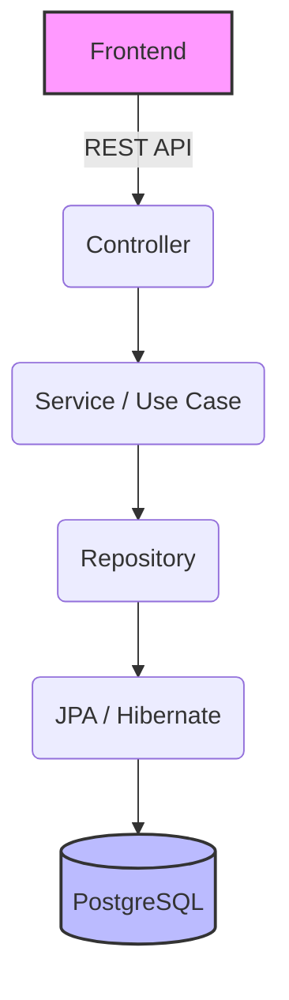

# Backend Modular Architecture

## 1. Tổng quan
Dự án EVManager sử dụng kiến trúc Backend dựa trên **Modular Monolith** kết hợp với **Clean Architecture** để đảm bảo tính dễ bảo trì, linh hoạt và độc lập giữa các nghiệp vụ. Toàn bộ backend được xây dựng trên nền tảng **Java 21**, **Spring Boot 3.x** và sử dụng **PostgreSQL**.

## 2. Các Module Chính
Hệ thống được chia thành các module độc lập theo ngữ cảnh nghiệp vụ (Bounded Context):

- **Auth**: Quản lý xác thực, cấp phát và xác thực JWT token.
- **Users**: Quản lý tài khoản người dùng nội bộ (nhân viên, admin).
- **Customers**: Quản lý thông tin khách hàng, lịch sử liên hệ.
- **Venues**: Quản lý sảnh tiệc, cơ sở vật chất, sức chứa.
- **Events**: Quản lý sự kiện, dịch vụ, trang trí, kịch bản chương trình.
- **Contracts**: Quản lý hợp đồng, trạng thái thanh lý, điều khoản.
- **Payments**: Quản lý giao dịch thanh toán, lịch sử đóng tiền, công nợ.
- **Reports**: Xử lý logic tính toán doanh thu, thống kê, xuất báo cáo.

## 3. Kiến Trúc Phân Lớp (Layer Architecture)
Mỗi module được thiết kế theo mô hình Clean Architecture để tách biệt trách nhiệm:



- **Controller**: Tiếp nhận request từ client (Frontend), xử lý routing, validate input cơ bản, gọi Use Case/Service tương ứng và trả về response. Không chứa business logic.
- **Service / Use Case**: Nơi chứa toàn bộ Business Logic và quy tắc nghiệp vụ. Orchestrate các Repositories hoặc API bên ngoài.
- **Repository**: Interface để giao tiếp với Data Layer, định nghĩa các phương thức lấy và lưu dữ liệu.
- **JPA / Hibernate**: Triển khai Repository sử dụng Spring Data JPA để tương tác với DB.

## 4. Quy Chuẩn RESTful API (RESTful API Convention)
- **Prefix chung**: Tất cả các API nghiệp vụ đều bắt đầu bằng `/api/v1`
- **Tên Resource**: Sử dụng danh từ số nhiều (plural nouns) và viết thường (kebab-case).
- **Ví dụ**:
  - `GET /api/v1/customers` - Lấy danh sách khách hàng
  - `GET /api/v1/customers/{id}` - Lấy chi tiết một khách hàng
  - `POST /api/v1/customers` - Tạo khách hàng mới
  - `PUT /api/v1/customers/{id}` - Cập nhật toàn bộ thông tin khách hàng
  - `DELETE /api/v1/customers/{id}` - Xóa khách hàng

## 5. HTTP Status Code
API phải trả về mã trạng thái HTTP chuẩn mực:
- **200 OK**: Request thành công (thường dùng cho GET, PUT, PATCH, DELETE).
- **201 Created**: Tạo mới tài nguyên thành công (POST).
- **400 Bad Request**: Lỗi input từ client (ví dụ: validation thất bại).
- **401 Unauthorized**: Thiếu token, token không hợp lệ hoặc hết hạn.
- **403 Forbidden**: Người dùng đã xác thực nhưng không có quyền truy cập resource.
- **404 Not Found**: Không tìm thấy tài nguyên.
- **409 Conflict**: Xung đột dữ liệu (ví dụ: duplicate resource, vi phạm business rule).
- **500 Internal Server Error**: Lỗi logic server hoặc exception không được handle.

## 6. Validation & Exception Handling
- **Validation**: Sử dụng **Jakarta Bean Validation** (`@Valid`, `@NotNull`, `@NotBlank`, `@Size`,...) ở tầng Controller DTO để đảm bảo tính đúng đắn của dữ liệu đầu vào trước khi tới Service.
- **Exception Handling**: 
  - Áp dụng Global Exception Handling thông qua `@ControllerAdvice` và `@ExceptionHandler`.
  - Không ném trực tiếp Stack Trace ra ngoài API. Response trả về cấu trúc lỗi chuẩn (Error Response) bao gồm: `timestamp`, `status`, `error`, `message`, `path`.

## 7. Authentication / Authorization
- **Authentication**: Sử dụng **Spring Security** kết hợp với **JWT (JSON Web Token)** để bảo mật các endpoint. Các API (ngoại trừ Auth/Public) đều yêu cầu token hợp lệ trong header (`Authorization: Bearer <token>`).
- **Authorization**: Triển khai cơ chế **RBAC (Role-Based Access Control)**. Các API được phân quyền tới từng role (Admin, Manager, Sales, Coordinator, Accountant) thông qua các annotation như `@PreAuthorize`.

## 8. Database
- **DBMS**: **PostgreSQL** là hệ quản trị CSDL chính.
- **ORM**: **Hibernate** thông qua **Spring Data JPA**.
- **Migration**: Quản lý phiên bản schema và thay đổi cơ sở dữ liệu hoàn toàn bằng **Flyway**. Không sử dụng `hibernate.hbm2ddl.auto = update` trong môi trường thực tế.

## 9. Package Structure (Spring Boot)
Cấu trúc package của project được tổ chức theo module, bên trong mỗi module chia theo tính năng (Package by Feature):

```text
com.evmanager
├── config              # Global configurations (Security, Swagger, WebMvc,...)
├── exception           # Global exception handler, custom exceptions
├── util                # Common helper classes, constants
├── auth                # Auth module
│   ├── controller
│   ├── service
│   ├── dto
│   └── security        # JWT filters, providers
├── users               # Users module
│   ├── controller
│   ├── service
│   ├── repository
│   ├── entity
│   └── dto
├── customers           # Customers module
├── venues              # Venues module
├── events              # Events module
├── contracts           # Contracts module
├── payments            # Payments module
└── reports             # Reports module
```
