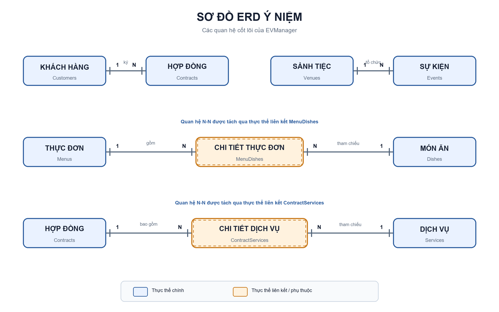

# Phân tích dữ liệu ban đầu — EVManager

## 1. Thông tin tài liệu

| Thuộc tính | Nội dung |
|---|---|
| Dự án | LV34-001 — Hệ thống quản lý tổng thể cho dịch vụ sự kiện |
| Công việc | Issue #11 — Xác định entities sơ bộ & data requirements |
| Phụ trách | Hậu — Database + QA/Tester |
| Phạm vi | Xác định thực thể cốt lõi và yêu cầu dữ liệu ban đầu |
| Nguồn đối chiếu | BRD, kiến trúc Backend và ERD dbdiagram cập nhật ngày 22/09/2026 |
| Trạng thái | Bản phân tích ban đầu, chưa phải schema/migration chính thức |

## 2. Mục tiêu và tiêu chuẩn đối chiếu

Tài liệu này chuyển các yêu cầu nghiệp vụ của BA thành danh mục dữ liệu ban đầu để làm đầu vào cho ERD, Data Dictionary và migration. Phạm vi được duyệt gồm **11 thực thể cốt lõi**, nằm trong tiêu chuẩn đồ án mức Khá là **8–12 bảng** ở mức phân tích nghiệp vụ.

Các yêu cầu nghiệp vụ cần được dữ liệu hỗ trợ:

- Xác thực người dùng và phân quyền theo vai trò.
- Quản lý khách hàng, sảnh, thực đơn, món ăn và dịch vụ.
- Quản lý lịch sự kiện và phát hiện xung đột lịch.
- Quản lý hợp đồng, đặt cọc, thanh toán và công nợ.
- Cung cấp dữ liệu cho dashboard, báo cáo và truy vết thao tác.

## 3. Kết quả đối chiếu ERD hiện tại

ERD tại [dbdiagram](https://dbdiagram.io/d/6aa3b35827f1ae8cdd6eeb92) hiện có 10 bảng vật lý:

`Customers`, `Contracts`, `Venues`, `Events`, `Menus`, `Dishes`, `MenuDishes`, `Services`, `ContractServices`, `Payments`.

So với 11 thực thể cốt lõi đã duyệt:

- Có 8 thực thể trùng khớp: `Customers`, `Venues`, `Dishes`, `Menus`, `Services`, `Events`, `Contracts`, `Payments`.
- Chưa có 3 thực thể phục vụ bảo mật và truy vết: `Users`, `Roles`, `AuditLogs`.
- ERD có 2 bảng nối kỹ thuật: `MenuDishes` và `ContractServices`. Hai bảng này cần thiết để biểu diễn quan hệ nhiều–nhiều nhưng không nằm trong danh sách 11 thực thể nghiệp vụ cốt lõi.

> **Lưu ý phạm vi:** Nếu bổ sung cả 3 bảng còn thiếu mà vẫn giữ 2 bảng nối, schema vật lý sẽ có 13 bảng và vượt ngưỡng 8–12 bảng. Việc gộp, loại hoặc tính riêng bảng nối phải được nhóm/giảng viên duyệt trước khi chốt ERD và migration. Tài liệu này không tự thay đổi schema.

## 4. Danh mục 11 thực thể cốt lõi

| # | Thực thể | Mục đích lưu trữ | Use Case liên quan |
|---:|---|---|---|
| 1 | `Roles` | Danh mục vai trò và phạm vi quyền trong cơ chế RBAC | UC02 |
| 2 | `Users` | Tài khoản người dùng nội bộ đăng nhập và thao tác hệ thống | UC01, UC02 |
| 3 | `Customers` | Hồ sơ khách hàng sử dụng dịch vụ sự kiện | UC03, UC05, UC08, UC09 |
| 4 | `Venues` | Thông tin sảnh, sức chứa, địa chỉ và giá thuê | UC06, UC07 |
| 5 | `Dishes` | Danh mục món ăn có thể đưa vào thực đơn | UC04 |
| 6 | `Menus` | Thực đơn/gói món ăn cung cấp cho sự kiện | UC04, UC05 |
| 7 | `Services` | Danh mục dịch vụ bổ sung cho sự kiện | UC04, UC05, UC08 |
| 8 | `Events` | Lịch tổ chức, sảnh, thời gian, số khách và trạng thái sự kiện | UC06, UC07, UC10 |
| 9 | `Contracts` | Cam kết dịch vụ, giá trị hợp đồng, tiền cọc và trạng thái | UC08 |
| 10 | `Payments` | Các lần đặt cọc/thanh toán và trạng thái giao dịch | UC09, UC11, UC12 |
| 11 | `AuditLogs` | Lịch sử thao tác quan trọng để truy vết và kiểm toán | UC02, UC08, UC09, UC10 |

## 5. Thuộc tính đặc trưng và yêu cầu dữ liệu

### 5.1. `Roles`

| Thuộc tính đề xuất | Kiểu dữ liệu gợi ý | Ràng buộc/yêu cầu |
|---|---|---|
| `role_id` | `BIGINT` | Khóa chính, tự tăng |
| `role_name` | `VARCHAR(50)` | Bắt buộc, duy nhất; ví dụ `ADMIN`, `MANAGER`, `SALES`, `COORDINATOR`, `ACCOUNTANT` |
| `description` | `VARCHAR(255)` | Mô tả phạm vi vai trò |
| `status` | `VARCHAR(30)` | Trạng thái hoạt động/ngừng hoạt động |
| `created_at`, `updated_at` | `TIMESTAMPTZ` | Thời điểm tạo và cập nhật |

### 5.2. `Users`

| Thuộc tính đề xuất | Kiểu dữ liệu gợi ý | Ràng buộc/yêu cầu |
|---|---|---|
| `user_id` | `BIGINT` | Khóa chính, tự tăng |
| `role_id` | `BIGINT` | Khóa ngoại bắt buộc đến `Roles` |
| `username` | `VARCHAR(50)` | Bắt buộc, duy nhất |
| `password_hash` | `VARCHAR(255)` | Chỉ lưu mật khẩu đã băm, không lưu mật khẩu thô |
| `full_name` | `VARCHAR(100)` | Bắt buộc |
| `email` | `VARCHAR(100)` | Đúng định dạng; nên duy nhất nếu dùng đăng nhập/khôi phục tài khoản |
| `phone` | `VARCHAR(20)` | Chuẩn hóa định dạng trước khi lưu |
| `status` | `VARCHAR(30)` | Ví dụ `ACTIVE`, `LOCKED`, `INACTIVE` |
| `last_login_at` | `TIMESTAMPTZ` | Có thể rỗng khi chưa đăng nhập |
| `created_at`, `updated_at` | `TIMESTAMPTZ` | Thời điểm tạo và cập nhật |

### 5.3. `Customers`

ERD hiện có: `customer_id`, `full_name`, `phone`, `email`, `address`.

| Thuộc tính | Kiểu dữ liệu | Ràng buộc/yêu cầu |
|---|---|---|
| `customer_id` | `INT` | Khóa chính, tự tăng |
| `full_name` | `VARCHAR(100)` | Bắt buộc |
| `phone` | `VARCHAR(20)` | Nên được chuẩn hóa; dùng để tra cứu/tránh hồ sơ trùng |
| `email` | `VARCHAR(100)` | Kiểm tra đúng định dạng |
| `address` | `VARCHAR(255)` | Địa chỉ liên hệ |

Yêu cầu tối thiểu một trong hai trường `phone` hoặc `email` để liên hệ khách hàng. Quy tắc duy nhất cho số điện thoại/email cần BA xác nhận trước khi tạo constraint.

### 5.4. `Venues`

ERD hiện có: `venue_id`, `venue_name`, `min_capacity`, `max_capacity`, `rental_price`, `address`, `status`.

| Thuộc tính | Kiểu dữ liệu | Ràng buộc/yêu cầu |
|---|---|---|
| `venue_id` | `INT` | Khóa chính, tự tăng |
| `venue_name` | `VARCHAR(100)` | Bắt buộc; nên duy nhất trong cùng địa điểm kinh doanh |
| `min_capacity` | `INT` | Số nguyên không âm |
| `max_capacity` | `INT` | Bắt buộc lớn hơn hoặc bằng `min_capacity` |
| `rental_price` | `DECIMAL(18,2)` | Không âm |
| `address` | `VARCHAR(255)` | Địa chỉ tổ chức |
| `status` | `VARCHAR(30)` | Ví dụ `AVAILABLE`, `MAINTENANCE`, `INACTIVE` |

### 5.5. `Dishes`

ERD hiện có: `dish_id`, `dish_name`, `category`, `price`, `description`, `status`.

| Thuộc tính | Kiểu dữ liệu | Ràng buộc/yêu cầu |
|---|---|---|
| `dish_id` | `INT` | Khóa chính, tự tăng |
| `dish_name` | `VARCHAR(100)` | Bắt buộc |
| `category` | `VARCHAR(50)` | Ví dụ khai vị, món chính, tráng miệng, đồ uống |
| `price` | `DECIMAL(18,2)` | Không âm |
| `description` | `TEXT` | Thành phần hoặc mô tả món |
| `status` | `VARCHAR(30)` | Trạng thái đang bán/ngừng bán |

### 5.6. `Menus`

ERD hiện có: `menu_id`, `menu_name`, `description`, `price`, `status`.

| Thuộc tính | Kiểu dữ liệu | Ràng buộc/yêu cầu |
|---|---|---|
| `menu_id` | `INT` | Khóa chính, tự tăng |
| `menu_name` | `VARCHAR(100)` | Bắt buộc |
| `description` | `TEXT` | Nội dung/tính chất của thực đơn |
| `price` | `DECIMAL(18,2)` | Không âm; cần xác nhận là giá mỗi bàn, mỗi khách hay trọn gói |
| `status` | `VARCHAR(30)` | Trạng thái đang áp dụng/ngừng áp dụng |

Quan hệ nhiều–nhiều giữa `Menus` và `Dishes` hiện được ERD biểu diễn qua `MenuDishes(menu_id, dish_id, quantity, note)` với khóa chính ghép `(menu_id, dish_id)`.

### 5.7. `Services`

ERD hiện có: `service_id`, `service_name`, `description`, `unit_price`, `status`.

| Thuộc tính | Kiểu dữ liệu | Ràng buộc/yêu cầu |
|---|---|---|
| `service_id` | `INT` | Khóa chính, tự tăng |
| `service_name` | `VARCHAR(100)` | Bắt buộc |
| `description` | `TEXT` | Mô tả phạm vi cung cấp |
| `unit_price` | `DECIMAL(18,2)` | Không âm |
| `status` | `VARCHAR(30)` | Trạng thái đang cung cấp/ngừng cung cấp |

Quan hệ nhiều–nhiều giữa `Contracts` và `Services` hiện được ERD biểu diễn qua `ContractServices(contract_id, service_id, quantity, unit_price, note)`. `unit_price` tại bảng nối là giá được chốt tại thời điểm lập hợp đồng, không phụ thuộc việc bảng `Services` thay đổi giá sau đó.

### 5.8. `Events`

ERD hiện có: `event_id`, `venue_id`, `event_name`, `event_date`, `start_time`, `end_time`, `guest_count`, `status`.

| Thuộc tính | Kiểu dữ liệu | Ràng buộc/yêu cầu |
|---|---|---|
| `event_id` | `INT` | Khóa chính, tự tăng |
| `venue_id` | `INT` | Khóa ngoại bắt buộc đến `Venues` |
| `event_name` | `VARCHAR(100)` | Bắt buộc |
| `event_date` | `DATE` | Ngày tổ chức |
| `start_time` | `TIME` | Giờ bắt đầu |
| `end_time` | `TIME` | Phải sau `start_time` |
| `guest_count` | `INT` | Không âm và phải nằm trong sức chứa được phép của sảnh |
| `status` | `VARCHAR(30)` | Ví dụ `SCHEDULED`, `PREPARING`, `IN_PROGRESS`, `COMPLETED`, `CANCELLED` |

Hệ thống phải kiểm tra xung đột lịch theo `venue_id`, ngày và khoảng thời gian. Kế hoạch rủi ro hiện yêu cầu có khoảng đệm 60 phút giữa hai sự kiện cùng sảnh; quy tắc này cần được BA xác nhận trong Acceptance Criteria trước khi triển khai constraint/service.

### 5.9. `Contracts`

ERD hiện có: `contract_id`, `customer_id`, `event_id`, `contract_code`, `contract_date`, `total_amount`, `deposit_amount`, `status`.

| Thuộc tính | Kiểu dữ liệu | Ràng buộc/yêu cầu |
|---|---|---|
| `contract_id` | `INT` | Khóa chính, tự tăng |
| `customer_id` | `INT` | Khóa ngoại bắt buộc đến `Customers` |
| `event_id` | `INT` | Khóa ngoại đến `Events`; ERD hiện cho phép rỗng |
| `contract_code` | `VARCHAR(50)` | Bắt buộc, duy nhất |
| `contract_date` | `DATE` | Ngày lập/ký hợp đồng |
| `total_amount` | `DECIMAL(18,2)` | Không âm |
| `deposit_amount` | `DECIMAL(18,2)` | Không âm và không vượt `total_amount` |
| `status` | `VARCHAR(30)` | Ví dụ `DRAFT`, `PENDING_CONFIRMATION`, `CONFIRMED`, `COMPLETED`, `CANCELLED` |

Giá dịch vụ đã chốt phải được lưu theo hợp đồng để bảo toàn lịch sử khi bảng giá hiện hành thay đổi.

### 5.10. `Payments`

ERD hiện có: `payment_id`, `contract_id`, `amount`, `payment_date`, `payment_method`, `status`.

| Thuộc tính | Kiểu dữ liệu | Ràng buộc/yêu cầu |
|---|---|---|
| `payment_id` | `INT` | Khóa chính, tự tăng |
| `contract_id` | `INT` | Khóa ngoại bắt buộc đến `Contracts` |
| `amount` | `DECIMAL(18,2)` | Bắt buộc lớn hơn 0 |
| `payment_date` | `TIMESTAMPTZ` | Thời điểm ghi nhận giao dịch; nên lưu theo UTC |
| `payment_method` | `VARCHAR(50)` | Ví dụ tiền mặt, chuyển khoản, cổng thanh toán |
| `status` | `VARCHAR(30)` | Ví dụ `PENDING`, `SUCCESS`, `FAILED`, `REFUNDED` |

Chỉ giao dịch thành công mới được tính vào tổng tiền đã thanh toán. Tổng tiền thanh toán hợp lệ không được vượt giá trị hợp đồng nếu chưa có nghiệp vụ hoàn tiền/điều chỉnh được duyệt.

### 5.11. `AuditLogs`

| Thuộc tính đề xuất | Kiểu dữ liệu gợi ý | Ràng buộc/yêu cầu |
|---|---|---|
| `audit_log_id` | `BIGINT` | Khóa chính, tự tăng |
| `user_id` | `BIGINT` | Khóa ngoại đến `Users`; có thể rỗng cho tác vụ hệ thống |
| `action` | `VARCHAR(100)` | Hành động, ví dụ `CREATE_CONTRACT`, `UPDATE_PAYMENT_STATUS` |
| `entity_type` | `VARCHAR(100)` | Loại đối tượng bị tác động |
| `entity_id` | `VARCHAR(100)` | Định danh đối tượng bị tác động |
| `old_values` | `JSONB` | Giá trị trước thay đổi, đã loại bỏ dữ liệu nhạy cảm |
| `new_values` | `JSONB` | Giá trị sau thay đổi, đã loại bỏ dữ liệu nhạy cảm |
| `occurred_at` | `TIMESTAMPTZ` | Thời điểm thao tác, lưu theo UTC |
| `ip_address` | `INET` | Chỉ lưu khi có căn cứ nghiệp vụ và chính sách bảo mật phù hợp |

Audit log chỉ nên cho phép ghi thêm và không được chứa mật khẩu, JWT, connection string hoặc thông tin thanh toán nhạy cảm.

## 6. Quan hệ dữ liệu sơ bộ

*Hình 1. Các quan hệ 1-N và các quan hệ N-N được tách qua `MenuDishes`, `ContractServices`.*

| Quan hệ | Bội số | Ý nghĩa |
|---|---|---|
| `Roles` → `Users` | 1–N | Một vai trò có nhiều người dùng; mỗi người dùng thuộc một vai trò trong mô hình ban đầu |
| `Users` → `AuditLogs` | 1–N | Một người dùng có thể tạo nhiều bản ghi truy vết |
| `Customers` → `Contracts` | 1–N | Một khách hàng có thể ký nhiều hợp đồng |
| `Venues` → `Events` | 1–N | Một sảnh tổ chức nhiều sự kiện ở các thời điểm khác nhau |
| `Events` → `Contracts` | 1–N theo ERD hiện tại | Một sự kiện có thể được tham chiếu bởi nhiều hợp đồng; bội số này cần BA xác nhận |
| `Contracts` → `Payments` | 1–N | Một hợp đồng có thể được thanh toán nhiều lần |
| `Menus` ↔ `Dishes` | N–N | Thông qua bảng nối `MenuDishes` |
| `Contracts` ↔ `Services` | N–N | Thông qua bảng nối `ContractServices` |

Các liên kết nghiệp vụ còn thiếu trong ERD hiện tại:

- Chưa xác định thực đơn (`Menus`) được chọn cho `Events` hay `Contracts`.
- Chưa xác định người dùng nào tạo/cập nhật hợp đồng, thanh toán và sự kiện ngoài dữ liệu `AuditLogs`.
- Chưa có quan hệ từ `AuditLogs` đến đối tượng nghiệp vụ bằng khóa ngoại vì log có thể ghi nhiều loại thực thể.

## 7. Quy tắc dữ liệu và trường hợp lỗi cần kiểm thử

| Nhóm | Quy tắc/hành vi cần kiểm thử |
|---|---|
| Sức chứa sảnh | `min_capacity >= 0`, `max_capacity >= min_capacity`, số khách không vượt sức chứa tối đa |
| Lịch sự kiện | Giờ kết thúc sau giờ bắt đầu; không trùng sảnh và khoảng thời gian; xử lý đúng múi giờ UTC+7 |
| Giá tiền | Giá thuê, giá món, giá menu, giá dịch vụ và giá trị hợp đồng không âm |
| Hợp đồng | Mã hợp đồng duy nhất; tiền cọc không vượt tổng giá trị; không xác nhận khi thiếu khách hàng/sự kiện bắt buộc |
| Thanh toán | Số tiền lớn hơn 0; chỉ trạng thái thành công làm thay đổi công nợ; giao dịch lỗi không được ghi nhận hai lần |
| RBAC | Người dùng không được thao tác ngoài quyền của vai trò |
| Dữ liệu danh mục | Không cho chọn sảnh, món, menu hoặc dịch vụ đã ngừng hoạt động cho giao dịch mới |
| Truy vết | Ghi nhận thay đổi quan trọng nhưng không log mật khẩu, JWT hoặc dữ liệu nhạy cảm |
| Xóa dữ liệu | Ưu tiên ngừng hoạt động/soft delete với dữ liệu đã được hợp đồng hoặc sự kiện tham chiếu |

## 8. Các điểm cần BA/nhóm xác nhận trước khi chốt ERD

1. Tiêu chuẩn 8–12 bảng sẽ tính các bảng nối như thế nào; nếu tính tất cả bảng vật lý thì phương án hiện tại có nguy cơ thành 13 bảng.
2. Một sự kiện có đúng một hợp đồng hay có thể có nhiều hợp đồng.
3. Thực đơn được gắn với sự kiện, hợp đồng hay một chi tiết hợp đồng riêng.
4. `Menus.price` là giá theo bàn, theo khách hay giá trọn gói.
5. Số điện thoại/email khách hàng có bắt buộc duy nhất hay chỉ dùng để cảnh báo trùng.
6. Khoảng đệm 60 phút giữa hai sự kiện cùng sảnh có phải quy tắc bắt buộc.
7. Trạng thái chuẩn của sảnh, menu, món ăn, dịch vụ, sự kiện, hợp đồng và thanh toán.
8. Có cho phép hoàn tiền, thanh toán dư hoặc điều chỉnh giá trị hợp đồng sau khi xác nhận hay không.

## 9. Kết luận

Danh mục 11 thực thể đã bao phủ các yêu cầu quản lý tài khoản/RBAC, khách hàng, danh mục dịch vụ, lịch sự kiện, hợp đồng, thanh toán và audit. ERD hiện tại là cơ sở tốt cho nghiệp vụ sự kiện nhưng chưa bao phủ `Users`, `Roles`, `AuditLogs` và còn một số quan hệ/cardinality cần BA xác nhận. Chỉ sau khi các điểm ở Mục 8 được duyệt mới chuyển tài liệu này thành ERD chính thức, Data Dictionary và Flyway migration.
