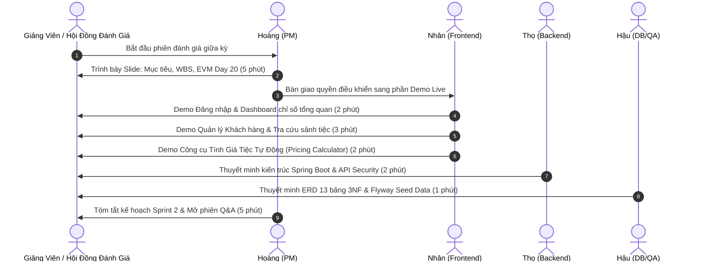

# Kịch Bản Trình Diễn Sản Phẩm Giữa Kỳ (Midterm Demo Script - 50%)
## Dự án: EVManager - Hệ Thống Quản Lý Trung Tâm Hội Nghị & Tiệc Cưới

---

## 1. Thông Tin Tổng Quan Buổi Demo

- **Thời gian diễn ra:** Buổi đánh giá giữa kỳ (Tuần 4 - Đầu Sprint 2)
- **Thời lượng:** 20 phút (5 phút Báo cáo tiến độ & EVM + 10 phút Trình diễn sản phẩm trực tiếp + 5 phút Hỏi đáp Q&A)
- **Thành phần tham dự & Phân vai:**
  - **Phạm Lê Huy Hoàng (PM):** Điều phối buổi demo, thuyết minh tiến độ, chỉ số EVM và định hướng giai đoạn 2.
  - **Võ Hoàng Nhân (Frontend & UI/UX):** Trình diễn luồng giao diện người dùng SPA (React, Vite, Tailwind CSS).
  - **Huỳnh Tấn Thọ (Backend):** Thuyết minh kiến trúc Spring Boot 3, RESTful API và cơ chế bảo mật JWT.
  - **Bùi Nguyễn Chí Hậu (DBA & QA):** Thuyết minh lược đồ CSDL PostgreSQL 13 bảng 3NF, Flyway migration và bằng chứng kiểm thử.
  - **Dương Khắc Đạt (DevOps):** Điều khiển hạ tầng vận hành, kiểm tra healthcheck và hỗ trợ kỹ thuật trình chiếu.

---

## 2. Chuẩn Bị Môi Trường & Dữ Liệu Kiểm Thử (Pre-requisites & Seed Data)

### 2.1. Môi Trường Vận Hành (Local / Staging)
- **Database:** PostgreSQL 16 chạy trên `localhost:5432`, database: `evmanager` (đã nạp migration `V1` -> `V8`).
- **Backend:** Java 21, Spring Boot chạy tại `http://localhost:8080` (Active profile: `dev`).
- **Frontend:** Node.js, React + Vite chạy tại `http://localhost:5173`.

### 2.2. Tài Khoản Thử Nghiệm (Test Accounts)
| Vai trò | Email đăng nhập | Mật khẩu | Quyền hạn trong hệ thống |
| :--- | :--- | :--- | :--- |
| **Quản trị viên (Admin)** | `admin@evmanager.vn` | `admin123` | Toàn quyền cấu hình sảnh, dịch vụ, tài khoản, xem dashboard tài chính. |
| **Nhân viên tư vấn (Staff)** | `staff@evmanager.vn` | `staff123` | Tra cứu sảnh, tính giá tiệc, quản lý khách hàng, tạo hợp đồng tiệc. |
| **Khách hàng mẫu (Customer)** | `khachhang1@gmail.com` | `123456` | Xem thông tin đặt tiệc cá nhân, tra cứu hợp đồng. |

### 2.3. Dữ Liệu Sảnh & Dịch Vụ Mẫu (Seeded Records)
- **Sảnh Diamond (Grand Ballroom):** Sức chứa 50 bàn (500 khách), diện tích 800m², giá ca tối: 25,000,000 VNĐ.
- **Sảnh Crystal:** Sức chứa 35 bàn (350 khách), diện tích 550m², giá ca tối: 18,000,000 VNĐ.
- **Sảnh Ruby:** Sức chứa 25 bàn (250 khách), diện tích 400m², giá ca tối: 12,000,000 VNĐ.
- **Sảnh Gold:** Sức chứa 15 bàn (150 khách), diện tích 250m², giá ca tối: 9,000,000 VNĐ.
- **Dịch vụ tiệc kèm theo:** Âm thanh ánh sáng sân khấu VIP, Ban nhạc hòa tấu, Tháp ly & Rượu champagne, Vũ đoàn khai tiệc.

---

## 3. Kịch Bản Trình Diễn Chi Tiết Từng Bước (Step-by-Step Execution)

---

### PHẦN 1: MỞ ĐẦU & BÁO CÁO TIẾN ĐỘ TỔNG QUAN (00:00 - 05:00)
- **Người thực hiện:** Phạm Lê Huy Hoàng (PM)
- **Hành động & Lời thoại:**
  1. Chào hội đồng và giới thiệu các thành viên cùng vai trò trong dự án EVManager.
  2. Nêu bật tính cấp thiết: Giải quyết bài toán quản lý phân mảnh, xung đột lịch sảnh và thất thoát phụ thu tiệc cưới của các trung tâm quy mô vừa và lớn.
  3. Báo cáo các chỉ số định lượng:
     - Đã hoàn thành 100% tài liệu phân tích nghiệp vụ, WBS 7 gói lớn và ERD 13 bảng.
     - **Chỉ số EVM tại Day 20:** $PV = 58.5\text{M VNĐ}$, $EV = 55.25\text{M VNĐ}$ ($42.5\%$ toàn dự án, đạt mốc $50\%$ tính năng cốt lõi), $AC = 63.3\text{M VNĐ}$.
     - Giải trình độ lệch: $SPI = 0.944$ (chậm nhẹ 1.5 ngày do mở rộng DB từ 8 lên 13 bảng chuẩn 3NF), $CPI = 0.873$ (đầu tư công sức OT ban đầu). Kế hoạch bù tiến độ Fast-tracking đã kiểm soát tốt và sẵn sàng bàn giao đúng hạn.
  4. Chuyển tiếp sang màn hình live demo.

---

### PHẦN 2: TRÌNH DIỄN SẢN PHẨM TRỰC TIẾP (05:00 - 15:00)

#### Bước 1: Xác thực & Giao diện Dashboard Điều Hành (05:00 - 07:00)
- **Người thực hiện:** Võ Hoàng Nhân (Frontend)
- **Màn hình demo:** Trang Đăng nhập (`/login`) $\rightarrow$ Trang Dashboard (`/dashboard`)
- **Các thao tác thực tế:**
  1. Nhập sai thông tin mật khẩu $\rightarrow$ Hệ thống hiển thị Toast thông báo lỗi tiếng Việt thân thiện, bảo mật.
  2. Đăng nhập với tài khoản Quản trị: `admin@evmanager.vn` / `admin123`.
  3. Điều hướng vào Dashboard:
     - Giới thiệu 4 thẻ chỉ số nhanh (KPI Cards): Tổng số sảnh hoạt động (4 sảnh), Tiệc sắp diễn ra trong tháng (12 tiệc), Doanh thu dự kiến tháng 9 (450,000,000 VNĐ), Tỷ lệ lấp đầy sảnh (78%).
     - Giới thiệu biểu đồ doanh thu theo tháng và bảng danh sách sự kiện gần nhất với trạng thái trực quan (Đã cọc, Đang tổ chức, Hoàn tất).
     - Trình diễn tính năng chuyển đổi giao diện Dark / Light Mode mượt mà và menu Sidebar responsive.

#### Bước 2: Quản Lý Khách Hàng & Tra Cứu Danh Mục Sảnh Tiệc (07:00 - 10:00)
- **Người thực hiện:** Võ Hoàng Nhân (Frontend)
- **Màn hình demo:** Trang Khách hàng (`/customers`) $\rightarrow$ Trang Quản lý Sảnh (`/venues`)
- **Các thao tác thực tế:**
  1. Vào trang Khách hàng:
     - Tìm kiếm nhanh khách hàng "Nguyễn Văn An" bằng ô lọc từ khóa.
     - Mở Modal xem chi tiết lịch sử đặt tiệc của khách hàng.
     - Bấm "Thêm khách hàng mới": nhập form có validate số điện thoại và email $\rightarrow$ danh sách cập nhật ngay lập tức.
  2. Vào trang Quản lý Sảnh tiệc:
     - Giới thiệu danh mục các sảnh tiệc: Sảnh Diamond, Sảnh Crystal, Sảnh Ruby, Sảnh Gold.
     - Lọc sảnh theo quy mô sức chứa (Ví dụ: lọc sảnh có sức chứa trên 40 bàn).
     - Xem chi tiết cơ sở vật chất sảnh: diện tích, chiều cao trần, hệ thống âm thanh, hình ảnh phối cảnh sảnh.

#### Bước 3: Công Cụ Tính Giá Tiệc Tự Động & Hỗ Trợ Báo Giá (10:00 - 12:00)
- **Người thực hiện:** Võ Hoàng Nhân (Frontend) kết hợp Huỳnh Tấn Thọ (Backend)
- **Màn hình demo:** Widget / Modal "Tính giá tiệc & Lập dự toán"
- **Các thao tác thực tế:**
  1. Nhân viên chọn: Sảnh Diamond $\rightarrow$ Thời gian: Buổi tối cuối tuần (Hệ thống tự động áp dụng bảng giá ca tối: 25,000,000 VNĐ).
  2. Chọn số lượng bàn: 40 bàn $\times$ Đơn giá thực đơn Set Menu Luxury (4,500,000 VNĐ/bàn) $= 180,000,000$ VNĐ.
  3. Tích chọn các dịch vụ đi kèm: Màn hình LED P3, Vũ đoàn mở màn, Bắn pháo kim tuyến.
  4. Hệ thống tính toán tức thì:
     - Tổng tiền dịch vụ sảnh + thực đơn.
     - Thuế VAT (8%) và phí phục vụ (5%).
     - Số tiền đặt cọc tối thiểu cần thanh toán đợt 1 (30% tổng giá trị hợp đồng).
  5. Thao tác này chứng minh luồng nghiệp vụ đã được số hóa hoàn toàn, nhân viên không cần tính toán thủ công trên Excel, loại bỏ hoàn toàn sai sót thất thoát doanh thu.

#### Bước 4: Kiến Trúc Kỹ Thuật, Cơ Sở Dữ Liệu & API (12:00 - 15:00)
- **Người thực hiện:** Huỳnh Tấn Thọ (Backend) & Bùi Nguyễn Chí Hậu (DBA/QA)
- **Hành động & Dẫn chứng kỹ thuật:**
  1. **Thọ (Backend):**
     - Mở giao diện Swagger UI / Postman: Trình bày cấu trúc API chuẩn RESTful (`/api/v1/auth`, `/api/v1/venues`, `/api/v1/halls`, `/api/v1/customers`).
     - Chứng minh cơ chế bảo mật: Gửi request không có Header Authorization trả về `401 Unauthorized`; gửi Token hợp lệ trả về dữ liệu chuẩn JSON kèm pagination.
  2. **Hậu (DBA/QA):**
     - Mở DBeaver kết nối PostgreSQL: Show lược đồ 13 bảng chuẩn 3NF liên kết chặt chẽ bằng Foreign Key.
     - Trình bày lịch sử Flyway migration từ `V1` đến `V8`: Đảm bảo cơ sở dữ liệu có tính tái lập tuyệt đối (reproducible) trên mọi máy thành viên.
     - Báo cáo kết quả kiểm thử: Toàn bộ Unit Test ở Backend và Static Analysis đều vượt qua 100%.

---

### PHẦN 3: KẾ HOẠCH NỬA SAU & HỎI ĐÁP Q&A (15:00 - 20:00)
- **Người thực hiện:** Phạm Lê Huy Hoàng (PM) và Toàn đội
- **Hành động & Nội dung:**
  1. Trình bày Roadmap Sprint 2 (Tuần 4 - Tuần 8):
     - Hoàn thiện luồng Ký kết hợp đồng điện tử và Phân rã lịch thanh toán nhiều đợt.
     - Xây dựng sơ đồ xếp bàn tiệc trực quan (Table Layout Management).
     - Hệ thống báo cáo thống kê chuyên sâu và phân quyền chi tiết.
     - Kiểm thử tải (Load testing) và đóng gói triển khai Docker staging.
  2. Cảm ơn hội đồng và tiếp nhận câu hỏi phản biện, ghi nhận các yêu cầu điều chỉnh (nếu có để xử lý trong Change Request CR-01).

---

## 4. Phương Án Dự Phòng Sự Cố (Contingency & Fallback Plans)

| Tình huống rủi ro | Mức độ | Phương án ứng phó tức thì | Người phụ trách |
| :--- | :---: | :--- | :--- |
| **Mất kết nối Internet hoặc mạng chập chờn** | Trung bình | Toàn bộ hệ thống chạy 100% trên Localhost (`localhost:8080` và `localhost:5173`) kèm Database PostgreSQL nội bộ, không phụ thuộc cloud hay internet ngoài. | Dương Khắc Đạt |
| **Backend Spring Boot khởi động chậm hoặc lỗi port** | Thấp | Frontend đã tích hợp sẵn chế độ Mock Service Worker / Local JSON mode, có thể bật cờ fallback ngay lập tức để tiếp tục luồng trình diễn giao diện. | Võ Hoàng Nhân |
| **Máy chiếu hoặc màn hình phụ không nhận tín hiệu** | Trung bình | Chuẩn bị sẵn 2 máy tính dự phòng đã clone nhánh `develop` mới nhất, kèm bản PDF slide và video quay sẵn màn hình demo full flow (1080p). | Huỳnh Tấn Thọ |

---
*Kịch bản được phê duyệt và ban hành bởi PM Phạm Lê Huy Hoàng.*
