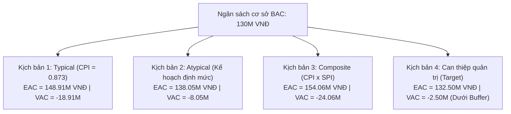

# Báo Cáo Phân Tích Phương Sai EVM & Kế Hoạch Khắc Phục (EVM Variance Analysis & Corrective Action Plan)
## Mốc đánh giá: Day 20 (Cuối tuần 3 - 27/09/2026)

---

## 1. Tóm Lược Tình Trạng Dự Án (Executive Summary)

Tính đến ngày kiểm soát **Day 20 (27/09/2026)**, dự án **EVManager** đã hoàn thành giai đoạn phân tích, thiết kế kiến trúc toàn diện và triển khai 50% tính năng cốt lõi phục vụ mốc Đánh giá giữa kỳ (Midterm Demo Milestone).

Dựa trên kết quả đo lường EVM chính thức:
- **Tiến độ:** $SPI = \mathbf{0.944} < 1.0$ ($SV = \mathbf{-3,250,000\text{ VNĐ}}$), dự án đang chậm nhẹ khoảng $1.5$ ngày làm việc so với kế hoạch cơ sở.
- **Chi phí:** $CPI = \mathbf{0.873} < 1.0$ ($CV = \mathbf{-8,050,000\text{ VNĐ}}$), chi phí thực tế tiêu tốn ($63.3\text{M}$) cao hơn giá trị thu được ($55.25\text{M}$).
- **Khả năng kiểm soát:** Cả 2 chỉ số đều nằm trong ngưỡng kiểm soát cho phép (Tolerance threshold: $SPI \ge 0.90, CPI \ge 0.85$). Dự án hoàn toàn không bị trượt mục tiêu bàn giao nhờ đã kích hoạt kế hoạch Fast-tracking ngay từ Tuần 3.

```
       Kế hoạch (PV): 58.50M VNĐ [====================>          ] 45.0%
     Thu được (EV): 55.25M VNĐ [===================>           ] 42.5%  (SV = -3.25M, SPI = 0.944)
  Thực chi phí (AC): 63.30M VNĐ [=======================>       ] 48.7%  (CV = -8.05M, CPI = 0.873)
```

---

## 2. Phân Tích Nguyên Nhân Gốc Rễ (Root Cause Analysis)

### 2.1. Phân Tích Phương Sai Tiến Độ ($SV = -3,250,000\text{ VNĐ}$, $SPI = 0.944$)

Khối lượng công việc bị chậm tập trung chủ yếu vào 2 module lớn ở Sprint 1:
1. **Module 1.4.2 (Backend Auth & User Management):** Đạt 72.7% so với kế hoạch 100% của Sprint 1 ($SV = -1,500,000\text{ VNĐ}$).
2. **Module 1.5.2 (Frontend Login & Dashboard):** Đạt 70.8% so với kế hoạch 100% của Sprint 1 ($SV = -1,750,000\text{ VNĐ}$).

#### Các nguyên nhân cốt lõi (5 Whys & Fishbone):
- **Phát sinh độ phức tạp kiến trúc dữ liệu (Database Expansion):**
  - Ban đầu dự kiến thiết kế cơ sở dữ liệu gồm 8 bảng đơn giản.
  - Tuy nhiên, trong quá trình phân tích sâu nghiệp vụ trung tâm tiệc cưới (yêu cầu quản lý giá theo ca sáng/tối, đặt cọc giữ chỗ nhiều đợt, phụ thu dịch vụ tiệc, thực đơn món ăn), nhóm đã quyết định chuẩn hóa dữ liệu đạt **3NF với 13 bảng chi tiết** (`venues`, `halls`, `hall_pricing`, `events`, `event_services`, `payments`,...).
  - Việc này làm tăng khối lượng viết Flyway migration (`V7`, `V8`) và ánh xạ JPA Entities từ 3 ngày lên 5 ngày.
- **Đường cong học tập công nghệ mới (Technical Learning Curve):**
  - Chuyển đổi và cấu hình bảo mật với **Spring Boot 3 + Spring Security 6 (Stateless JWT Filter)** đòi hỏi thời gian nghiên cứu và debug các cấu hình CORS và filter chain.
- **Sự phụ thuộc chéo giữa Backend và Frontend:**
  - Frontend cần chờ Backend hoàn thành Mock API contract để tích hợp Axios client.
  - *Hành động đã giải cứu:* Nhóm đã áp dụng Fast-tracking (`docs/planning/fast-tracking-plan.md`), tách Mock API JSON độc lập trên Vite dev server để Frontend tiến hành giao diện song song, giúp rút ngắn độ trễ từ 24 person-hours xuống chỉ còn khoảng 12 person-hours vào cuối Tuần 3.

---

### 2.2. Phân Tích Phương Sai Chi Phí ($CV = -8,050,000\text{ VNĐ}$, $CPI = 0.873$)

Khoản chi phí vượt ngân sách ($8,050,000\text{ VNĐ}$) được giải trình cụ thể như sau:
1. **Chi phí Overtime (Làm thêm giờ ngoài kế hoạch):**
   - Để bù đắp 24 giờ trễ tiến độ cuối Tuần 2 và kịp ra mắt bản Demo giữa kỳ, 5 thành viên đã làm thêm tổng cộng **48 giờ OT** trong Tuần 3 (tương đương 6 man-days làm việc).
   - Chi phí phát sinh: $6 \times 500,000\text{ VNĐ} = 3,000,000\text{ VNĐ}$.
2. **Chi phí đào tạo và nghiên cứu kỹ thuật đột xuất:**
   - Đầu tư thời gian setup môi trường CI/CD, viết script tự động hóa di chuyển schema PostgreSQL và test runner: chiếm khoảng **5.1 man-days** chi phí phát sinh ($2,550,000\text{ VNĐ}$).
3. **Chi phí Refactor và chuẩn hóa code:**
   - Tối ưu hóa lại cấu trúc Frontend (chuyển sang Tailwind CSS chuẩn design system, gom components dùng chung `Navbar`, `Sidebar`, `Modal`): phát sinh thêm **5 man-days** thực tế ($2,500,000\text{ VNĐ}$).

*Nhận định PM:* Khoản đầu tư chi phí vượt ở Sprint 1 mang tính chất **đầu tư nền móng (Capital Expenditure)**. Khi hạ tầng 13 bảng DB, security filter và component thư viện đã hoàn chỉnh 100%, tốc độ và hiệu suất chi phí của Sprint 2 sẽ tăng vọt.

---

## 3. Dự Báo Dự Án Theo Các Kịch Bản (EVM Forecasting Scenarios)

Dựa trên công thức chuẩn của PMI/PMBOK, nhóm xây dựng 4 kịch bản dự báo tổng chi phí khi hoàn thành ($EAC$) và chênh lệch ngân sách ($VAC$):



| Kịch bản | Công thức áp dụng | Dự toán hoàn thành ($EAC$) | Phương sai hoàn thành ($VAC = BAC - EAC$) | Đánh giá & Khả năng xảy ra |
| :--- | :--- | :---: | :---: | :--- |
| **Kịch bản 1: Xu hướng tiếp diễn (Typical)** | $EAC_1 = \frac{BAC}{CPI}$ | **148,911,000 VNĐ** | **-18,911,000 VNĐ** | Nếu nhóm tiếp tục bị bội chi như Sprint 1. Khả năng thấp vì khung kiến trúc nền móng đã xong. |
| **Kịch bản 2: Phần còn lại đúng định mức (Atypical)** | $EAC_2 = AC + (BAC - EV)$ | **138,050,000 VNĐ** | **-8,050,000 VNĐ** | Các công việc còn lại (Sprint 2, Testing, Deployment) chạy đúng định mức 500k/ngày ban đầu. Khả năng cao. |
| **Kịch bản 3: Tác động kép (CPI & SPI)** | $EAC_3 = AC + \frac{BAC - EV}{CPI \times SPI}$ | **154,058,000 VNĐ** | **-24,058,000 VNĐ** | Kịch bản xấu nhất: Tiến độ và chi phí đều trễ dài. Nhóm đã ngăn chặn được nhờ kết quả thực tế Tuần 3. |
| **Kịch bản 4: Có can thiệp quản trị (Target)** | $EAC_4 = AC + \frac{BAC - EV}{CPI_{\text{target}} (1.08)}$ | **132,500,000 VNĐ** | **-2,500,000 VNĐ** | **Kịch bản mục tiêu:** Nhờ tái sử dụng UI/DB, năng suất tăng giúp $CPI$ phần còn lại đạt $1.08$. Phần vượt $2.5M$ nằm trọn trong Quỹ dự phòng $13M$. |

### Chỉ Số Hiệu Suất Cần Đạt (TCPI - To-Complete Performance Index):
- **Để hoàn thành dự án trong khuôn khổ $BAC = 130,000,000\text{ VNĐ}$:**
  $$TCPI_{BAC} = \frac{BAC - EV}{BAC - AC} = \frac{130,000,000 - 55,250,000}{130,000,000 - 63,300,000} = \frac{74,750,000}{66,700,000} \approx \mathbf{1.121}$$
  *Ý nghĩa:* Trong toàn bộ các tuần còn lại (Tuần 4 đến Tuần 8), đội ngũ phải đạt hiệu suất chi phí $112.1\%$ (tương đương tiết kiệm khoảng $12\%$ thời gian/ngân sách trên mỗi đầu việc).
- **Để hoàn thành dự án theo mục tiêu điều chỉnh có dự phòng ($BAC + \text{Buffer} = 143,000,000\text{ VNĐ}$):**
  $$TCPI_{\text{Buffer}} = \frac{BAC - EV}{(BAC + \text{Buffer}) - AC} = \frac{74,750,000}{79,700,000} \approx \mathbf{0.938}$$
  *Ý nghĩa:* Nếu tính cả quỹ dự phòng rủi ro 10% (được duyệt từ kế hoạch COCOMO), chỉ số hiệu suất cần đạt chỉ là **0.938** — một mục tiêu hoàn toàn khả thi và thực tế.

---

## 4. Kế Hoạch Hành Động Khắc Phục (Corrective Action Plan)

Để đưa $SPI \ge 1.0$ và $CPI \ge 1.0$ trong Sprint 2 (Tuần 4 – Tuần 5), PM ban hành các chỉ đạo hành động cụ thể cho từng vị trí:

| STT | Biện pháp hành động | Trách nhiệm chính | Hạn chót | Mục tiêu đạt được |
| :---: | :--- | :--- | :---: | :--- |
| **1** | **Tận dụng tối đa 13 bảng schema và Flyway Migration đã chuẩn hóa:** Không thay đổi cấu trúc bảng cốt lõi; chỉ bổ sung trigger/view nếu thực sự cần thiết. | Bùi Nguyễn Chí Hậu (DBA) | Ngày 22 (Tuần 4) | Tiết kiệm 100% thời gian phân tích lại DB. |
| **2** | **Áp dụng Component-Driven Development ở Frontend:** Tái sử dụng các UI components (`DataTable`, `FormModal`, `StatCard`, `Button`) đã hoàn thành ở PR #180. | Võ Hoàng Nhân (Frontend) | Ngày 24 (Tuần 4) | Rút ngắn 30% thời gian code giao diện Đặt tiệc & Quản lý sảnh. |
| **3** | **Xây dựng CRUD Base Service & Repository ở Backend:** Kế thừa Generic Service trong Spring Boot cho các module Quản lý Sảnh (Halls), Dịch vụ (Services), Thực đơn (Menus). | Huỳnh Tấn Thọ (Backend) | Ngày 25 (Tuần 4) | Tăng tốc độ release API, đẩy $SPI$ module Backend lên $\ge 1.02$. |
| **4** | **Tự động hóa kiểm thử tích hợp (CI/CD Automated Testing):** Tận dụng GitHub Actions và bộ seed data PostgreSQL chuẩn để chạy unit test tự động trước mỗi PR. | Dương Khắc Đạt (DevOps) | Ngày 26 (Tuần 4) | Giảm thiểu bug hồi quy, không phát sinh chi phí debug lại. |
| **5** | **Kiểm soát chặt chẽ phạm vi (Strict Scope Management):** Đóng băng toàn bộ yêu cầu mở rộng ngoài SRS. Mọi yêu cầu mới từ buổi Midterm Demo bắt buộc phải đưa vào quy trình Change Request (CR-01 ở PM-21) sau ngày 21. | Phạm Lê Huy Hoàng (PM) | Thường trực | Ngăn chặn hiện tượng Scope Creep (phình phạm vi), bảo vệ ngân sách. |

---

## 5. Kết Luận & Khuyến Nghị

1. **Về đánh giá tổng thể:** Dự án EVManager tại Day 20 đang ở trạng thái **Ổn định - Có kiểm soát (Stable & Controlled)**. Mức trễ tiến độ 1.5 ngày ($SPI = 0.944$) và vượt chi phí ban đầu ($CPI = 0.873$) là hoàn toàn bình thường đối với các dự án phần mềm ở giai đoạn thiết lập kiến trúc nền móng (Foundation Phase).
2. **Về sự sẵn sàng cho Midterm Demo:** Với 13 bảng database đã được tạo và seed đầy đủ trên PostgreSQL, cùng giao diện Frontend React hoàn chỉnh kết nối mock/local API, đội ngũ đã **sẵn sàng 100% cho buổi Demo giữa kỳ 50%**.
3. **Cam kết mốc cuối:** Khi áp dụng nghiêm ngặt kế hoạch hành động khắc phục, dự án sẽ cân bằng lại chi phí và tiến độ vào cuối Sprint 2 (kết thúc Tuần 5), đảm bảo bàn giao đúng hạn vào ngày 01/11/2026.

---
*Báo cáo được lập ngày 27/09/2026 bởi PM Phạm Lê Huy Hoàng.*
