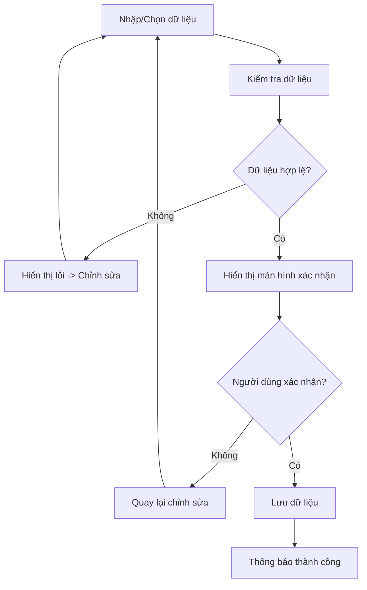

# TÀI LIỆU ĐẶC TẢ YÊU CẦU PHẦN MỀM – SRS v1.0

**SOFTWARE REQUIREMENTS SPECIFICATION – SRS v1.0**

- **Dự án:** EVManager – Hệ thống quản lý Trung tâm Hội nghị & Tiệc cưới
- **Phiên bản:** 1.0
- **Ngày:** 25/09/2026
- **Người lập:** Business Analyst
- **Trạng thái:** Draft – Chờ Review nội bộ

---

## 1. GIỚI THIỆU

### 1.1. Mục đích tài liệu
Tài liệu SRS v1.0 mô tả các yêu cầu chức năng và phi chức năng của hệ thống EVManager – Hệ thống quản lý Trung tâm Hội nghị & Tiệc cưới.

Tài liệu là cơ sở để:
- Phân tích và thiết kế hệ thống.
- Thiết kế cơ sở dữ liệu.
- Phát triển Frontend và Backend.
- Xây dựng API.
- Thiết kế giao diện.
- Xây dựng Test Case.
- Kiểm thử UAT.
- Nghiệm thu hệ thống.
- Quản lý thay đổi yêu cầu trong quá trình phát triển.

Tài liệu được tổ chức theo cấu trúc SRS hướng IEEE 830 và được sử dụng làm baseline yêu cầu cho phiên bản 1.0.

---

## 2. TỔNG QUAN DỰ ÁN

### 2.1. Tên hệ thống
EVManager – Hệ thống quản lý Trung tâm Hội nghị & Tiệc cưới

### 2.2. Mục tiêu
Hệ thống nhằm số hóa quy trình quản lý:
$$\text{Tiếp nhận khách} \rightarrow \text{Tư vấn chọn sảnh/thực đơn} \rightarrow \text{Báo giá} \rightarrow \text{Hợp đồng \& Đặt cọc} \rightarrow \text{Điều phối sự kiện} \rightarrow \text{Thanh toán}$$

Hệ thống hỗ trợ quản lý sảnh, thực đơn, dịch vụ, báo giá, hợp đồng, thanh toán, điều phối sự kiện và báo cáo.
Tài liệu dự án xác định mục tiêu hệ thống là hỗ trợ 4 phân hệ chính: Quản trị, Sales/Tư vấn, Điều phối/Bếp và Khách hàng, đồng thời cảnh báo xung đột lịch sảnh và cung cấp báo cáo doanh thu theo thời gian thực.

---

## 3. PHẠM VI HỆ THỐNG

### 3.1. Trong phạm vi
EVManager bao gồm:
1. Quản lý tài khoản.
2. Quản lý người dùng và phân quyền.
3. Quản lý khách hàng.
4. Quản lý sảnh.
5. Kiểm tra lịch và xung đột sảnh.
6. Giữ chỗ sảnh.
7. Quản lý Set Menu.
8. Tùy chỉnh món ăn.
9. Quản lý dịch vụ bổ sung.
10. Tính toán chi phí.
11. Lập và gửi báo giá.
12. Quản lý hợp đồng.
13. Quản lý thanh toán.
14. Điều phối sự kiện.
15. Quản lý phát sinh.
16. Quyết toán sau sự kiện.
17. Dashboard và báo cáo.
18. Thông báo.

### 3.2. Ngoài phạm vi
- Các chức năng chưa được xác định trong baseline SRS v1.0 không được xem là yêu cầu bắt buộc cho phiên bản này.
- Các chức năng mở rộng như AI đề xuất thực đơn hoặc dự báo chi phí chỉ được triển khai nếu được phê duyệt bổ sung vào phạm vi.

---

## 4. ĐỐI TƯỢNG SỬ DỤNG

| Actor | Mô tả |
| :--- | :--- |
| **Admin/Quản lý** | Quản lý người dùng, phân quyền, danh mục, chính sách và báo cáo |
| **Nhân viên Tư vấn (Sales)** | Tiếp nhận khách, tư vấn, chọn sảnh, thực đơn, dịch vụ và lập báo giá |
| **Điều phối sự kiện** | Lập lịch, kiểm tra xung đột, điều phối nhân sự và theo dõi sự kiện |
| **Khách hàng** | Cung cấp yêu cầu, xem báo giá, xác nhận hợp đồng và thanh toán |

---

## 5. CÁC YÊU CẦU CHỨC NĂNG

### 5.1. Danh sách 14 Use Case

| Mã | Use Case | Actor chính | Trạng thái |
| :---: | :--- | :--- | :---: |
| **UC-01** | Đăng nhập / Quên mật khẩu | Người dùng | Đã đặc tả |
| **UC-02** | Quản lý tài khoản người dùng | Admin | Đã đặc tả |
| **UC-03** | Quản lý hồ sơ khách hàng | Sales | Đã đặc tả |
| **UC-04** | Tra cứu và kiểm tra sảnh | Sales | Đã đặc tả |
| **UC-05** | Giữ chỗ sảnh | Sales | Đã đặc tả |
| **UC-06** | Chọn danh mục món ăn và lập thực đơn tiệc cưới | Sales | Đã đặc tả |
| **UC-07** | Chọn các gói dịch vụ bổ sung | Sales | Đã đặc tả |
| **UC-08** | Tự động tính toán chi phí và lập báo giá | Sales | Đã đặc tả |
| **UC-09** | Lập lịch sự kiện | Điều phối | Đã đặc tả |
| **UC-10** | Kiểm tra xung đột lịch | Hệ thống/Điều phối | Đã đặc tả |
| **UC-11** | Quản lý hợp đồng | Sales/Khách hàng | Cần hoàn thiện đặc tả |
| **UC-12** | Quản lý thanh toán | Kế toán/Quản lý | Cần hoàn thiện đặc tả |
| **UC-13** | Điều phối nhân sự và chuẩn bị tiệc | Điều phối | Cần hoàn thiện đặc tả |
| **UC-14** | Quyết toán và hoàn tất sự kiện | Điều phối/Kế toán | Cần hoàn thiện đặc tả |

*Lưu ý: UC-11 đến UC-14 được đưa vào cấu trúc SRS để đảm bảo đủ 14 Use Case theo phạm vi dự án. Nội dung chi tiết cần được đối chiếu với đặc tả UC tương ứng trước khi Baseline SRS v1.0.*

---

## 6. TÓM TẮT CÁC USE CASE

### UC-01 – Đăng nhập / Quên mật khẩu
Hệ thống cho phép người dùng đăng nhập bằng tài khoản hợp lệ.
Chức năng quên mật khẩu:
$$\text{Quên mật khẩu} \rightarrow \text{nhập Email} \rightarrow \text{kiểm tra Email} \rightarrow \text{gửi OTP} \rightarrow \text{nhập OTP} \rightarrow \text{xác thực} \rightarrow \text{nhập mật khẩu mới} \rightarrow \text{cập nhật mật khẩu}$$
Hệ thống kiểm tra dữ liệu và hiển thị thông báo khi Email không tồn tại, OTP sai/hết hạn hoặc mật khẩu không hợp lệ.

### UC-02 – Quản lý tài khoản người dùng
Admin có thể: Xem danh sách tài khoản, Thêm tài khoản, Gán vai trò, Đổi mật khẩu, Khóa tài khoản, Kích hoạt tài khoản, Vô hiệu hóa tài khoản.
Chỉ tài khoản đang hoạt động mới được phép đăng nhập.

### UC-03 – Quản lý hồ sơ khách hàng
Sales có thể: Tạo hồ sơ khách hàng, Tra cứu khách hàng bằng số điện thoại, Cập nhật thông tin, Xem lịch sử giao dịch, Xem các sự kiện đã tổ chức.
Số điện thoại được sử dụng để hạn chế tạo trùng hồ sơ khách hàng.

### UC-04 – Tra cứu và kiểm tra sảnh
Sales nhập: Ngày tổ chức, Ca tiệc, Số lượng bàn dự kiến.
Hệ thống kiểm tra: Sức chứa sảnh, Lịch sử dụng sảnh, Khoảng thời gian tổ chức, Khoảng thời gian chuẩn bị/dọn dẹp, Xung đột với lịch đã tồn tại.
Nếu phát hiện xung đột, hệ thống hiển thị cảnh báo và đề xuất sảnh phù hợp.

### UC-05 – Giữ chỗ sảnh
Sales có thể giữ chỗ sảnh trong trường hợp khách hàng chưa hoàn tất lựa chọn thực đơn.
Thời gian giữ chỗ mẫu: **48 giờ**.
Hết thời gian giữ chỗ mà khách hàng chưa xác nhận/đặt cọc, hệ thống tự động giải phóng sảnh.

---

## 7. UC-06 – CHỌN DANH MỤC MÓN ĂN VÀ LẬP THỰC ĐƠN

UC-06 cho phép Sales và khách hàng: Xem danh mục món, Chọn Set Menu, Chọn số lượng Set Menu, Thay đổi món, Tính chênh lệch giá, Ghi nhận yêu cầu món chay, Ghi nhận dị ứng thực phẩm, Ghi nhận nguyên liệu cần tránh, Tính giá trị thực đơn, Lưu thực đơn.

### Phân loại Set Menu

| Loại | Số món tham khảo | Đơn giá tham khảo/bàn |
| :--- | :---: | :--- |
| **Cơ bản** | Khoảng 6 món | 3.500.000 – 5.000.000 VNĐ |
| **Phổ biến** | Khoảng 7–8 món | 5.000.000 – 10.000.000 VNĐ |
| **Cao cấp** | Khoảng 9–10+ món | 8.000.000 – 20.000.000 VNĐ |

*Giá thực tế được cấu hình theo nhà hàng.*

**Công thức chênh lệch món:**
$$\text{Chênh lệch} = \text{Đơn giá món mới} - \text{Đơn giá món cũ}$$

**Đơn giá trung bình/bàn:**
$$\text{Đơn giá trung bình/bàn} = \frac{\text{Tổng giá trị Set Menu}}{\text{Tổng số bàn}}$$

Hệ thống phải yêu cầu người dùng kiểm tra và xác nhận dữ liệu trước khi lưu.

---

## 8. UC-07 – CHỌN GÓI DỊCH VỤ BỔ SUNG

Các nhóm dịch vụ gồm:
1. Gói trang trí hoa tươi.
2. Gói âm thanh – ánh sáng sân khấu.
3. Ban nhạc & MC.
4. Tháp rượu & Bánh cưới.

Hệ thống hỗ trợ: Chọn gói dịch vụ, Chọn số lượng, Tính tiền, Ghi nhận dịch vụ phát sinh, Áp dụng dịch vụ tặng kèm, Cập nhật tổng chi phí.

### Chính sách tặng kèm
Theo chính sách mẫu: **Trên 25 bàn $\rightarrow$ tặng MC và tháp ly/rượu.**
Dịch vụ được tặng hiển thị: *"Tặng kèm – 0 VNĐ"*.

**Công thức:**
$$\text{Thành tiền dịch vụ} = \text{Đơn giá} \times \text{Số lượng}$$

---

## 9. UC-08 – TỰ ĐỘNG TÍNH TOÁN CHI PHÍ VÀ LẬP BÁO GIÁ

UC-08 tổng hợp dữ liệu từ UC-06 và UC-07 để lập báo giá.

**Công thức:**
$$\text{Tiền Set Menu} = \sum(\text{Số bàn} \times \text{Đơn giá Set Menu/bàn})$$
$$\text{Tiền dịch vụ} = \text{Dịch vụ tính phí} + \text{Dịch vụ phát sinh} - \text{Dịch vụ tặng kèm}$$
$$\text{Tiền chiết khấu} = \text{Giá trị trước chiết khấu} \times \text{Tỷ lệ chiết khấu}$$
$$\text{Giá trị trước VAT} = \text{Giá trị trước chiết khấu} - \text{Tiền chiết khấu}$$
$$\text{VAT} = \text{Giá trị trước VAT} \times 8\%$$
$$\text{Tổng thanh toán} = \text{Giá trị trước VAT} + \text{VAT}$$

Báo giá được lưu, có ngày phát hành, có ngày hết hạn (thời hạn mẫu 7 ngày kể từ ngày phát hành), có thể xuất file và gửi qua Email/Zalo. UC-08 phải có bước xác nhận dữ liệu trước khi phát hành báo giá.

---

## 10. UC-09 – LẬP LỊCH SỰ KIỆN

Điều phối viên nhập: Sự kiện, Sảnh, Ngày, Ca, Thời gian bắt đầu, Thời gian kết thúc, Ghi chú.
Hệ thống kiểm tra dữ liệu trước khi lưu.
Sau khi dữ liệu hợp lệ: Hiển thị thông tin xác nhận $\rightarrow$ người dùng xác nhận $\rightarrow$ lưu lịch.

---

## 11. UC-10 – KIỂM TRA XUNG ĐỘT LỊCH

Hệ thống kiểm tra sự trùng lặp lịch dựa trên:
$$\text{new\_start} < \text{old\_end} \quad \text{AND} \quad \text{new\_end} > \text{old\_start}$$

Nếu có xung đột: Không cho phép lưu lịch, Hiển thị lịch bị xung đột, Hiển thị thời gian xung đột, Đề xuất thời gian/sảnh khác nếu có.

---

## 12. UC-11 – QUẢN LÝ HỢP ĐỒNG

Chức năng dự kiến: Tạo hợp đồng từ báo giá đã xác nhận, Hiển thị thông tin khách hàng, Hiển thị thông tin sự kiện, Hiển thị giá trị hợp đồng, Ghi nhận điều khoản, Xác nhận hợp đồng, Theo dõi trạng thái hợp đồng.
Luồng tổng quát: Báo giá được chấp nhận $\rightarrow$ tạo hợp đồng $\rightarrow$ kiểm tra dữ liệu $\rightarrow$ xác nhận $\rightarrow$ lưu hợp đồng.

---

## 13. UC-12 – QUẢN LÝ THANH TOÁN

Hệ thống quản lý: Tiền đặt cọc, Các lần thanh toán, Số tiền đã thanh toán, Số tiền còn lại, Ngày thanh toán, Phương thức thanh toán, Trạng thái thanh toán.
Hệ thống phải cập nhật số tiền còn phải thanh toán sau mỗi giao dịch.

---

## 14. UC-13 – ĐIỀU PHỐI NHÂN SỰ VÀ CHUẨN BỊ TIỆC

Điều phối viên:
1. Kiểm tra tình trạng sảnh.
2. Kiểm tra thiết bị.
3. Phân công nhân viên phục vụ.
4. Phân công nhân sự kỹ thuật.
5. Kiểm tra mức độ sẵn sàng.
6. Theo dõi quá trình tổ chức tiệc.
7. Ghi nhận phát sinh trong sự kiện.

---

## 15. UC-14 – QUYẾT TOÁN VÀ HOÀN TẤT SỰ KIỆN

Sau khi kết thúc sự kiện:
1. Kiểm tra thực tế sử dụng.
2. Xác nhận số bàn thực tế.
3. Kiểm tra Set Menu dự phòng.
4. Ghi nhận dịch vụ phát sinh.
5. Xác nhận với khách hàng.
6. Lập quyết toán.
7. Ghi nhận thanh toán còn lại.
8. Cập nhật trạng thái hợp đồng/sự kiện hoàn tất.

---

## 16. YÊU CẦU PHI CHỨC NĂNG

### 16.1. Hiệu năng – Performance

| ID | Yêu cầu | Tiêu chí |
| :---: | :--- | :--- |
| **NFR-P01** | Thời gian phản hồi | Các thao tác nghiệp vụ thông thường phản hồi dưới 3 giây |
| **NFR-P02** | Tra cứu sảnh | Kết quả tra cứu được trả về dưới 3 giây trong điều kiện tải bình thường |
| **NFR-P03** | Tính báo giá | Hệ thống tính toán và hiển thị kết quả dưới 3 giây |
| **NFR-P04** | Dashboard | Dữ liệu dashboard được tải trong thời gian đáp ứng yêu cầu hệ thống |

---

## 17. BẢO MẬT – SECURITY

### 17.1. Xác thực
Hệ thống sử dụng cơ chế xác thực bằng JWT (JSON Web Token) để: xác thực phiên đăng nhập, xác định người dùng, kiểm soát quyền truy cập API, hạn chế truy cập trái phép.

### 17.2. Bảo vệ mật khẩu
Mật khẩu người dùng không được lưu dưới dạng plaintext. Hệ thống sử dụng BCrypt để hash mật khẩu trước khi lưu vào cơ sở dữ liệu.

### 17.3. Phân quyền

| Vai trò | Quyền |
| :--- | :--- |
| **Admin/Quản lý** | Quản trị hệ thống |
| **Sales** | Khách hàng, sảnh, thực đơn, dịch vụ, báo giá |
| **Điều phối** | Lịch, điều phối, sự kiện |
| **Khách hàng** | Báo giá, hợp đồng, thanh toán và thông tin cá nhân |

### 17.4. Bảo vệ dữ liệu
Hệ thống phải: kiểm tra quyền truy cập API, không trả về mật khẩu trong API response, kiểm tra dữ liệu đầu vào, ghi nhận các thao tác quan trọng, hạn chế truy cập dữ liệu khách hàng không được phân quyền.

---

## 18. TÍNH KHẢ DỤNG – AVAILABILITY

Hệ thống được yêu cầu hướng tới khả năng vận hành: **24/7**
Yêu cầu: Hoạt động liên tục, có cơ chế xử lý lỗi, có backup dữ liệu, có khả năng khôi phục khi xảy ra sự cố. Bảo trì phải được thông báo trước.

---

## 19. KHẢ NĂNG TƯƠNG THÍCH – COMPATIBILITY

Hệ thống phải hỗ trợ giao diện trên Máy tính để bàn, Laptop, Máy tính bảng (Responsive design). Các thành phần Dashboard, Danh sách, Form nhập liệu, Báo giá, Hợp đồng phải hiển thị và thao tác được trên máy tính bảng.

---

## 20. KHẢ NĂNG SỬ DỤNG – USABILITY

Hệ thống phải: Có giao diện tiếng Việt, các chức năng tổ chức theo vai trò, thông báo lỗi rõ ràng, không yêu cầu nhập lại dữ liệu không cần thiết, có bước xác nhận trước các thao tác quan trọng.
Quy trình dữ liệu quan trọng:
$$\text{Nhập} \rightarrow \text{Kiểm tra} \rightarrow \text{Hiển thị xác nhận} \rightarrow \text{Người dùng xác nhận} \rightarrow \text{Lưu}$$

---

## 21. TÍNH TOÀN VẸN DỮ LIỆU

Hệ thống phải đảm bảo: Không tạo trùng khách hàng, Không cho phép đặt trùng sảnh, Không lưu báo giá thiếu đơn giá, Không lưu thực đơn thiếu dữ liệu bắt buộc, Không ghi nhận thanh toán vượt quá giá trị hợp lệ, Cập nhật nhất quán giữa các module.

---

## 22. YÊU CẦU GIAO DIỆN

- **22.1. Giao diện đăng nhập:** Email/tài khoản, Mật khẩu, Đăng nhập, Quên mật khẩu, Thông báo lỗi.
- **22.2. Dashboard:** Số lượng sự kiện, Lịch sự kiện, Doanh thu, Thanh toán, Trạng thái hợp đồng, Cảnh báo.
- **22.3. Màn hình quản lý sảnh:** Tra cứu, Lọc, Xem trạng thái, Xem lịch, Kiểm tra xung đột.
- **22.4. Màn hình lập báo giá:** Khách hàng, Sự kiện, Số bàn, Set Menu, Dịch vụ, Phát sinh, Chiết khấu, VAT, Tổng thanh toán, Thời hạn báo giá.

---

## 23. YÊU CẦU DỮ LIỆU

| Nhóm | Dữ liệu |
| :--- | :--- |
| **Người dùng** | Tài khoản, vai trò, trạng thái |
| **Khách hàng** | Họ tên, điện thoại, địa chỉ, lịch sử |
| **Sảnh** | Tên, sức chứa, trạng thái |
| **Món ăn** | Tên món, nhóm món, đơn giá |
| **Set Menu** | Tên, loại, đơn giá, danh sách món |
| **Dịch vụ** | Tên, gói, đơn giá |
| **Sự kiện** | Ngày, ca, sảnh, số bàn |
| **Báo giá** | Chi tiết chi phí, chiết khấu, VAT, tổng |
| **Hợp đồng** | Thông tin hợp đồng và trạng thái |
| **Thanh toán** | Số tiền, ngày, phương thức, trạng thái |
| **Lịch** | Thời gian và tài nguyên |
| **Báo cáo** | Doanh thu, sự kiện, thanh toán |

---

## 24. QUY TẮC XÁC NHẬN DỮ LIỆU

Quy tắc này áp dụng cho: Lưu khách hàng, Lưu thực đơn, Lưu dịch vụ, Phát hành báo giá, Xác nhận lịch, Xác nhận hợp đồng, Xác nhận thanh toán.

---

## 25. GLOSSARY – BẢNG THUẬT NGỮ

| Thuật ngữ | Định nghĩa |
| :--- | :--- |
| **EVManager** | Hệ thống quản lý Trung tâm Hội nghị & Tiệc cưới |
| **SRS** | Software Requirements Specification – Tài liệu đặc tả yêu cầu phần mềm |
| **UC** | Use Case – Trường hợp sử dụng |
| **Actor** | Đối tượng tương tác với hệ thống |
| **Admin** | Người quản trị hệ thống |
| **Sales** | Nhân viên tư vấn/kinh doanh |
| **Coordinator** | Nhân viên điều phối sự kiện |
| **Set Menu** | Gói thực đơn được định nghĩa theo giá/bàn |
| **Menu** | Thực đơn của tiệc |
| **Sảnh** | Không gian tổ chức tiệc/sự kiện |
| **Booking** | Thông tin đặt sảnh/đặt tiệc |
| **Hold** | Trạng thái giữ chỗ tạm thời |
| **Quotation** | Bảng báo giá |
| **Contract** | Hợp đồng dịch vụ |
| **Deposit** | Khoản tiền đặt cọc |
| **VAT** | Thuế giá trị gia tăng |
| **Discount** | Chiết khấu/giảm giá |
| **Service Package** | Gói dịch vụ bổ sung |
| **Service Extra** | Dịch vụ phát sinh ngoài gói |
| **Spare Table** | Bàn dự phòng |
| **Conflict** | Xung đột/trùng lịch |
| **Dashboard** | Màn hình tổng quan dữ liệu |
| **UAT** | User Acceptance Testing – Kiểm thử chấp nhận người dùng |
| **JWT** | JSON Web Token – Cơ chế token dùng cho xác thực |
| **BCrypt** | Thuật toán hash mật khẩu |
| **API** | Application Programming Interface |
| **Frontend** | Thành phần giao diện người dùng |
| **Backend** | Thành phần xử lý nghiệp vụ phía máy chủ |
| **Database** | Cơ sở dữ liệu |
| **BA** | Business Analyst |
| **PM** | Project Manager |
| **Dev Lead** | Người phụ trách kỹ thuật/phát triển |
| **QA** | Quality Assurance |
| **MVP** | Minimum Viable Product |
| **Real-time** | Dữ liệu được cập nhật/gửi gần như ngay lập tức |

---

## 26. YÊU CẦU VỀ KIỂM THỬ VÀ NGHIỆM THU

Mỗi yêu cầu chức năng phải có: Requirement ID, Mô tả, Acceptance Criteria, Test Case tương ứng, Kết quả kiểm thử.
Các chức năng quan trọng phải được kiểm thử tối thiểu: Đăng nhập, Phân quyền, Quản lý khách hàng, Tra cứu sảnh, Kiểm tra xung đột, Giữ chỗ, Chọn Set Menu, Chọn dịch vụ, Tính báo giá, Chiết khấu, VAT, Hợp đồng, Thanh toán, Điều phối, Quyết toán.

---

## 27. TRACEABILITY

Mỗi yêu cầu trong SRS phải được liên kết với:
$$\text{Business Requirement} \rightarrow \text{Use Case} \rightarrow \text{Functional Requirement} \rightarrow \text{Acceptance Criteria} \rightarrow \text{Test Case} \rightarrow \text{UAT}$$

**Ví dụ:**

| Business Requirement | Use Case | Acceptance | Test |
| :--- | :---: | :--- | :--- |
| Không đặt trùng sảnh | UC-04/UC-10 | AC-Conflict | TC-CON-01 |
| Giữ sảnh tối đa 48h | UC-05 | AC-HOLD | TC-HOLD-01 |
| Tính tiền Set Menu | UC-06/UC-08 | AC-MENU | TC-MENU-01 |
| Tặng dịch vụ khi >25 bàn | UC-07 | AC-SERVICE | TC-SVC-01 |
| Tự động lập báo giá | UC-08 | AC-QUOTE | TC-QUOTE-01 |
| Xác nhận lịch | UC-09 | AC-SCHEDULE | TC-SCH-01 |
