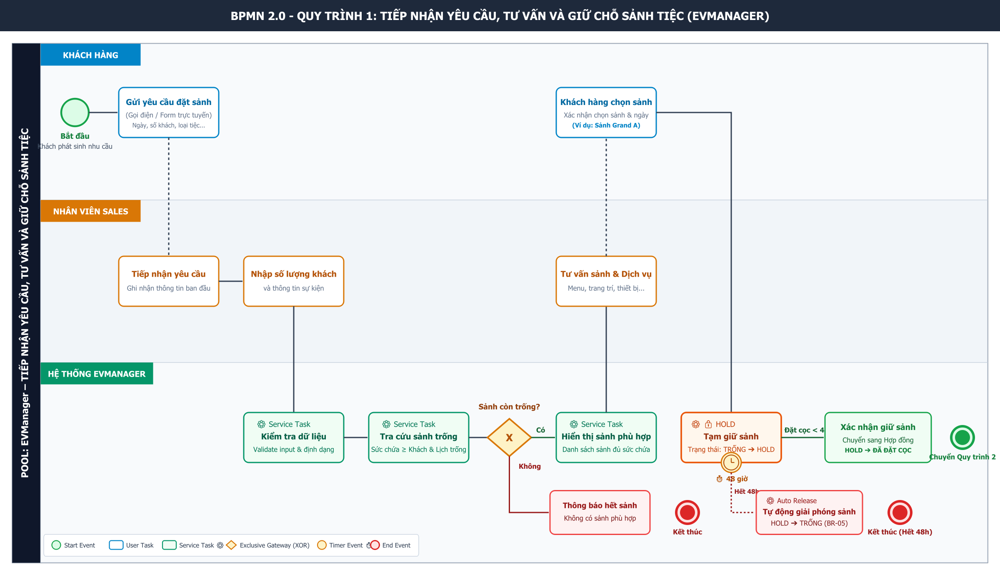

# BA-05: Sơ Đồ BPMN Quy Trình 1 – Tiếp Nhận Yêu Cầu, Tư Vấn Và Giữ Chỗ Sảnh Tiệc

Dự án: **EVManager – Hệ thống quản lý dịch vụ sự kiện**

---

## 1. Sơ đồ BPMN 2.0 Tổng Thể



---

## 2. Cấu Trúc Pool & Swimlane

Sơ đồ được thiết kế với **1 Pool** duy nhất đại diện cho hệ thống EVManager và **3 Swimlanes** tương ứng với các vai trò thực thi:

| Swimlane | Vai trò & Trách nhiệm |
| :--- | :--- |
| **KHÁCH HÀNG** | Phát sinh nhu cầu, gửi thông tin yêu cầu (gọi điện/form), chọn sảnh phù hợp và thực hiện đặt cọc trong thời hạn giữ chỗ. |
| **NHÂN VIÊN SALES** | Tiếp nhận yêu cầu từ khách hàng, ghi nhận vào hệ thống, nhập thông tin quy mô/số lượng khách, tư vấn sảnh & các dịch vụ đi kèm. |
| **HỆ THỐNG EVMANAGER** | Tự động kiểm tra dữ liệu, tra cứu lịch và sức chứa sảnh, điều hướng gateway kiểm tra sảnh trống, tạm giữ sảnh (HOLD), theo dõi thời gian 48 giờ và tự động giải phóng sảnh khi hết hạn cọc. |

---

## 3. Sơ Đồ BPMN Dạng Text / ASCII

```
┌─────────────────────────────────────────────────────────────────────────────┐
│ POOL: EVManager – TIẾP NHẬN YÊU CẦU, TƯ VẤN VÀ GIỮ CHỖ SẢNH TIỆC           │
├──────────────────────┬───────────────────────┬──────────────────────────────┤
│ KHÁCH HÀNG           │ NHÂN VIÊN SALES       │ HỆ THỐNG EVMANAGER           │
├──────────────────────┼───────────────────────┼──────────────────────────────┤
│                      │                       │                              │
│  ○ Bắt đầu           │                       │                              │
│       │              │                       │                              │
│       ▼              │                       │                              │
│ Gửi yêu cầu          │                       │                              │
│ (Gọi điện/Form)      │                       │                              │
│       │              │                       │                              │
│       └─────────────►│                       │                              │
│                      │                       │                              │
│                      ▼                       │                              │
│                Tiếp nhận yêu cầu            │                              │
│                      │                       │                              │
│                      ▼                       │                              │
│                Nhập số lượng khách          │                              │
│                      │                       │                              │
│                      └──────────────────────►│                              │
│                                              ▼                              │
│                                       Kiểm tra dữ liệu                      │
│                                              │                              │
│                                              ▼                              │
│                                       Tra cứu sảnh trống                   │
│                                              │                              │
│                                              ▼                              │
│                                      ◇ Sảnh còn trống?                     │
│                                        /          \                         │
│                                      Có            Không                    │
│                                      │               │                      │
│                                      ▼               ▼                      │
│                               Hiển thị sảnh      Thông báo                  │
│                                  phù hợp         hết sảnh                   │
│                                      │               │                      │
│                                      ▼               ▼                      │
│                              Tư vấn sảnh       Kết thúc                     │
│                              và dịch vụ             │                      │
│                                      │                                      │
│                      ◄───────────────┘                                      │
│                      │                                                      │
│                      ▼                                                      │
│                Khách hàng chọn sảnh                                         │
│                      │                                                      │
│                      └──────────────────────►│                              │
│                                              ▼                              │
│                                         Tạm giữ sảnh                        │
│                                              │                              │
│                                              ▼                              │
│                                         🔒 HOLD                             │
│                                              │                              │
│                                              ▼                              │
│                                      ⏱ Timer 48 giờ                        │
│                                      /              \                       │
│                              Có đặt cọc              Hết 48h                │
│                                  │                      │                   │
│                                  ▼                      ▼                   │
│                            Chuyển sang             Tự động                 │
│                         Hợp đồng/Đặt cọc        giải phóng sảnh             │
│                                                         │                   │
│                                                         ▼                   │
│                                                       Kết thúc              │
└─────────────────────────────────────────────────────────────────────────────┘
```

---

## 4. Danh Sách BPMN Elements Sử Dụng

| STT | Element BPMN | Tên trên sơ đồ | Swimlane | Chức năng & Nghiệp vụ |
| :---: | :--- | :--- | :--- | :--- |
| **1** | **Start Event** | Khách hàng có nhu cầu đặt sảnh | Khách hàng | Khách hàng phát sinh nhu cầu tổ chức sự kiện/tiệc cưới. |
| **2** | **Task** | Gửi yêu cầu qua gọi điện/Form | Khách hàng | Gửi thông tin ngày, số khách, loại tiệc cho trung tâm. |
| **3** | **Task** | Tiếp nhận yêu cầu | Nhân viên Sales | Sales tiếp nhận thông tin từ các kênh tiếp thị/hotline. |
| **4** | **Task** | Nhập số lượng khách | Nhân viên Sales | Nhập số lượng khách dự kiến & thông tin sự kiện vào EVManager. |
| **5** | **Service Task** ⚙️ | Kiểm tra dữ liệu yêu cầu | EVManager | Hệ thống validate định dạng dữ liệu và tính hợp lệ của input. |
| **6** | **Service Task** ⚙️ | Tra cứu sảnh trống | EVManager | Tự động đối chiếu lịch sảnh, trạng thái sảnh & sức chứa $\ge$ số khách. |
| **7** | **Exclusive Gateway (XOR)** ◇ | Sảnh còn trống? | EVManager | Phân nhánh kiểm tra xem có sảnh khả dụng phù hợp không. |
| **8A**| **Service Task** ⚙️ | Hiển thị sảnh phù hợp | EVManager | Trả về danh sách sảnh trống đáp ứng quy mô tiệc. |
| **8B**| **Service Task** ⚙️ | Thông báo hết sảnh | EVManager | Gửi thông báo không có sảnh trống phù hợp và kết thúc luồng. |
| **9** | **Task** | Tư vấn sảnh & dịch vụ | Nhân viên Sales | Tư vấn vị trí sảnh, menu, dịch vụ trang trí & gói âm thanh. |
| **10**| **Task** | Chọn sảnh | Khách hàng | Khách hàng chốt lựa chọn sảnh (Ví dụ: Sảnh Grand A). |
| **11**| **Service Task** ⚙️ | Tạm giữ sảnh (HOLD) | EVManager | Đổi trạng thái sảnh từ `TRỐNG` $\rightarrow$ `HOLD`, tự động khóa sảnh. |
| **12**| **Boundary Timer Event** ⏱ | 48 giờ | EVManager | Event kích hoạt đếm ngược 48 giờ kể từ khi kích hoạt HOLD. |
| **13A**| **Task / Service Task** | Xác nhận cọc / Chuyển sang Quy trình 2 | Sales / EVManager | Khách hàng đặt cọc trước khi hết 48h; chuyển trạng thái sảnh thành `ĐÃ ĐẶT CỌC`. |
| **13B**| **Service Task** ⚙️ | Tự động giải phóng sảnh | EVManager | Khi timer 48h kích hoạt mà chưa cọc, hệ thống tự động đổi trạng thái `HOLD` $\rightarrow$ `TRỐNG`. |
| **14**| **End Event** | Kết thúc | EVManager | Hoàn tất giữ sảnh hoặc giải phóng sảnh do hết hạn. |

---

## 5. Mô Tả Chi Tiết Các Bước Nghiệp Vụ

### Bước 1 – Khách hàng gửi yêu cầu
* **Actor:** Khách hàng
* **Mô tả:** Khách hàng phát sinh nhu cầu tổ chức tiệc/hội nghị và liên hệ thông qua hotline hoặc gửi Form trực tuyến trên website/ứng dụng.
* **Thông tin ban đầu bao gồm:**
  * Ngày tổ chức sự kiện
  * Số lượng khách dự kiến
  * Loại sự kiện (Tiệc cưới, Tiệc công ty, Sinh nhật...)
  * Yêu cầu đặc thù về sảnh và dịch vụ đi kèm.

### Bước 2 – Sales tiếp nhận và ghi nhận yêu cầu
* **Actor:** Nhân viên Sales
* **Mô tả:** Sales tiếp nhận thông tin từ kênh gọi điện/Form, mở ứng dụng EVManager và tạo hồ sơ yêu cầu mới. Mục đích là số hóa dữ liệu ngay từ bước đầu để quản lý tập trung.

### Bước 3 – Nhập số lượng khách và thông tin sự kiện
* **Actor:** Nhân viên Sales
* **Mô tả:** Sales nhập số lượng khách dự kiến (VD: 300 khách). Thông tin này quyết định việc lọc danh sách các sảnh có sức chứa phù hợp (sức chứa $\ge 300$ khách).

### Bước 4 – Tra cứu sảnh trống (Service Task)
* **Actor:** Hệ thống EVManager
* **Mô tả:** EVManager tự động thực hiện truy vấn cơ sở dữ liệu dựa trên:
  * Ngày tổ chức và khung giờ tiệc (Sáng/Tối)
  * Sức chứa tối đa của từng sảnh
  * Trạng thái hiện tại của sảnh (`TRỐNG`, `HOLD`, `ĐÃ ĐẶT`).

### Bước 5 – Exclusive Gateway: Sảnh còn trống?
* **Nhánh Có:** Hệ thống hiển thị danh sách các sảnh phù hợp (VD: Sảnh A 300 khách - Trống, Sảnh B 500 khách - Trống).
* **Nhánh Không:** Hệ thống thông báo *"Không tìm thấy sảnh trống phù hợp"* và kết thúc quy trình (hoặc Sales thương lượng chọn ngày khác).

### Bước 6 – Tư vấn sảnh và gói dịch vụ
* **Actor:** Nhân viên Sales
* **Mô tả:** Dựa trên kết quả tra cứu từ hệ thống, Sales gửi hình ảnh, thông số sảnh và bảng giá các gói Set Menu/Dịch vụ để khách hàng tham khảo.

### Bước 7 – Khách hàng chọn sảnh
* **Actor:** Khách hàng
* **Mô tả:** Khách hàng chốt chọn 1 sảnh phù hợp (Ví dụ: Khách xác nhận *"Giữ Sảnh Grand A cho ngày 25/10/2026"*).

### Bước 8 – Tạm giữ sảnh (HOLD) & Boundary Timer 48h
* **Actor:** Hệ thống EVManager
* **Mô tả:** EVManager chuyển trạng thái sảnh từ `TRỐNG` $\rightarrow$ `HOLD`. Hệ thống khóa sảnh trên lịch realtime để ngăn đặt trùng. Đồng thời, một **Boundary Timer Event (48 giờ)** được gắn trực tiếp vào hoạt động này.
* **Xử lý 2 nhánh Timer:**
  1. **Đặt cọc trong 48h:** Khách hàng nộp tiền cọc. Hệ thống chuyển trạng thái `HOLD` $\rightarrow$ `ĐÃ ĐẶT CỌC` và chuyển sang Quy trình 2 (Lập Báo giá & Hợp đồng).
  2. **Quá 48h không đặt cọc:** Timer kích hoạt, EVManager chạy Service Task tự động chuyển sảnh từ `HOLD` $\rightarrow$ `TRỐNG`, đồng thời gửi email/SMS thông báo giải phóng sảnh cho khách hàng và Sales.

---

## 6. Business Rules (Quy Tắc Nghiệp Vụ)

* **BR-01 (Kiểm tra sức chứa):** Sảnh được đề xuất phải có sức chứa tối đa đáp ứng số lượng khách dự kiến ($\text{Sức chứa sảnh} \ge \text{Số khách dự kiến}$).
* **BR-02 (Kiểm tra lịch sảnh):** Hệ thống bắt buộc phải đối chiếu tình trạng lịch sảnh theo ngày và khung giờ tiệc trước khi cho phép tạm giữ.
* **BR-03 (Không giữ trùng sảnh):** Một sảnh tại cùng một khung thời gian không được phép tồn tại 2 trạng thái `HOLD` hoặc `ĐÃ ĐẶT` đồng thời.
* **BR-04 (Thời hạn Hold sảnh):** Sảnh được tạm giữ tối đa 48 giờ tính từ thời điểm kích hoạt trạng thái `HOLD`.
* **BR-05 (Tự động giải phóng sảnh):** Nếu khách hàng không thực hiện đặt cọc hợp lệ trong thời hạn 48 giờ, hệ thống tự động giải phóng sảnh về trạng thái `TRỐNG`.
* **BR-06 (Chuyển tiếp Quy trình):** Việc đặt cọc thành công trong thời hạn 48h là điều kiện bắt buộc để chuyển hồ sơ sang Quy trình 2 (Lập báo giá & Ký hợp đồng).

---

## 7. Hướng Dẫn Vẽ Sơ Đồ Trên Draw.io / Camunda

Khi vẽ trên các công cụ chuẩn BPMN 2.0 như **Draw.io** hoặc **Camunda Modeler**:
1. Sử dụng **BPMN Palette** chính thức.
2. Tạo 1 Pool `EVManager - TIẾP NHẬN YÊU CẦU, TƯ VẤN VÀ GIỮ CHỖ SẢNH TIỆC` với 3 Swimlane: *Khách hàng*, *Nhân viên Sales*, *Hệ thống EVManager*.
3. Không vẽ bước "Chờ 48h" thành 1 Task thông thường; phải dùng **Boundary Timer Event ⏱ 48h** gắn vào cạnh dưới của Service Task `Tạm giữ sảnh (HOLD)`.
4. Đường ra từ Boundary Timer dẫn trực tiếp đến Service Task `Tự động giải phóng sảnh` để thể hiện đúng bản chất sự kiện bất đồng bộ trong BPMN 2.0.
