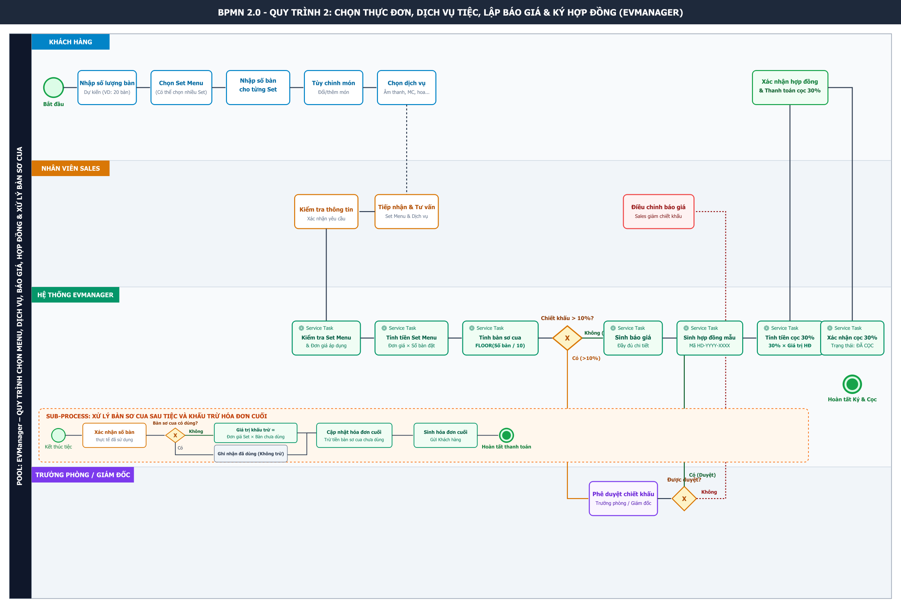

# BA-06: BPMN Quy Trình 2 – Chọn Thực Đơn, Dịch Vụ Tiệc, Lập Báo Giá & Ký Hợp Đồng

Dự án: **EVManager – Hệ thống quản lý dịch vụ sự kiện**

---

## 1. Sơ đồ BPMN 2.0 Tổng Thể



---

## 2. Phạm Vi và Phân Phối Swimlane

Sơ đồ được thiết kế với **1 Pool** duy nhất và **4 Swimlanes** tương ứng với các nhóm tác nhân trong quy trình:

| Swimlane | Vai trò & Trách nhiệm chính |
| :--- | :--- |
| **KHÁCH HÀNG** | Nhập số lượng bàn dự kiến, chọn một hoặc nhiều Set Menu, nhập số lượng từng Set, tùy chỉnh món ăn, chọn gói dịch vụ tiệc, xem/xác nhận báo giá, ký hợp đồng và nộp tiền cọc đợt 1 (30%). Sau tiệc xác nhận số bàn thực tế và nhận hóa đơn cuối. |
| **NHÂN VIÊN SALES** | Tiếp nhận yêu cầu chọn menu/dịch vụ từ khách hàng, tư vấn Set Menu và dịch vụ đi kèm, kiểm tra thông tin, gửi báo giá, điều chỉnh báo giá nếu chiết khấu không được duyệt và gửi hợp đồng cho khách hàng. |
| **HỆ THỐNG EVMANAGER** | Kiểm tra danh mục Set Menu & đơn giá, tự động tính tiền theo công thức, tính số bàn sơ cua $\text{FLOOR}(\text{Số bàn}/10)$, kiểm tra hạn mức chiết khấu (>10%), tự động sinh báo giá, sinh hợp đồng mẫu (`HD-YYYY-XXXX`), tính tiền cọc đợt 1 (30%), ghi nhận thanh toán và tự động tính khấu trừ bàn sơ cua chưa sử dụng sau tiệc. |
| **TRƯỞNG PHÒNG / GIÁM ĐỐC** | Tiếp nhận yêu cầu phê duyệt chiết khấu đặc biệt khi mức chiết khấu $\text{Chiết khấu} > 10\%$, xem xét phê duyệt hoặc từ chối để Sales điều chỉnh. |

---

## 3. Sơ Đồ BPMN Tổng Thể Dạng Text / ASCII

```
┌─────────────────────────────────────────────────────────────────────────────────────────┐
│                              KHÁCH HÀNG                                                  │
│                                                                                         │
│  ● Bắt đầu                                                                              │
│      │                                                                                  │
│      ▼                                                                                  │
│  Nhập số lượng bàn                                                                       │
│      │                                                                                  │
│      ▼                                                                                  │
│  Chọn Set Menu                                                                           │
│      │                                                                                  │
│      ▼                                                                                  │
│  Nhập số lượng từng Set Menu                                                             │
│      │                                                                                  │
│      ▼                                                                                  │
│  Tùy chỉnh món ăn                                                                         │
│      │                                                                                  │
│      ▼                                                                                  │
│  Chọn gói dịch vụ                                                                         │
│      │                                                                                  │
│      │                                                                                  │
│      │                                      ┌─────────────────────┐                       │
│      │                                      │     Xem báo giá     │                       │
│      │                                      └──────────┬──────────┘                       │
│      │                                                 │                                  │
│      │                                          ◇ Đồng ý báo giá?                         │
│      │                                          /              \                          │
│      │                                        Có                Không                     │
│      │                                        │                    │                       │
│      │                                        │                    ▼                       │
│      │                                        │              Yêu cầu điều chỉnh ──────┐  │
│      │                                        │                                         │  │
│      │                                        ▼                                         │  │
│      │                               Xác nhận hợp đồng                                 │  │
│      │                                        │                                         │  │
│      │                                        ▼                                         │  │
│      │                               Thanh toán tiền cọc                               │  │
│      │                                        │                                         │  │
│      │                                        ▼                                         │  │
│      │                                  ● Kết thúc                                      │  │
└──────┼──────────────────────────────────────────────────────────────────────────────────┼──┘
       │                                                                                  │
       │                                                                                  │
┌──────▼──────────────────────────────────────────────────────────────────────────────────┴──┐
│                              NHÂN VIÊN SALES                                                │
│                                                                                             │
│                    Tiếp nhận yêu cầu                                                        │
│                           │                                                                 │
│                           ▼                                                                 │
│                    Tư vấn Set Menu và gói dịch vụ                                           │
│                           │                                                                 │
│                           ▼                                                                 │
│                    Kiểm tra thông tin                                                       │
│                           │                                                                 │
│                           ▼                                                                 │
│                    Gửi báo giá                                                              │
│                           │                                                                 │
│                           │ ◄──────── Yêu cầu điều chỉnh                                    │
│                           │                                                                 │
│                           ▼                                                                 │
│                    Điều chỉnh báo giá                                                       │
│                           │                                                                 │
│                           ▼                                                                 │
│                    Kiểm tra hợp đồng                                                        │
└─────────────────────────────────────────────────────────────────────────────────────────────┘
                           │
                           ▼
┌─────────────────────────────────────────────────────────────────────────────────────────────┐
│                              HỆ THỐNG EVMANAGER                                              │
│                                                                                             │
│                    Kiểm tra Set Menu và đơn giá                                              │
│                              │                                                              │
│                              ▼                                                              │
│                    Tính tiền từng Set Menu (Đơn giá × Số lượng bàn)                          │
│                              │                                                              │
│                              ▼                                                              │
│                    Tính tiền gói dịch vụ                                                    │
│                              │                                                              │
│                              ▼                                                              │
│                    Tính số bàn sơ cua: FLOOR(Số bàn / 10)                                   │
│                              │                                                              │
│                              ▼                                                              │
│                    Tính tổng tiền                                                           │
│                              │                                                              │
│                              ▼                                                              │
│                       ◇ Chiết khấu > 10%?                                                   │
│                         /                  \                                                 │
│                       Có                    Không                                            │
│                        │                       │                                             │
│                        ▼                       │                                             │
│                Chờ phê duyệt                  │                                             │
│                        │                       │                                             │
│                        ▼                       │                                             │
│                  ◇ Được duyệt?                │                                             │
│                   /          \                │                                             │
│                 Có            Không            │                                             │
│                  │              │              │                                             │
│                  │              ▼              │                                             │
│                  │        Điều chỉnh CK ──────┘                                             │
│                  │                                                                         │
│                  └───────────────┬─────────────────────────────────────────────────────────┘
│                                  ▼
│                           Sinh báo giá
│                                  │
│                                  ▼
│                         Sinh hợp đồng mẫu
│                                  │
│                                  ▼
│                         Tính tiền cọc 30%
│                                  │
│                                  ▼
│                         Xác nhận thanh toán
└─────────────────────────────────────────────────────────────────────────────────────────────┘
                           ▲
                           │
┌──────────────────────────┴──────────────────────────────────────────────────────────────────┐
│                         TRƯỞNG PHÒNG / GIÁM ĐỐC                                             │
│                                                                                             │
│                         Nhận yêu cầu phê duyệt                                               │
│                                  │                                                          │
│                                  ▼                                                          │
│                         Phê duyệt chiết khấu                                                 │
│                                  │                                                          │
│                                  ▼                                                          │
│                         Trả kết quả phê duyệt ───────────────► Hệ thống                    │
└─────────────────────────────────────────────────────────────────────────────────────────────┘
```

---

## 4. Công Thức Tính Tiền & Chính Sách Bàn Sơ Cua

### 4.1. Bảng công thức tính tiền hệ thống

| Khoản mục | Công thức tính toán |
| :--- | :--- |
| **Thành tiền từng Set Menu** | $\text{Đơn giá Set Menu} \times \text{Số lượng bàn của Set đó}$ |
| **Tổng tiền Set Menu** | $\sum (\text{Đơn giá từng Set} \times \text{Số lượng từng Set})$ |
| **Tổng tiền dịch vụ** | $\sum \text{Giá các gói dịch vụ chọn thêm}$ |
| **Tổng trước chiết khấu** | $\text{Tổng tiền Set Menu} + \text{Tổng tiền dịch vụ} + \text{Phụ thu tùy chỉnh món}$ |
| **Tổng sau chiết khấu** | $\text{Tổng trước chiết khấu} - \text{Chiết khấu}$ |
| **Số bàn sơ cua được tặng** | $\text{FLOOR}\left(\frac{\text{Số bàn đặt}}{10}\right)$ |
| **Tiền cọc đợt 1 (30%)** | $30\% \times \text{Tổng giá trị hợp đồng sau chiết khấu}$ |
| **Giá trị bàn sơ cua chưa dùng**| $\sum (\text{Đơn giá Set Menu tương ứng} \times \text{Số bàn sơ cua chưa dùng})$ |
| **Hóa đơn cuối sau tiệc** | $\text{Tổng sau chiết khấu} - \text{Giá trị bàn sơ cua chưa dùng} - \text{Tiền cọc đợt 1} \pm \text{Phát sinh hợp lệ}$ |

### 4.2. Chính sách bàn sơ cua

| Số bàn đặt chính thức | Số bàn sơ cua tặng kèm (Không tính tiền ban đầu) |
| :---: | :---: |
| **1 – 9 bàn** | **0 bàn** |
| **10 – 19 bàn** | **1 bàn** |
| **20 – 29 bàn** | **2 bàn** |
| **30 – 39 bàn** | **3 bàn** |
| **40 – 49 bàn** | **4 bàn** |

* **Quy tắc bàn sơ cua:** Bàn sơ cua được chuẩn bị sẵn để dự phòng cho tiệc. Tại thời điểm ký hợp đồng, bàn sơ cua **không tính tiền**. Sau tiệc:
  * Nếu bàn sơ cua **đã sử dụng**: Ghi nhận đã sử dụng, tính tiền bàn sơ cua đó theo giá trị Set Menu tương ứng.
  * Nếu bàn sơ cua **chưa sử dụng**: Hệ thống quy đổi theo đơn giá Set Menu tương ứng và **khấu trừ trực tiếp vào hóa đơn cuối cùng**.

---

## 5. Sơ Đồ BPMN Sub-Process: Xử Lý Bàn Sơ Cua Sau Tiệc

```
┌────────────────────────────── KHÁCH HÀNG ──────────────────────────────────────┐
│                                                                                │
│   ● Bắt đầu                                                                    │
│       │                                                                        │
│       ▼                                                                        │
│   Kết thúc tiệc                                                                │
│       │                                                                        │
│       ▼                                                                        │
│   Xác nhận số bàn thực tế sử dụng                                              │
│       │                                                                        │
│       ▼                                                                        │
│   Nhận hóa đơn cuối cùng                                                       │
│       │                                                                        │
│       ▼                                                                        │
│   ● Kết thúc                                                                    │
│                                                                                │
└────────────────────────────────────────────────────────────────────────────────┘
                         │
                         ▼
┌──────────────────────── NHÂN VIÊN SALES / ĐIỀU PHỐI ───────────────────────────┐
│                                                                                │
│                     Xác nhận số bàn thực tế                                   │
│                              │                                                 │
│                              ▼                                                 │
│                     Đối chiếu bàn sơ cua                                      │
│                              │                                                 │
│                              ▼                                                 │
│                     Xác nhận bàn sơ cua đã dùng                               │
│                              │                                                 │
│                              │                                                 │
│                              ▼                                                 │
│                  ┌─────────────────────────┐                                  │
│                  │                         │                                  │
│                  │  Kiểm tra số bàn thực tế│                                  │
│                  │                         │                                  │
│                  └────────────┬────────────┘                                  │
│                               │                                                │
└───────────────────────────────┼────────────────────────────────────────────────┘
                                │
                                ▼
┌──────────────────────────── HỆ THỐNG EVMANAGER ─────────────────────────────────┐
│                                                                                │
│                    Kiểm tra số bàn sơ cua                                     │
│                              │                                                 │
│                              ▼                                                 │
│                    ◇ Bàn sơ cua có sử dụng?                                  │
│                         /                  \                                   │
│                       Có                    Không                             │
│                       │                       │                                │
│                       ▼                       ▼                                │
│              Ghi nhận bàn đã sử dụng    Xác định Set Menu                     │
│                       │                  tương ứng                              │
│                       │                       │                                │
│                       │                       ▼                                │
│                       │              Xác định số bàn                           │
│                       │              sơ cua chưa sử dụng                       │
│                       │                       │                                │
│                       │                       ▼                                │
│                       │              Tính giá trị khấu trừ                     │
│                       │                       │                                │
│                       │                       ▼                                │
│                       │        Giá trị = Đơn giá Set Menu                     │
│                       │                    × Số bàn chưa dùng                  │
│                       │                       │                                │
│                       │                       ▼                                │
│                       │              Lập khoản khấu trừ                        │
│                       │                       │                                │
│                       └───────────────┬───────┘                                │
│                                       ▼                                        │
│                              Cập nhật hóa đơn cuối                             │
│                                       │                                        │
│                                       ▼                                        │
│                              Trừ tiền bàn sơ cua                               │
│                              chưa sử dụng                                      │
│                                       │                                        │
│                                       ▼                                        │
│                              Sinh hóa đơn cuối                                 │
│                                       │                                        │
└───────────────────────────────────────┼────────────────────────────────────────┘
                                        │
                                        ▼
                              Khách hàng nhận hóa đơn
```

---

## 6. Ví Dụ Tính Toán Nghiệp Vụ Minh Họa

Khách hàng đặt cho sự kiện quy mô **20 bàn**:
* **Cấu hình Set Menu:**
  * 15 bàn chọn **Set Menu A** (Đơn giá: $2.500.000\text{ VNĐ/bàn}$).
  * 5 bàn chọn **Set Menu B** (Đơn giá: $3.500.000\text{ VNĐ/bàn}$).
  * $\text{Tiền Set Menu} = 15 \times 2.500.000 + 5 \times 3.500.000 = 37.500.000 + 17.500.000 = 55.000.000\text{ VNĐ}$.
* **Dịch vụ chọn thêm:** Gói Âm thanh & Ánh sáng sân khấu = $15.000.000\text{ VNĐ}$, Trọn gói trang trí tiệc = $30.000.000\text{ VNĐ}$.
* **Bàn sơ cua được tặng:** $\text{FLOOR}(20 / 10) = 2\text{ bàn sơ cua}$ (Không tính tiền lúc ký hợp đồng).
* **Tổng giá trị hợp đồng:** $55.000.000 + 45.000.000 = 100.000.000\text{ VNĐ}$.
* **Tiền cọc đợt 1 (30%):** $30\% \times 100.000.000 = 30.000.000\text{ VNĐ}$.
* **Xử lý sau tiệc:**
  * Nếu cả 2 bàn sơ cua **không sử dụng** và được xác định quy đổi theo Set Menu A ($2.500.000\text{ VNĐ/bàn}$):
  * $\text{Giá trị khấu trừ} = 2 \times 2.500.000 = 5.000.000\text{ VNĐ}$.
  * $\text{Hóa đơn cuối cần thanh toán} = 100.000.000 - 5.000.000 - 30.000.000 (\text{đã cọc}) = 65.000.000\text{ VNĐ}$.

---

## 7. Business Rules (Quy Tắc Nghiệp Vụ)

| Mã BR | Quy tắc nghiệp vụ chi tiết |
| :---: | :--- |
| **BR-01** | Một Set Menu được tính theo đơn vị 1 bàn. |
| **BR-02** | Một buổi tiệc có thể chọn nhiều Set Menu khác nhau với nhiều mức giá tương ứng. |
| **BR-03** | Thành tiền từng Set Menu = $\text{Đơn giá Set Menu} \times \text{Số lượng bàn}$. |
| **BR-04** | Khách hàng có quyền thay đổi, thêm, bớt hoặc nâng cấp món ăn trong Set Menu theo chính sách nhà hàng (hệ thống tự động tính phụ thu nếu có). |
| **BR-05** | Khách hàng được lựa chọn nhiều gói dịch vụ tiệc (âm thanh, ánh sáng, MC, trang trí) theo nhu cầu. |
| **BR-06** | Hệ thống EVManager tự động cập nhật tổng tiền realtime khi có thay đổi về số lượng bàn, thực đơn hoặc dịch vụ. |
| **BR-07** | Số lượng bàn sơ cua tự động tính bằng $\text{FLOOR}(\text{Số bàn đặt} / 10)$. |
| **BR-08** | Bàn sơ cua tuyệt đối không tính tiền tại thời điểm lập báo giá và giao kết hợp đồng. |
| **BR-09** | Bàn sơ cua không sử dụng sau tiệc bắt buộc phải quy đổi theo đơn giá Set Menu tương ứng để khấu trừ vào hóa đơn cuối. |
| **BR-10** | Tỷ lệ chiết khấu $\text{Chiết khấu} > 10\%$ bắt buộc phải qua bước phê duyệt của Trưởng phòng / Giám đốc trên hệ thống. |
| **BR-11** | Tiền cọc đợt 1 bắt buộc bằng $30\%$ tổng giá trị hợp đồng sau chiết khấu. |
| **BR-12** | Hợp đồng sinh ra phải thể hiện đầy đủ: Mã HĐ, danh sách Set Menu, số lượng bàn, các gói dịch vụ, bàn sơ cua, giá tiền, chiết khấu và điều khoản thanh toán. |
| **BR-13** | Hợp đồng phải quy định chi tiết điều kiện hủy tiệc, mức phạt hủy và phương án xử lý tiền cọc. |
| **BR-14** | Mức phạt hủy cụ thể phải tuân thủ chính sách nhà hàng/hợp đồng được phê duyệt, không tự suy diễn nếu chưa có quy định. |

---

## 8. Quyết Định Đầu Ra Quy Trình

Quy trình BA-06 tạo ra các kết quả đầu ra chuẩn hóa trên hệ thống EVManager:
1. Thông tin tổng số lượng bàn đặt và lịch sự kiện.
2. Danh sách các Set Menu kèm số lượng bàn cho từng Set.
3. Đơn giá và thành tiền chi tiết của từng Set Menu.
4. Danh sách chi tiết các món ăn đã tùy chỉnh.
5. Danh sách các gói dịch vụ tiệc được chọn.
6. Số lượng bàn sơ cua được tặng kèm theo quy định.
7. Bảng báo giá chính thức và lịch sử phê duyệt chiết khấu.
8. Hợp đồng dịch vụ tiệc/sự kiện (Mã dạng `HD-YYYY-XXXX`).
9. Thông tin tiền cọc đợt 1 (30%) và trạng thái thanh toán (`ĐÃ CỌC`).
10. Ghi nhận số bàn sơ cua thực tế sử dụng sau tiệc.
11. Hóa đơn quyết toán cuối cùng kèm khoản khấu trừ bàn sơ cua chưa dùng.
