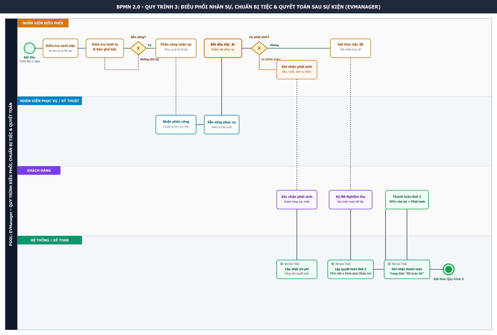

# BA-07: BPMN Quy Trình 3 – Điều Phối Nhân Sự, Chuẩn Bị Tiệc & Quyết Toán Sau Sự Kiện

Dự án: **EVManager – Hệ thống quản lý dịch vụ sự kiện**

---

## 1. Sơ đồ BPMN 2.0 Tổng Thể



---

## 2. Cấu Trúc Pool & Swimlane

Sơ đồ được thiết kế với **1 Pool** duy nhất và **4 Swimlanes** tương ứng với các vai trò thực thi:

| Swimlane | Vai trò & Trách nhiệm chính |
| :--- | :--- |
| **NHÂN VIÊN ĐIỀU PHỐI** | Trực tiếp kiểm tra sảnh tiệc, kiểm tra trang thiết bị & bàn ghế trước tiệc 1 ngày, phân công nhân viên phục vụ & kỹ thuật, kiểm tra công tác chuẩn bị, bắt đầu tiệc, giám sát quá trình phục vụ, ghi nhận dịch vụ phát sinh và đối chiếu thực tế sau tiệc. |
| **NHÂN VIÊN PHỤC VỤ / KỸ THUẬT** | Nhận nhiệm vụ phân công, chuẩn bị khu vực phục vụ/âm thanh/ánh sáng, sẵn sàng phục vụ, thực hiện công tác phục vụ tiệc và báo cáo các khoản phát sinh cho Điều phối. |
| **KHÁCH HÀNG** | Tham dự tiệc, xác nhận dịch vụ phát sinh trong tiệc (bàn tiệc thêm, đồ uống, thiết bị bổ sung), kiểm tra chất lượng dịch vụ sau khi kết thúc tiệc, ký biên bản nghiệm thu và thực hiện thanh toán đợt 2 (70% còn lại). |
| **HỆ THỐNG / KẾ TOÁN** | Tiếp nhận thông tin phát sinh, cập nhật chi phí phát sinh, kế toán lập bảng quyết toán đợt 2 theo công thức $\text{Quyết toán đợt 2} = 70\% \text{ HĐ} + \text{Phát sinh} - \text{Khấu trừ}$, ghi nhận thanh toán và cập nhật trạng thái hợp đồng thành `"Đã hoàn tất"`. |

---

## 3. Sơ Đồ BPMN Dạng Text / ASCII

```
┌──────────────────────────── NHÂN VIÊN ĐIỀU PHỐI ──────────────────────────────┐
│                                                                                │
│  ● Bắt đầu                                                                    │
│      │                                                                         │
│      ▼                                                                         │
│  Trước tiệc 1 ngày                                                            │
│      │                                                                         │
│      ▼                                                                         │
│  Kiểm tra sảnh tiệc                                                            │
│      │                                                                         │
│      ▼                                                                         │
│  Kiểm tra bàn ghế, trang thiết bị                                              │
│      │                                                                         │
│      ▼                                                                         │
│  Phân công nhân viên phục vụ                                                   │
│      │                                                                         │
│      ▼                                                                         │
│  Phân công nhân viên kỹ thuật                                                  │
│      │                                                                         │
│      ▼                                                                         │
│  Kiểm tra công tác chuẩn bị                                                    │
│      │                                                                         │
│      ▼                                                                         │
│  Bắt đầu tiệc                                                                  │
│      │                                                                         │
│      ▼                                                                         │
│  Giám sát quá trình phục vụ                                                    │
│      │                                                                         │
│      ▼                                                                         │
│  Ghi nhận dịch vụ phát sinh                                                    │
│      │                                                                         │
│      │                                                                         │
│      ▼                                                                         │
│  Kết thúc tiệc                                                                 │
│      │                                                                         │
│      ▼                                                                         │
│  Kiểm tra thực tế & đối chiếu phát sinh                                        │
│      │                                                                         │
└──────┼─────────────────────────────────────────────────────────────────────────┘
       │
       ▼
┌──────────────────── NHÂN VIÊN PHỤC VỤ / KỸ THUẬT ─────────────────────────────┐
│                                                                                │
│                   Nhận phân công                                               │
│                        │                                                       │
│                        ▼                                                       │
│                   Chuẩn bị khu vực phục vụ / kỹ thuật                          │
│                        │                                                       │
│                        ▼                                                       │
│                   Sẵn sàng phục vụ                                             │
│                        │                                                       │
│                        ▼                                                       │
│                   Phục vụ tiệc                                                 │
│                        │                                                       │
│                        ▼                                                       │
│                   Thực hiện dịch vụ âm thanh / ánh sáng                        │
│                        │                                                       │
│                        ▼                                                       │
│                   Báo phát sinh cho Điều phối                                  │
│                                                                                │
└────────────────────────────────────────────────────────────────────────────────┘
       │
       │
       ▼
┌────────────────────────────── KHÁCH HÀNG ──────────────────────────────────────┐
│                                                                                │
│                         Tham dự tiệc                                           │
│                              │                                                 │
│                              ▼                                                 │
│                       Xác nhận dịch vụ phát sinh nếu có                        │
│                              │                                                 │
│                              ▼                                                 │
│                       Kiểm tra kết quả sau khi kết thúc                        │
│                              │                                                 │
│                              ▼                                                 │
│                     Ký biên bản nghiệm thu                                     │
│                              │                                                 │
│                              ▼                                                 │
│                         Thanh toán đợt 2 (70%)                                 │
│                                                                                │
└────────────────────────────────────────────────────────────────────────────────┘
       │
       ▼
┌──────────────────────── HỆ THỐNG / KẾ TOÁN ────────────────────────────────────┐
│                                                                                │
│                    Tiếp nhận thông tin phát sinh                               │
│                              │                                                 │
│                              ▼                                                 │
│                    Cập nhật dịch vụ phát sinh                                  │
│                              │                                                 │
│                              ▼                                                 │
│                    Tính chi phí phát sinh                                      │
│                              │                                                 │
│                              ▼                                                 │
│                    Cập nhật tổng giá trị quyết toán                            │
│                              │                                                 │
│                              ▼                                                 │
│                    Khách ký nghiệm thu                                         │
│                              │                                                 │
│                              ▼                                                 │
│                    Kế toán lập bảng quyết toán đợt 2                           │
│                              │                                                 │
│                              ▼                                                 │
│                    70% giá trị còn lại                                         │
│                              │                                                 │
│                              ▼                                                 │
│                    Ghi nhận thanh toán                                         │
│                              │                                                 │
│                              ▼                                                 │
│                    Cập nhật trạng thái hợp đồng = "Đã hoàn tất"                │
│                              │                                                 │
│                              ▼                                                 │
│                            ● Kết thúc                                          │
│                                                                                │
└────────────────────────────────────────────────────────────────────────────────┘
```

---

## 4. Các Exclusive Gateways Trong Quy Trình

### Gateway 1 – Sảnh & Thiết bị đã sẵn sàng?
```
Kiểm tra sảnh & thiết bị
           │
           ▼
     ◇ Sẵn sàng?
      /        \
    Có          Không
    │             │
    ▼             ▼
Tiếp tục    Xử lý thiếu sót & bổ sung
```
* **Nhánh Có:** Tiến hành phân công nhân viên phục vụ và kỹ thuật.
* **Nhánh Không:** Yêu cầu bộ phận kho/kỹ thuật bổ sung trang thiết bị, thay thế đồ hỏng hóc hoặc làm sạch sảnh tiệc trước khi cho phép phục vụ.

### Gateway 2 – Có dịch vụ phát sinh trong tiệc?
```
Giám sát tiệc
      │
      ▼
◇ Có phát sinh?
 /          \
Có           Không
│              │
▼              ▼
Ghi nhận      Tiếp tục phục vụ
phát sinh          │
 \                /
  ────────────────
         │
         ▼
   Kết thúc tiệc
```
* **Các khoản phát sinh bao gồm:**
  * Phát sinh thêm bàn tiệc ngoài hợp đồng ban đầu.
  * Đồ uống/nước giải khát gọi thêm ngoài gói.
  * Dịch vụ kéo dài thời gian tiệc hoặc thiết bị bổ sung.
  * Các chi phí phát sinh khác được khách hàng xác nhận tại chỗ.

---

## 5. Quy Tắc Quyết Toán Tài Chính Đợt 2

Theo chính sách của hệ thống EVManager:
* **Đợt 1:** $30\%$ tổng giá trị hợp đồng khi ký kết hợp đồng chính thức (Quy trình 2).
* **Đợt 2:** $70\%$ giá trị còn lại + cộng/trừ các khoản phát sinh và khấu trừ hợp lệ sau khi tiệc kết thúc.

$$\text{Quyết toán Đợt 2} = (70\% \times \text{Giá trị hợp đồng}) + \text{Chi phí phát sinh} - \text{Khấu trừ bàn sơ cua chưa dùng}$$

Sau khi khách hàng ký biên bản nghiệm thu và hoàn tất thanh toán Đợt 2, hệ thống tự động cập nhật trạng thái hợp đồng từ `ĐANG THỰC HIỆN` $\rightarrow$ `ĐÃ HOÀN TẤT`.
