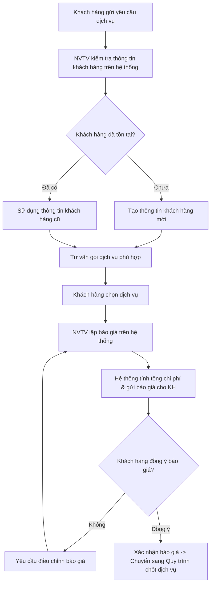
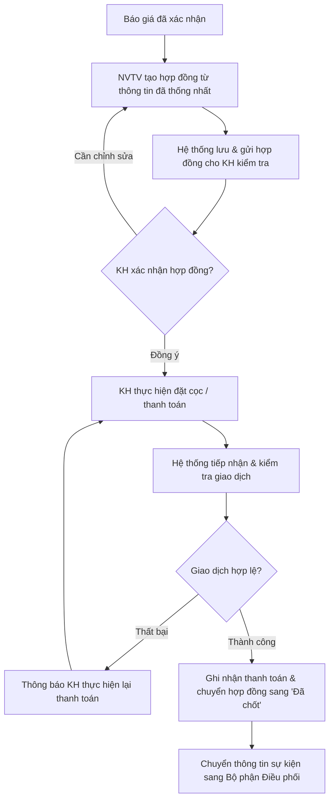
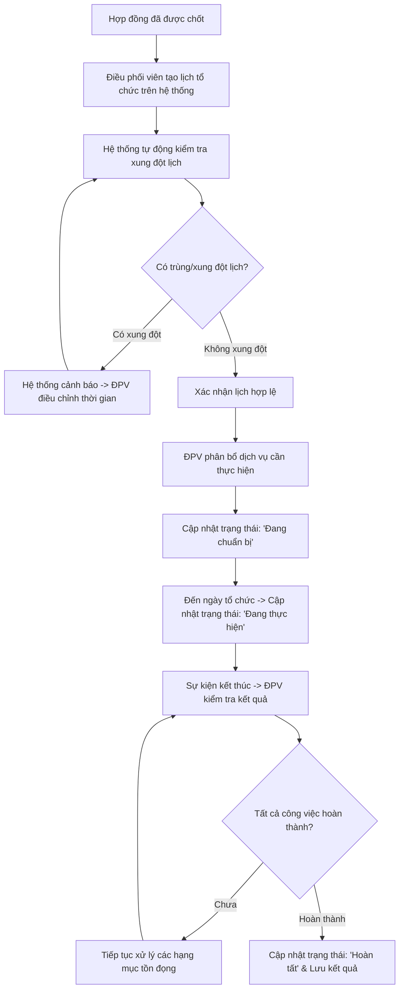

# Business Requirements Document (BRD) - Hệ Thống Quản Lý Dịch Vụ Sự Kiện

## 1. Stakeholders & Actors

### 1.1. Stakeholders (Các bên liên quan)

* **Stakeholder chính:**
  * **Admin / Quản lý:** Theo dõi tình hình kinh doanh, báo cáo, phân quyền và kiểm soát toàn hệ thống.
  * **Nhân viên tư vấn:** Trực tiếp tương tác với khách hàng, tư vấn gói dịch vụ, lập báo giá và theo dõi hợp đồng.
  * **Điều phối sự kiện:** Quản lý lịch trình, kiểm tra xung đột, phân bổ dịch vụ và giám sát tiến độ thực hiện sự kiện.
  * **Khách hàng:** Trực tiếp gửi yêu cầu, xem/xác nhận báo giá & hợp đồng, thực hiện thanh toán và theo dõi tiến độ sự kiện.
* **Stakeholder phụ:**
  * **Đơn vị cung cấp dịch vụ:** Cung cấp dịch vụ/thiết bị phụ trợ cho sự kiện.
  * **Bộ phận kế toán/thanh toán:** Đối soát doanh thu, hóa đơn và giao dịch tài chính (nếu có tham gia quy trình thực tế).

---

### 1.2. Actor – Các tác nhân của hệ thống

Actor là đối tượng bên ngoài tương tác trực tiếp với hệ thống để thực hiện một hoặc nhiều Use Case.

| STT | Actor | Mục đích | Danh sách chức năng / Use Case tương tác |
| :--- | :--- | :--- | :--- |
| 1 | **Admin / Quản lý** | Quản lý và kiểm soát toàn bộ hệ thống. | • Đăng nhập / Đăng xuất<br>• Quản lý User<br>• Quản lý Role và phân quyền<br>• Quản lý khách hàng<br>• Quản lý gói dịch vụ<br>• Quản lý hợp đồng<br>• Quản lý thanh toán<br>• Quản lý lịch sự kiện<br>• Cập nhật trạng thái sự kiện<br>• Xem Dashboard<br>• Xem báo cáo / Thống kê<br>• Import / Export dữ liệu<br>• Gửi thông báo |
| 2 | **Nhân viên tư vấn** | Tiếp nhận nhu cầu và tư vấn dịch vụ cho khách hàng. | • Đăng nhập / Đăng xuất<br>• Quản lý thông tin khách hàng<br>• Xem / Quản lý gói dịch vụ<br>• Tiếp nhận yêu cầu<br>• Tạo báo giá<br>• Gửi báo giá cho khách hàng<br>• Quản lý hợp đồng<br>• Theo dõi thanh toán<br>• Gửi thông báo |
| 3 | **Điều phối sự kiện** | Quản lý và điều phối việc thực hiện sự kiện. | • Đăng nhập / Đăng xuất<br>• Xem lịch sự kiện<br>• Tạo / Cập nhật lịch<br>• Kiểm tra xung đột lịch<br>• Theo dõi dịch vụ cần thực hiện<br>• Cập nhật trạng thái sự kiện<br>• Thông báo tình trạng sự kiện |
| 4 | **Khách hàng** | Sử dụng và theo dõi dịch vụ sự kiện. | • Đăng nhập / Đăng xuất<br>• Xem gói dịch vụ<br>• Gửi yêu cầu dịch vụ<br>• Nhận / Xem báo giá<br>• Xác nhận báo giá<br>• Xem / Xác nhận hợp đồng<br>• Đặt cọc / Thanh toán<br>• Theo dõi trạng thái sự kiện<br>• Nhận thông báo |

---

## 2. Problem Statement (Phát Biểu Vấn Đề)

### 2.1. Vấn đề hiện tại
Các hoạt động quản lý dịch vụ sự kiện như tiếp nhận thông tin khách hàng, tư vấn gói dịch vụ, lập báo giá, quản lý lịch sự kiện, hợp đồng và thanh toán có thể được thực hiện phân tán hoặc thủ công. Điều này gây khó khăn trong việc theo dõi thông tin, dễ xảy ra sai sót và đặc biệt là trùng lịch sự kiện hoặc thiếu đồng bộ giữa các bộ phận.

Bên cạnh đó, người quản lý khó có thể theo dõi tình hình kinh doanh, doanh thu, số lượng sự kiện và trạng thái xử lý một cách nhanh chóng nếu dữ liệu chưa được tập trung.

### 2.2. Problem Statement hoàn chỉnh
> **Công ty kinh doanh dịch vụ cưới hỏi/sự kiện đang gặp khó khăn trong việc quản lý tập trung thông tin khách hàng, gói dịch vụ, yêu cầu/báo giá, hợp đồng, thanh toán và lịch sự kiện. Việc quản lý thiếu đồng bộ có thể dẫn đến sai sót dữ liệu, trùng lịch, khó theo dõi tiến độ và mất nhiều thời gian khi tổng hợp báo cáo. Vì vậy, cần xây dựng một hệ thống quản lý tổng thể cho dịch vụ sự kiện nhằm tập trung dữ liệu, hỗ trợ phân quyền người dùng, tự động kiểm tra xung đột lịch, quản lý quy trình từ tư vấn đến hoàn tất sự kiện và cung cấp dashboard/báo cáo để hỗ trợ quản lý ra quyết định.**

### 2.3. Mục tiêu giải quyết vấn đề
Hệ thống cần đáp ứng 10 mục tiêu lõi sau:
1. **Tập trung dữ liệu khách hàng và dịch vụ.**
2. **Hỗ trợ tư vấn và báo giá.**
3. **Quản lý hợp đồng và thanh toán.**
4. **Quản lý lịch sự kiện.**
5. **Kiểm tra trùng / xung đột lịch.**
6. **Theo dõi trạng thái sự kiện.**
7. **Phân quyền theo từng vai trò.**
8. **Cung cấp Dashboard và báo cáo.**
9. **Hỗ trợ Import / Export dữ liệu.**
10. **Gửi thông báo cho các bên liên quan.**

---

## 3. Step-by-Step 3 Quy Trình Lõi

### 3.1. Quy trình tiếp nhận và tư vấn

#### Chi tiết các bước thực hiện:
1. **Gửi yêu cầu:** Quy trình bắt đầu khi khách hàng có nhu cầu sử dụng dịch vụ sự kiện và gửi yêu cầu cho hệ thống. Khách hàng cung cấp các thông tin cần thiết như thông tin cá nhân, loại sự kiện, thời gian tổ chức, địa điểm và những dịch vụ mong muốn.
2. **Kiểm tra thông tin khách hàng:** Sau khi tiếp nhận yêu cầu, nhân viên tư vấn kiểm tra thông tin khách hàng trên hệ thống. 
   * Nếu khách hàng chưa có trong hệ thống, nhân viên sẽ tạo thông tin khách hàng mới.
   * Nếu đã tồn tại, hệ thống sẽ sử dụng thông tin khách hàng đã được lưu trước đó.
3. **Tư vấn và lựa chọn dịch vụ:** Nhân viên tư vấn dựa trên nhu cầu của khách hàng để tư vấn các gói dịch vụ phù hợp. Khách hàng lựa chọn các dịch vụ mong muốn.
4. **Lập và gửi báo giá:** Nhân viên tiến hành lập báo giá. Hệ thống dựa trên các dịch vụ và đơn giá đã lựa chọn để tính toán tổng chi phí, lưu thông tin báo giá và gửi báo giá cho khách hàng.
5. **Phản hồi & Xác nhận báo giá:** Khách hàng xem báo giá và đưa ra quyết định:
   * **Nếu đồng ý:** Báo giá được xác nhận và chuyển sang bước chốt dịch vụ.
   * **Nếu chưa đồng ý:** Khách hàng yêu cầu điều chỉnh, nhân viên tư vấn sẽ cập nhật báo giá trên hệ thống và gửi lại.

* **Kết quả:** Hệ thống có thông tin khách hàng, yêu cầu dịch vụ và báo giá đã được xác nhận.

#### Biểu đồ quy trình (Flowchart):


---

### 3.2. Quy trình chốt dịch vụ

#### Chi tiết các bước thực hiện:
1. **Tạo hợp đồng:** Sau khi khách hàng xác nhận báo giá, nhân viên tư vấn tiến hành tạo hợp đồng dựa trên các thông tin dịch vụ đã thống nhất.
2. **Gửi và kiểm tra hợp đồng:** Hợp đồng được lưu trên hệ thống và gửi cho khách hàng kiểm tra. Khách hàng xem các nội dung như dịch vụ sử dụng, thời gian, địa điểm, chi phí và các điều khoản trong hợp đồng.
3. **Xác nhận & Thanh toán đặt cọc:** 
   * Nếu khách hàng đồng ý, khách hàng xác nhận hợp đồng và tiến hành đặt cọc hoặc thanh toán theo thỏa thuận.
   * Hệ thống tiếp nhận thông tin thanh toán và kiểm tra giao dịch.
4. **Xử lý giao dịch:**
   * **Thanh toán hợp lệ:** Hệ thống ghi nhận giao dịch, cập nhật trạng thái thanh toán, chuyển trạng thái hợp đồng sang "Đã chốt".
   * **Thanh toán thất bại:** Hệ thống thông báo cho khách hàng để thực hiện lại giao dịch.
5. **Chuyển điều phối:** Sau khi hợp đồng được chốt, thông tin sự kiện được chuyển sang bộ phận điều phối để chuẩn bị và tổ chức sự kiện.

* **Kết quả:** Hợp đồng được xác nhận, khoản đặt cọc/thanh toán được ghi nhận và dịch vụ chính thức được chốt.

#### Biểu đồ quy trình (Flowchart):


---

### 3.3. Quy trình điều phối sự kiện

#### Chi tiết các bước thực hiện:
1. **Tạo lịch sự kiện:** Quy trình bắt đầu khi hợp đồng đã được xác nhận. Điều phối viên tiếp nhận thông tin sự kiện và tiến hành tạo lịch tổ chức trên hệ thống.
2. **Kiểm tra xung đột lịch:** Sau khi tạo lịch, hệ thống tự động kiểm tra ngày, thời gian và các lịch sự kiện khác để phát hiện khả năng xung đột.
   * **Nếu lịch bị trùng:** Hệ thống thông báo cho điều phối viên. Điều phối viên xem các lịch trùng và điều chỉnh ngày/thời gian tổ chức, sau đó hệ thống kiểm tra lại.
   * **Khi không còn xung đột:** Lịch sự kiện được xác nhận là hợp lệ.
3. **Phân bổ dịch vụ & Chuẩn bị:** Điều phối viên phân bổ các dịch vụ cần thực hiện cho sự kiện. Hệ thống lưu danh sách dịch vụ và cập nhật trạng thái sự kiện (Ví dụ: `Đã lên lịch` → `Đang chuẩn bị`).
4. **Thực hiện sự kiện:** Khi đến thời gian tổ chức, điều phối viên theo dõi và giám sát quá trình thực hiện sự kiện. Hệ thống cập nhật trạng thái sang `Đang thực hiện`.
5. **Hoàn tất sự kiện:** Sau khi sự kiện kết thúc, điều phối viên kiểm tra kết quả:
   * **Mọi công việc đã hoàn thành:** Hệ thống cập nhật trạng thái sự kiện thành `Hoàn tất` và lưu thông tin kết quả.
   * **Chưa hoàn thành:** Điều phối viên tiếp tục xử lý và cập nhật trạng thái cho đến khi hoàn tất.

* **Kết quả:** Sự kiện được lên lịch, điều phối, thực hiện và cập nhật trạng thái hoàn tất trên hệ thống.

#### Biểu đồ quy trình (Flowchart):


---

## 4. Danh Sách Use Case Chính (Draft Use Cases)

Các Use Case của hệ thống được chia thành 5 nhóm nghiệp vụ chính:

```
┌────────────────────────────────────────────────────────────────────────────────────────┐
│                                 DANH SÁCH USE CASE CHÍNH                               │
├───────────────────────┬───────────────────────────┬────────────────────────────────────┤
│ Nhóm Nghiệp Vụ        │ Mã Use Case               │ Tên Use Case                       │
├───────────────────────┼───────────────────────────┼────────────────────────────────────┤
│ 1. Quản lý hệ thống   │ UC01                      │ Đăng nhập / Đăng xuất              │
│                       │ UC02                      │ Quản lý User & Role                │
├───────────────────────┼───────────────────────────┼────────────────────────────────────┤
│ 2. Tiếp nhận & tư vấn │ UC03                      │ Quản lý khách hàng                 │
│                       │ UC04                      │ Quản lý gói dịch vụ                │
│                       │ UC05                      │ Tạo yêu cầu / Báo giá              │
├───────────────────────┼───────────────────────────┼────────────────────────────────────┤
│ 3. Chốt dịch vụ       │ UC08                      │ Quản lý hợp đồng                   │
│                       │ UC09                      │ Đặt cọc / Thanh toán               │
├───────────────────────┼───────────────────────────┼────────────────────────────────────┤
│ 4. Điều phối sự kiện  │ UC06                      │ Quản lý lịch sự kiện               │
│                       │ UC07                      │ Kiểm tra xung đột lịch             │
│                       │ UC10                      │ Cập nhật trạng thái sự kiện        │
├───────────────────────┼───────────────────────────┼────────────────────────────────────┤
│ 5. Quản lý & báo cáo  │ UC11                      │ Dashboard                          │
│                       │ UC12                      │ Báo cáo & Thống kê                 │
│                       │ UC13                      │ Import / Export dữ liệu            │
│                       │ UC14                      │ Gửi thông báo                      │
└───────────────────────┴───────────────────────────┴────────────────────────────────────┘
```

### Chi tiết phân bổ Use Case theo Actor

| Use Case ID | Tên Use Case | Admin / Quản lý | Nhân viên tư vấn | Điều phối sự kiện | Khách hàng |
| :--- | :--- | :---: | :---: | :---: | :---: |
| **UC01** | Đăng nhập / Đăng xuất | x | x | x | x |
| **UC02** | Quản lý User & Role | x | | | |
| **UC03** | Quản lý khách hàng | x | x | | |
| **UC04** | Quản lý gói dịch vụ | x | x | | x |
| **UC05** | Tạo yêu cầu / Báo giá | | x | | x |
| **UC06** | Quản lý lịch sự kiện | x | | x | |
| **UC07** | Kiểm tra xung đột lịch | | | x | |
| **UC08** | Quản lý hợp đồng | x | x | | x |
| **UC09** | Đặt cọc / Thanh toán | x | x | | x |
| **UC10** | Cập nhật trạng thái sự kiện | x | | x | x |
| **UC11** | Dashboard | x | | | |
| **UC12** | Báo cáo & Thống kê | x | | | |
| **UC13** | Import / Export dữ liệu | x | | | |
| **UC14** | Gửi thông báo | x | x | x | x |
