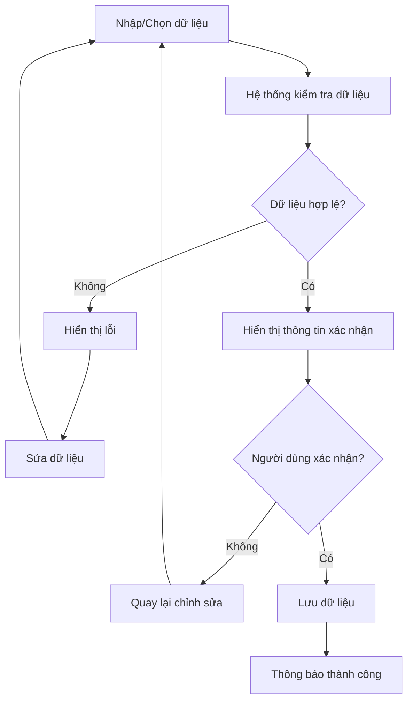

# UC-08: Tự động tính toán chi phí và lập bảng báo giá tiệc cưới

Dự án: **EVManager – Hệ thống quản lý dịch vụ sự kiện**

---

## 1. Thông tin Use Case

| Thành phần | Nội dung |
| :--- | :--- |
| **Mã Use Case** | UC-08 |
| **Tên Use Case** | Tự động tính toán chi phí và lập bảng báo giá tiệc cưới |
| **Actor chính** | Nhân viên Tư vấn (Sales) |
| **Actor phụ** | Khách hàng |
| **Actor liên quan** | Hệ thống EVManager |
| **Mục tiêu** | Tự động tổng hợp chi phí từ Set Menu, dịch vụ bổ sung, dịch vụ phát sinh, chiết khấu và VAT để tạo bảng báo giá tiệc cưới gửi cho khách hàng. |
| **Trigger** | Sales hoàn tất lựa chọn thực đơn và dịch vụ, sau đó yêu cầu hệ thống lập báo giá. |
| **Tiền điều kiện** | Khách hàng và sự kiện đã tồn tại; số lượng bàn đã được xác định; Set Menu và dịch vụ đã được lựa chọn; đơn giá đã được cấu hình. |
| **Hậu điều kiện thành công** | Bảng báo giá được tạo, lưu vào hệ thống, có thời hạn hiệu lực và có thể gửi cho khách hàng qua Email/Zalo. |
| **Hậu điều kiện thất bại** | Báo giá không được tạo hoặc hệ thống yêu cầu Sales bổ sung/chỉnh sửa dữ liệu không hợp lệ. |

---

## 2. Phạm vi chức năng

UC-08 bao gồm:
1. Lấy số lượng bàn từ thông tin đặt tiệc.
2. Lấy đơn giá Set Menu.
3. Tính tiền Set Menu.
4. Lấy chi phí dịch vụ từ UC-07.
5. Tính chi phí dịch vụ phát sinh.
6. Áp dụng dịch vụ được tặng kèm.
7. Tính chiết khấu theo chính sách.
8. Tính VAT 8%.
9. Tính tổng giá trị báo giá.
10. Hiển thị chi tiết các khoản tiền.
11. Tạo bảng báo giá dự kiến.
12. Thiết lập thời hạn hiệu lực báo giá.
13. Xuất báo giá.
14. Gửi báo giá qua Email/Zalo.
15. Lưu lịch sử báo giá.
16. Theo dõi trạng thái báo giá.

---

## 3. Thành phần chi phí báo giá

Bảng báo giá được hình thành từ các thành phần:

| Thành phần | Mô tả |
| :--- | :--- |
| **Tiền Set Menu** | Chi phí thực đơn theo số lượng bàn |
| **Tiền dịch vụ** | Các dịch vụ bổ sung khách hàng lựa chọn |
| **Tiền phát sinh** | Các dịch vụ/hạng mục phát sinh ngoài gói |
| **Chiết khấu** | Khoản giảm giá theo chính sách mùa vụ hoặc khách hàng thân thiết |
| **VAT** | Thuế giá trị gia tăng, áp dụng mức 8% theo cấu hình nghiệp vụ |
| **Tổng thanh toán** | Số tiền cuối cùng khách hàng cần thanh toán theo báo giá |

---

## 4. Công thức tính toán

### 4.1. Tiền Set Menu
Đối với trường hợp sự kiện sử dụng một Set Menu:
$$\text{Tiền Set Menu} = \text{Số bàn} \times \text{Đơn giá Set Menu/bàn}$$

**Ví dụ:**
- Số bàn: 20
- Đơn giá: 7.000.000 VNĐ/bàn

$$\rightarrow \text{Tiền Set Menu}: 20 \times 7.000.000 = 140.000.000 \text{ VNĐ}$$

### 4.2. Trường hợp sử dụng nhiều Set Menu
Nếu khách hàng sử dụng nhiều Set Menu:
$$\text{Tiền Set Menu} = \sum (\text{Số bàn của từng Set Menu} \times \text{Đơn giá Set Menu/bàn})$$

**Ví dụ:**

| Set Menu | Số bàn | Đơn giá/bàn | Thành tiền |
| :--- | :---: | :---: | :---: |
| Menu A | 15 | 6.000.000 | 90.000.000 |
| Menu B | 5 | 8.000.000 | 40.000.000 |
| **Tổng** | **20** | | **130.000.000** |

---

## 5. Tính tiền dịch vụ

Tiền dịch vụ được lấy từ UC-07.

**Công thức:**
$$\text{Tiền dịch vụ} = \text{Tổng dịch vụ tính phí} + \text{Tổng dịch vụ phát sinh} - \text{Giá trị dịch vụ tặng kèm}$$

**Ví dụ:**
- Trang trí: 5.000.000 VNĐ
- Âm thanh ánh sáng: 8.000.000 VNĐ
- MC: 3.000.000 VNĐ (được tặng)
- Tháp rượu: 2.000.000 VNĐ (được tặng)
- Dịch vụ phát sinh: 1.500.000 VNĐ

$$\rightarrow \text{Tiền dịch vụ}: 5.000.000 + 8.000.000 + 1.500.000 = 14.500.000 \text{ VNĐ}$$

---

## 6. Tính chiết khấu

Hệ thống hỗ trợ nhiều loại chính sách chiết khấu.

### 6.1. Chiết khấu theo mùa vụ
Admin/Quản lý có thể cấu hình chương trình khuyến mãi theo thời gian:
- Tên chương trình, Thời gian bắt đầu, Thời gian kết thúc, Mức chiết khấu (%), Điều kiện áp dụng, Phạm vi áp dụng, Trạng thái.

**Ví dụ minh họa:**

| Chương trình | Điều kiện | Chiết khấu |
| :--- | :--- | :---: |
| Khuyến mãi mùa cưới | Đặt tiệc trong thời gian chương trình | 5% |
| Khuyến mãi đặc biệt | Đạt điều kiện chương trình | 8% |
| Chương trình cuối mùa | Trong thời gian được cấu hình | 10% |

*Các tỷ lệ trên chỉ là ví dụ cấu hình, không phải tỷ lệ chính sách cố định của nhà hàng.*

---

## 7. Chiết khấu khách hàng thân thiết

Hệ thống có thể áp dụng mức chiết khấu riêng cho khách hàng thân thiết dựa trên hạng thành viên hoặc chính sách khách hàng.

**Ví dụ cấu hình:**

| Hạng khách hàng | Mức chiết khấu minh họa |
| :--- | :---: |
| Khách hàng thường | 0% |
| Thành viên | 3% |
| Khách hàng thân thiết | 5% |
| Khách hàng VIP | 7% |

*Mức chiết khấu thực tế do Admin/Quản lý cấu hình.*

---

## 8. Quy tắc khi có nhiều chương trình chiết khấu

Để tránh giảm giá nhiều lần ngoài chính sách, hệ thống phải xác định cách áp dụng chương trình.

**Quy tắc (BR):** Một báo giá phải xác định rõ chương trình chiết khấu được áp dụng.
Nếu có nhiều chương trình cùng đủ điều kiện, hệ thống:
1. Kiểm tra mức độ ưu tiên của chương trình.
2. Xác định chương trình được phép áp dụng.
3. Hiển thị chương trình và mức chiết khấu trên báo giá.
4. Không tự động cộng dồn nhiều chương trình nếu chính sách không cho phép.

---

## 9. Tính số tiền chiết khấu

**Công thức:**
$$\text{Tiền chiết khấu} = \text{Giá trị trước chiết khấu} \times \text{Tỷ lệ chiết khấu}$$

Trong đó:
$$\text{Giá trị trước chiết khấu} = \text{Tiền Set Menu} + \text{Tiền dịch vụ}$$

**Ví dụ:**
- Tiền Set Menu: 130.000.000 VNĐ
- Tiền dịch vụ: 14.500.000 VNĐ
- Chiết khấu: 5%

$$\text{Giá trị trước chiết khấu}: 130.000.000 + 14.500.000 = 144.500.000 \text{ VNĐ}$$
$$\text{Tiền chiết khấu}: 144.500.000 \times 5\% = 7.225.000 \text{ VNĐ}$$

---

## 10. Tính giá trị trước VAT

**Công thức:**
$$\text{Giá trị trước VAT} = \text{Giá trị trước chiết khấu} - \text{Tiền chiết khấu}$$

**Ví dụ:**
$$144.500.000 - 7.225.000 = 137.275.000 \text{ VNĐ}$$

---

## 11. Tính VAT

Hệ thống áp dụng mức VAT được cấu hình cho báo giá.
Theo yêu cầu nghiệp vụ hiện tại: **VAT = 8%**

**Công thức:**
$$\text{VAT} = \text{Giá trị trước VAT} \times 8\%$$

**Ví dụ:**
$$137.275.000 \times 8\% = 10.982.000 \text{ VNĐ}$$

---

## 12. Tính tổng thanh toán

**Công thức tổng quát:**
$$\text{Tổng thanh toán} = (\text{Tiền Set Menu} + \text{Tiền dịch vụ} - \text{Chiết khấu}) + \text{VAT}$$
Hoặc:
$$\text{Tổng thanh toán} = \text{Giá trị trước VAT} + \text{VAT}$$

Với ví dụ trên:
$$137.275.000 + 10.982.000 = 148.257.000 \text{ VNĐ}$$

**Công thức tổng quát của hệ thống:**
$$\text{TỔNG} = (\text{Số bàn} \times \text{Đơn giá bàn}) + \text{Tiền dịch vụ} + \text{Tiền phát sinh} - \text{Chiết khấu} + \text{VAT}$$

Trong trường hợp có nhiều Set Menu:
$$\text{TỔNG} = \sum(\text{Số bàn} \times \text{Đơn giá Set Menu}) + \text{Dịch vụ} + \text{Phát sinh} - \text{Chiết khấu} + \text{VAT}$$

---

## 13. Luồng chính – Basic Flow

### B1. Khởi tạo báo giá
- **B1.1:** Sales mở hồ sơ sự kiện.
- **B1.2:** Sales chọn chức năng Lập báo giá.
- **B1.3:** Hệ thống lấy dữ liệu từ UC-06 và UC-07.
- **B1.4:** Hệ thống kiểm tra: Số lượng bàn, Set Menu, Đơn giá Set Menu, Dịch vụ, Đơn giá dịch vụ, Dịch vụ phát sinh, Dịch vụ tặng kèm.

---

## 14. Tự động tính chi phí

- **B2.1:** Hệ thống tính tiền Set Menu.
- **B2.2:** Hệ thống tính tiền dịch vụ.
- **B2.3:** Hệ thống tính tiền phát sinh.
- **B2.4:** Hệ thống xác định chương trình chiết khấu.
- **B2.5:** Hệ thống tính tiền chiết khấu.
- **B2.6:** Hệ thống tính giá trị trước VAT.
- **B2.7:** Hệ thống tính VAT 8%.
- **B2.8:** Hệ thống tính tổng thanh toán.

---

## 15. Hiển thị bảng báo giá

Hệ thống tạo bảng báo giá dự kiến gồm:

- **Thông tin khách hàng:** Mã khách hàng, Họ tên cô dâu/chú rể, Số điện thoại, Địa chỉ.
- **Thông tin sự kiện:** Mã sự kiện, Tên sự kiện, Ngày tổ chức, Sảnh, Ca tiệc, Số lượng bàn.
- **Chi tiết thực đơn:** Tên Set Menu, Phân khúc, Số lượng bàn, Đơn giá/bàn, Thành tiền.
- **Chi tiết dịch vụ:** Tên dịch vụ, Gói dịch vụ, Số lượng, Đơn giá, Thành tiền, Dịch vụ tặng kèm.
- **Tổng hợp chi phí:** Tiền Set Menu, Tiền dịch vụ, Tiền phát sinh, Tạm tính, Chiết khấu, VAT 8%, Tổng thanh toán.

---

## 16. Xác định thời hạn báo giá

Mỗi báo giá phải có thời hạn hiệu lực.
Theo chính sách mẫu: **Báo giá có hiệu lực trong 7 ngày kể từ ngày phát hành.**

**Ví dụ:**
- Ngày phát hành: 01/10/2026
- Thời hạn: 7 ngày
$$\rightarrow \text{Báo giá có hiệu lực đến 08/10/2026}$$

Hệ thống lưu: Ngày tạo báo giá, Ngày hết hạn, Người tạo, Trạng thái báo giá.

---

## 17. Trạng thái báo giá

| Trạng thái | Ý nghĩa |
| :--- | :--- |
| **Nháp** | Báo giá đang được Sales chỉnh sửa |
| **Đã phát hành** | Báo giá đã được gửi cho khách hàng |
| **Khách đang xem** | Khách hàng đã nhận báo giá |
| **Đã chấp nhận** | Khách hàng đồng ý với báo giá |
| **Yêu cầu điều chỉnh** | Khách hàng yêu cầu thay đổi |
| **Hết hạn** | Đã vượt quá thời hạn hiệu lực |
| **Đã hủy** | Báo giá không còn được sử dụng |

---

## 18. Xuất bảng báo giá dự kiến

Sales có thể xuất báo giá dưới dạng PDF, Excel hoặc File điện tử để gửi khách hàng.

Báo giá phải thể hiện rõ: Thông tin nhà hàng, Thông tin khách hàng, Thông tin sự kiện, Chi tiết Set Menu, Chi tiết dịch vụ, Chiết khấu, VAT, Tổng thanh toán, Thời hạn hiệu lực, Ghi chú và điều kiện áp dụng.

---

## 19. Gửi báo giá qua Email/Zalo

### B6.1. Gửi qua Email
- **B6.1.1:** Sales chọn Gửi báo giá $\rightarrow$ Phương thức Email.
- **B6.1.2:** Hệ thống kiểm tra Email khách hàng.
- **B6.1.3:** Hệ thống đính kèm báo giá hoặc đường dẫn xem báo giá.
- **B6.1.4:** Hệ thống gửi Email & ghi nhận lịch sử gửi.

### B6.2. Gửi qua Zalo
- **B6.2.1:** Sales chọn phương thức Zalo.
- **B6.2.2:** Hệ thống tạo nội dung/link báo giá.
- **B6.2.3:** Sales gửi báo giá đến khách hàng qua Zalo.
- **B6.2.4:** Hệ thống ghi nhận thời gian và trạng thái gửi.

---

## 20. Luồng phụ – Alternative Flow

### A1. Khách hàng yêu cầu điều chỉnh báo giá
- **A1.1:** Khách hàng xem báo giá và yêu cầu thay đổi.
- **A1.2:** Sales tiếp nhận và điều chỉnh thông tin.
- **A1.3:** Hệ thống tính toán lại toàn bộ chi phí và tạo phiên bản báo giá mới.

### A2. Báo giá hết hạn
- **A2.1:** Hệ thống kiểm tra ngày hiện tại $> \text{Ngày hết hạn}$.
- **A2.2:** Trạng thái chuyển thành Hết hạn.
- **A2.3:** Sales có thể tạo lại báo giá mới với giá hiện hành.

### A3. Không có chiết khấu
- **A3.1:** Không có chương trình chiết khấu phù hợp $\rightarrow \text{Chiết khấu} = 0 \text{ VNĐ}$.
- **A3.2:** Hệ thống tiếp tục tính VAT và tổng thanh toán.

### A4. Có nhiều chương trình chiết khấu
- **A4.1:** Hệ thống kiểm tra quy tắc ưu tiên và áp dụng chương trình được phép theo chính sách.
- **A4.2:** Báo giá hiển thị rõ chương trình và mức chiết khấu.

---

## 21. Luồng ngoại lệ – Exception Flow

### E1. Thiếu đơn giá
- **E1.1:** Hệ thống không tìm thấy đơn giá Set Menu hoặc dịch vụ.
- **E1.2:** Hệ thống thông báo: *"Không thể lập báo giá do thiếu đơn giá. Vui lòng kiểm tra lại danh mục giá."*

### E2. Thiếu số lượng bàn
- **E2.1:** Sự kiện chưa có số lượng bàn.
- **E2.2:** Hệ thống thông báo: *"Vui lòng nhập số lượng bàn trước khi lập báo giá."*

### E3. Lỗi tính toán
- **E3.1:** Dữ liệu tính toán không hợp lệ $\rightarrow$ Không phát hành báo giá, ghi nhận lỗi.

### E4. Gửi Email thất bại
- **E4.1:** Không gửi được Email $\rightarrow$ Trạng thái gửi = Gửi thất bại. Báo giá vẫn được lưu, Sales có thể gửi lại.

---

## 22. Quy tắc nghiệp vụ – Business Rules

| Mã | Quy tắc |
| :--- | :--- |
| **BR-01** | Báo giá phải được tính dựa trên dữ liệu Set Menu và dịch vụ đã được xác nhận. |
| **BR-02** | Tiền Set Menu = Số bàn × Đơn giá Set Menu/bàn. |
| **BR-03** | Nếu sử dụng nhiều Set Menu, hệ thống tính riêng từng Set Menu rồi cộng tổng. |
| **BR-04** | Tiền dịch vụ được lấy từ các dịch vụ tính phí trong UC-07. |
| **BR-05** | Dịch vụ tặng kèm có giá thanh toán bằng 0 VNĐ. |
| **BR-06** | Dịch vụ phát sinh phải được cộng vào chi phí báo giá. |
| **BR-07** | Chiết khấu được xác định theo chương trình khuyến mãi hoặc chính sách khách hàng được cấu hình. |
| **BR-08** | Không tự động cộng dồn nhiều chương trình chiết khấu nếu chính sách không cho phép. |
| **BR-09** | Tiền chiết khấu = Giá trị trước chiết khấu × Tỷ lệ chiết khấu. |
| **BR-10** | VAT được tính trên giá trị sau chiết khấu theo mức VAT được cấu hình. |
| **BR-11** | Mức VAT theo nghiệp vụ hiện tại là 8%. |
| **BR-12** | Tổng thanh toán = Giá trị trước VAT + VAT. |
| **BR-13** | Báo giá phải có ngày phát hành và ngày hết hạn. |
| **BR-14** | Thời hạn báo giá mẫu là 7 ngày kể từ ngày phát hành. |
| **BR-15** | Báo giá hết hạn không được sử dụng để xác nhận đặt tiệc nếu chưa được gia hạn/tạo lại. |
| **BR-16** | Mọi thay đổi về số bàn, Set Menu hoặc dịch vụ phải làm hệ thống tính lại báo giá. |
| **BR-17** | Báo giá phải được lưu lại để theo dõi lịch sử. |
| **BR-18** | Báo giá có thể được xuất thành file và gửi cho khách hàng qua các kênh được hệ thống hỗ trợ. |

---

## 23. Tiêu chí nghiệm thu – Acceptance Criteria

### AC-01 – Tính tiền Set Menu
- **Given** sự kiện có số lượng bàn và Set Menu hợp lệ
- **When** Sales lập báo giá
- **Then** hệ thống tính tiền Set Menu = Số bàn × Đơn giá/bàn.

### AC-02 – Tính nhiều Set Menu
- **Given** sự kiện sử dụng nhiều Set Menu
- **When** Sales lập báo giá
- **Then** hệ thống tính riêng từng Set Menu và cộng thành tổng tiền thực đơn.

### AC-03 – Tính dịch vụ
- **Given** sự kiện có các dịch vụ bổ sung
- **When** Sales lập báo giá
- **Then** hệ thống cộng chi phí các dịch vụ tính phí vào báo giá.

### AC-04 – Tính dịch vụ phát sinh
- **Given** khách hàng có dịch vụ phát sinh
- **When** Sales lập báo giá
- **Then** hệ thống cộng chi phí phát sinh vào tổng giá trị báo giá.

### AC-05 – Áp dụng chiết khấu
- **Given** khách hàng đáp ứng điều kiện của một chương trình chiết khấu
- **When** hệ thống lập báo giá
- **Then** hệ thống tự động áp dụng mức chiết khấu được cấu hình.

### AC-06 – Tính VAT
- **Given** hệ thống có giá trị trước VAT
- **When** hệ thống tính tổng báo giá
- **Then** VAT được tính theo mức cấu hình, hiện tại là 8%.

### AC-07 – Tính tổng thanh toán
- **Given** đã xác định tiền Set Menu, dịch vụ, chiết khấu và VAT
- **When** hệ thống hoàn tất tính toán
- **Then** hệ thống hiển thị chính xác tổng thanh toán.

### AC-08 – Thời hạn báo giá
- **Given** Sales tạo báo giá vào ngày phát hành
- **When** hệ thống lưu báo giá
- **Then** hệ thống tự động xác định ngày hết hạn theo thời hạn được cấu hình, mặc định mẫu là 7 ngày.

### AC-09 – Xuất báo giá
- **Given** báo giá đã được tính toán hợp lệ
- **When** Sales chọn Xuất báo giá
- **Then** hệ thống tạo file báo giá chứa đầy đủ thông tin và tổng tiền.

### AC-10 – Gửi Email
- **Given** khách hàng có Email hợp lệ
- **When** Sales chọn gửi báo giá qua Email
- **Then** hệ thống gửi báo giá hoặc đường dẫn báo giá và lưu lịch sử gửi.

### AC-11 – Gửi Zalo
- **Given** hệ thống đã được cấu hình kênh Zalo phù hợp
- **When** Sales chọn gửi báo giá qua Zalo
- **Then** hệ thống tạo/gửi nội dung hoặc đường dẫn báo giá và ghi nhận trạng thái gửi.

### AC-12 – Báo giá hết hạn
- **Given** ngày hiện tại vượt quá ngày hết hạn báo giá
- **When** khách hàng hoặc Sales mở báo giá
- **Then** hệ thống hiển thị trạng thái Hết hạn và yêu cầu tạo báo giá mới nếu cần.

---

## 24. Hậu điều kiện & Luồng xác nhận dữ liệu

Sau khi UC-08 hoàn tất thành công:
- Tiền Set Menu, tiền dịch vụ, chi phí phát sinh, chiết khấu, VAT, và tổng thanh toán được tính chính xác.
- Báo giá được lưu trong hệ thống với ngày phát hành và ngày hết hạn.
- Báo giá sẵn sàng được xuất file và gửi cho khách hàng qua Email/Zalo.
- Báo giá làm cơ sở cho bước xác nhận đặt tiệc $\rightarrow$ lập hợp đồng $\rightarrow$ thanh toán tiền cọc.

### Quy trình xác nhận dữ liệu:
- **Bước 1:** Nhập và lựa chọn dữ liệu.
- **Bước 2:** Kiểm tra dữ liệu (trường bắt buộc, đúng định dạng, số lượng không âm, không trùng/xung đột).
- **Bước 3:** Xử lý dữ liệu không hợp lệ (hiển thị lỗi cụ thể).
- **Bước 4:** Hiển thị dữ liệu xác nhận.
- **Bước 5:** Người dùng xác nhận (Xác nhận $\rightarrow$ Lưu; Chỉnh sửa $\rightarrow$ Quay lại).
- **Bước 6:** Lưu dữ liệu vào CSDL.
- **Bước 7:** Thông báo kết quả "Xác nhận dữ liệu thành công".

### Luồng thay thế xác nhận:
- **ALT-01:** Dữ liệu thiếu $\rightarrow$ Yêu cầu bổ sung.
- **ALT-02:** Dữ liệu sai định dạng $\rightarrow$ Thông báo trường cần sửa.
- **ALT-03:** Người dùng chọn Chỉnh sửa $\rightarrow$ Quay lại bước nhập dữ liệu.
- **ALT-04:** Người dùng hủy $\rightarrow$ Không lưu dữ liệu và quay lại màn hình trước.
