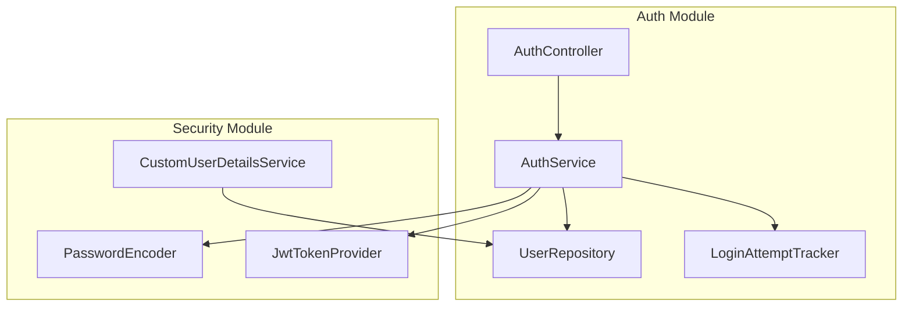

# Auth Validation & Security Implementation Plan

> **For agentic workers:** REQUIRED SUB-SKILL: Use superpowers:subagent-driven-development to implement this plan task-by-task. Steps use checkbox (`- [ ]`) syntax for tracking.

**Goal:** Implement robust, production-ready validation for Register and Login, including locked account checks and failed login tracking.

**Architecture:** We will enhance the existing `AuthService` to include registration logic and a simple in-memory failed login tracker. We will update `CustomUserDetailsService` to respect the `status` field (`ACTIVE`, `LOCKED`, etc.). We will update DTOs with strict Jakarta Validation annotations.

**Architecture Diagram:**



**Tech Stack:** Java 21, Spring Boot, Spring Security, BCrypt.

**Spec:** (Current User Request)

## Global Constraints

- Java 21
- Keep existing JWT architecture
- No plaintext passwords in DB or logs
- Consistent JSON error responses

---

### Task 1: Update DTOs with Validation

**Files:**
- Modify: `backend/src/main/java/com/evmanager/users/dto/UserRegistrationRequest.java`
- Modify: `backend/src/main/java/com/evmanager/auth/dto/LoginRequest.java`

**Interfaces:**
- Produces: Strictly validated `UserRegistrationRequest` with `confirmPassword` and `phone`.

- [ ] **Step 1: Update `UserRegistrationRequest`**
Replace the content of `UserRegistrationRequest.java` to add `confirmPassword` and `phone` fields, and strict validation.

```java
package com.evmanager.users.dto;

import jakarta.validation.constraints.Email;
import jakarta.validation.constraints.NotBlank;
import jakarta.validation.constraints.Pattern;
import jakarta.validation.constraints.Size;
import lombok.Data;

@Data
public class UserRegistrationRequest {

    @NotBlank(message = "Username cannot be blank")
    @Size(min = 3, max = 50, message = "Username must be between 3 and 50 characters")
    @Pattern(regexp = "^[a-zA-Z0-9_.]+$", message = "Username can only contain letters, numbers, underscores, and dots")
    private String username;

    @NotBlank(message = "Password cannot be blank")
    @Size(min = 8, message = "Password must be at least 8 characters long")
    @Pattern(regexp = "^(?=.*[a-z])(?=.*[A-Z])(?=.*\\d)[a-zA-Z\\d\\W]{8,}$", 
             message = "Password must contain at least one uppercase letter, one lowercase letter, and one number")
    private String password;

    @NotBlank(message = "Confirm password cannot be blank")
    private String confirmPassword;

    @NotBlank(message = "Email cannot be blank")
    @Email(message = "Email format is not valid")
    private String email;
    
    @NotBlank(message = "Full name cannot be blank")
    @Size(min = 2, max = 100, message = "Full name must be between 2 and 100 characters")
    @Pattern(regexp = "^(?!\\s*$).+", message = "Full name cannot be only whitespace")
    private String fullName;

    @Pattern(regexp = "^(0|\\+84)[0-9]{9}$", message = "Invalid phone number format")
    private String phone;
}
```

- [ ] **Step 2: Update `LoginRequest`**
Ensure `LoginRequest` has `@NotBlank` annotations.

```java
package com.evmanager.auth.dto;

import jakarta.validation.constraints.NotBlank;
import lombok.Data;

@Data
public class LoginRequest {
    @NotBlank(message = "Username or email cannot be blank")
    private String usernameOrEmail;

    @NotBlank(message = "Password cannot be blank")
    private String password;
}
```

- [ ] **Step 3: Commit**
```bash
git add backend/src/main/java/com/evmanager/users/dto/UserRegistrationRequest.java backend/src/main/java/com/evmanager/auth/dto/LoginRequest.java
git commit -m "feat(auth): add strict validation to registration and login DTOs"
```

---

### Task 2: Implement Registration Logic

**Files:**
- Modify: `backend/src/main/java/com/evmanager/auth/service/AuthService.java`
- Modify: `backend/src/main/java/com/evmanager/auth/controller/AuthController.java`

- [ ] **Step 1: Update `AuthService` with `register` method**
Add dependencies (`UserRepository`, `RoleRepository`, `PasswordEncoder`) and implement `register`.

```java
// Inside AuthService.java, add:
    private final com.evmanager.users.repository.UserRepository userRepository;
    private final com.evmanager.users.repository.RoleRepository roleRepository;
    private final org.springframework.security.crypto.password.PasswordEncoder passwordEncoder;

// (Update constructor to include these)

    @org.springframework.transaction.annotation.Transactional
    public void register(com.evmanager.users.dto.UserRegistrationRequest request) {
        if (!request.getPassword().equals(request.getConfirmPassword())) {
            throw new IllegalArgumentException("Passwords do not match");
        }

        String username = request.getUsername().trim();
        String email = request.getEmail().trim().toLowerCase();

        if (userRepository.findByUsernameIgnoreCase(username).isPresent()) {
            throw new com.evmanager.exception.ResourceConflictException("Username already exists");
        }
        if (userRepository.findByEmailIgnoreCase(email).isPresent()) {
            throw new com.evmanager.exception.ResourceConflictException("Email already exists");
        }

        com.evmanager.users.model.Role role = roleRepository.findByRoleName("ROLE_CUSTOMER")
                .orElseGet(() -> roleRepository.findAll().stream().findFirst()
                .orElseThrow(() -> new IllegalStateException("No roles found in database")));

        com.evmanager.users.model.User user = new com.evmanager.users.model.User();
        user.setUsername(username);
        user.setEmail(email);
        user.setPasswordHash(passwordEncoder.encode(request.getPassword()));
        user.setFullName(request.getFullName().trim());
        if (request.getPhone() != null && !request.getPhone().trim().isEmpty()) {
            user.setPhone(request.getPhone().trim());
        }
        user.setRole(role);
        user.setStatus("ACTIVE");

        userRepository.save(user);
    }
```

- [ ] **Step 2: Add `/register` endpoint to `AuthController`**
```java
// Inside AuthController.java, add:
    @PostMapping("/register")
    public ResponseEntity<String> register(@Valid @RequestBody com.evmanager.users.dto.UserRegistrationRequest request) {
        authService.register(request);
        return ResponseEntity.status(org.springframework.http.HttpStatus.CREATED).body("User registered successfully");
    }
```

- [ ] **Step 3: Commit**
```bash
git add backend/src/main/java/com/evmanager/auth/service/AuthService.java backend/src/main/java/com/evmanager/auth/controller/AuthController.java
git commit -m "feat(auth): implement secure user registration"
```

---

### Task 3: Enforce Account Status and Failed Login Tracking

**Files:**
- Modify: `backend/src/main/java/com/evmanager/auth/service/CustomUserDetailsService.java`
- Modify: `backend/src/main/java/com/evmanager/auth/service/AuthService.java`
- Modify: `backend/src/main/java/com/evmanager/exception/GlobalExceptionHandler.java`

- [ ] **Step 1: Enforce Status in `CustomUserDetailsService`**
Modify `loadUserByUsername` to map `status` to boolean flags.

```java
        boolean enabled = "ACTIVE".equalsIgnoreCase(user.getStatus());
        boolean accountNonLocked = !"LOCKED".equalsIgnoreCase(user.getStatus());

        return new org.springframework.security.core.userdetails.User(
                user.getUsername(),
                user.getPasswordHash(),
                enabled,
                true,
                true,
                accountNonLocked,
                java.util.Collections.singleton(new org.springframework.security.core.authority.SimpleGrantedAuthority("ROLE_" + user.getRole().getRoleName()))
        );
```

- [ ] **Step 2: Add Failed Login Tracker to `AuthService`**
Add an in-memory map to track failures and update `login` method.

```java
// In AuthService.java, add:
    private final java.util.concurrent.ConcurrentHashMap<String, Integer> failedAttempts = new java.util.concurrent.ConcurrentHashMap<>();
    private static final int MAX_FAILED_ATTEMPTS = 5;

// Update login method:
    public String login(com.evmanager.auth.dto.LoginRequest loginRequest) {
        String identifier = loginRequest.getUsernameOrEmail().trim().toLowerCase();
        
        try {
            Authentication authentication = authenticationManager.authenticate(
                    new UsernamePasswordAuthenticationToken(identifier, loginRequest.getPassword())
            );

            failedAttempts.remove(identifier);

            SecurityContextHolder.getContext().setAuthentication(authentication);
            return jwtTokenProvider.generateToken(authentication);
            
        } catch (org.springframework.security.authentication.BadCredentialsException ex) {
            int attempts = failedAttempts.getOrDefault(identifier, 0) + 1;
            failedAttempts.put(identifier, attempts);
            
            if (attempts >= MAX_FAILED_ATTEMPTS) {
                userRepository.findByUsernameIgnoreCaseOrEmailIgnoreCase(identifier, identifier)
                    .ifPresent(user -> {
                        user.setStatus("LOCKED");
                        userRepository.save(user);
                    });
            }
            throw ex;
        }
    }
```

- [ ] **Step 3: Handle Security Exceptions in `GlobalExceptionHandler`**
Add handlers for `LockedException` and `DisabledException`.

```java
    @ExceptionHandler(org.springframework.security.authentication.LockedException.class)
    public ResponseEntity<ErrorResponse> handleLockedException(org.springframework.security.authentication.LockedException ex, HttpServletRequest request) {
        ErrorResponse errorResponse = new ErrorResponse(
                HttpStatus.FORBIDDEN.value(),
                HttpStatus.FORBIDDEN.getReasonPhrase(),
                "Account is locked due to too many failed login attempts. Please contact support.",
                request.getRequestURI()
        );
        return new ResponseEntity<>(errorResponse, HttpStatus.FORBIDDEN);
    }

    @ExceptionHandler(org.springframework.security.authentication.DisabledException.class)
    public ResponseEntity<ErrorResponse> handleDisabledException(org.springframework.security.authentication.DisabledException ex, HttpServletRequest request) {
        ErrorResponse errorResponse = new ErrorResponse(
                HttpStatus.FORBIDDEN.value(),
                HttpStatus.FORBIDDEN.getReasonPhrase(),
                "Account is disabled. Please contact support.",
                request.getRequestURI()
        );
        return new ResponseEntity<>(errorResponse, HttpStatus.FORBIDDEN);
    }
```

- [ ] **Step 4: Commit**
```bash
git add backend/src/main/java/com/evmanager/auth/service/CustomUserDetailsService.java backend/src/main/java/com/evmanager/auth/service/AuthService.java backend/src/main/java/com/evmanager/exception/GlobalExceptionHandler.java
git commit -m "feat(auth): enforce account status and track failed logins"
```
