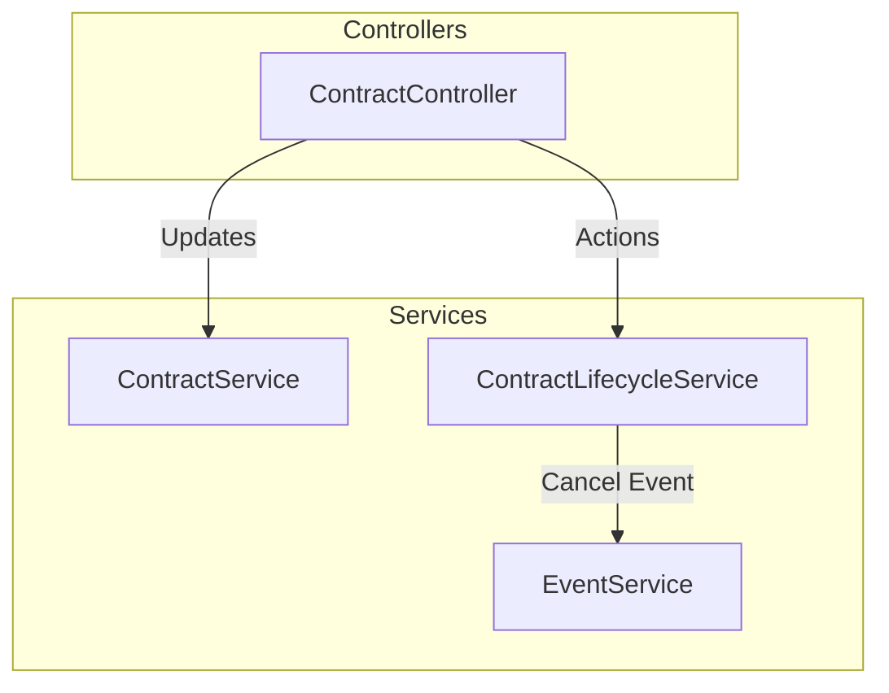

# BE-19: Contract State Machine Implementation Plan

> **For agentic workers:** REQUIRED SUB-SKILL: Use superpowers:subagent-driven-development to implement this plan task-by-task. Steps use checkbox (`- [ ]`) syntax for tracking.

**Goal:** Implement a strict state machine to manage the contract lifecycle, blocking invalid transitions and protecting data integrity.

**Architecture:** We will introduce a new `ContractLifecycleService` that handles state transitions (approve, reject, cancel, start, complete, confirm) atomically, ensuring Event statuses are updated and constraints are met. `ContractController` will expose explicit action endpoints. `ContractService` will be updated to block modifications to contracts that are CONFIRMED or later.

**Architecture Diagram:**

**Tech Stack:** Java, Spring Boot, Spring Security, JUnit.

**Spec:** BE-19 Requirements (Final Design)

## Global Constraints

- Do not create `paid_amount` column or Payment tables.
- Do not expose public `/confirm` endpoint.
- Do not modify existing `V12` migrations or add DB migrations unless necessary.
- Follow existing RBAC.

---

### Task 1: Contract Lifecycle Service

**Files:**
- Create: `backend/src/main/java/com/evmanager/contracts/service/ContractLifecycleService.java`
- Test: `backend/src/test/java/com/evmanager/contracts/service/ContractLifecycleServiceTest.java`

**Interfaces:**
- Consumes: `ContractRepository`, `EventRepository`

- [ ] **Step 1: Write the failing tests**
Write unit tests for `ContractLifecycleServiceTest` checking all valid and invalid transitions: `approveContract`, `rejectContract` (transitions to DRAFT), `cancelContract` (transitions to CANCELLED and cancels event), `startContract`, `completeContract`, `transitionToConfirmed`. Mock dependencies.

- [ ] **Step 2: Run test to verify it fails**
Run: `mvn clean test -Dtest=ContractLifecycleServiceTest`
Expected: FAIL

- [ ] **Step 3: Write minimal implementation**
Implement `ContractLifecycleService` with:
- `approveContract(Long id)`: PENDING_APPROVAL -> PENDING_DEPOSIT
- `rejectContract(Long id)`: PENDING_APPROVAL -> DRAFT
- `cancelContract(Long id)`: Any (except IN_PROGRESS, COMPLETED, CANCELLED) -> CANCELLED + `event.setStatus("CANCELLED"); eventRepository.save(event);`
- `startContract(Long id)`: CONFIRMED -> IN_PROGRESS
- `completeContract(Long id)`: IN_PROGRESS -> COMPLETED
- `transitionToConfirmed(Long id)`: Internal method for BE-20. PENDING_DEPOSIT -> CONFIRMED.

- [ ] **Step 4: Run test to verify it passes**
Run: `mvn clean test -Dtest=ContractLifecycleServiceTest`
Expected: PASS

- [ ] **Step 5: Commit**

---

### Task 2: Contract Controller Action Endpoints

**Files:**
- Modify: `backend/src/main/java/com/evmanager/contracts/controller/ContractController.java`
- Modify: `backend/src/main/java/com/evmanager/contracts/service/ContractService.java` (if needed for update protection)

**Interfaces:**
- Consumes: `ContractLifecycleService`

- [ ] **Step 1: Add Endpoints**
Add the following endpoints to `ContractController`:
- `POST /{id}/actions/approve` (@PreAuthorize("hasRole('ADMIN')"))
- `POST /{id}/actions/reject` (@PreAuthorize("hasRole('ADMIN')"))
- `POST /{id}/actions/cancel` (@PreAuthorize("hasAnyRole('ADMIN', 'SALES')"))
- `POST /{id}/actions/start` (@PreAuthorize("hasAnyRole('ADMIN', 'COORDINATOR')"))
- `POST /{id}/actions/complete` (@PreAuthorize("hasAnyRole('ADMIN', 'COORDINATOR')"))

- [ ] **Step 2: Add Update Protection Logic**
In `ContractService`, update the logic that modifies contract details to block modifications if status is `CONFIRMED`, `IN_PROGRESS`, `COMPLETED`, or `CANCELLED`. Throw `IllegalStateException`.

- [ ] **Step 3: Run test to verify it passes**
Run: `mvn clean test`

- [ ] **Step 4: Commit**
