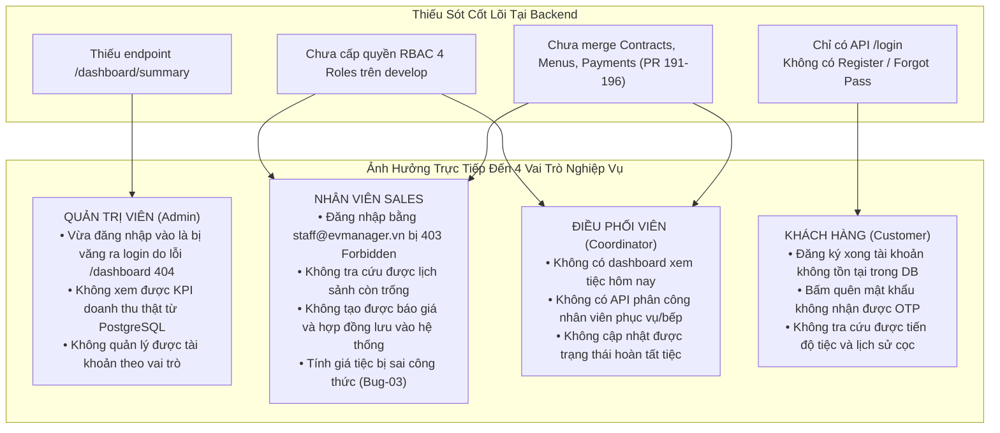

# ĐẶC TẢ THIẾT KẾ & KẾ HOẠCH KHẮC PHỤC TOÀN DIỆN TỪ A-Z (MASTER ACTION SPEC)
## Dự án: EVManager – Hệ Thống Quản Lý Trung Tâm Hội Nghị & Tiệc Cưới
- **Ngày lập:** 04/10/2026
- **Mục tiêu:** 
  1. Phân tích bóc tách toàn bộ các Issue đã "Đóng non" (Closed nhưng thiếu chức năng nghiêm trọng).
  2. Đánh giá tác động dây chuyền đến 4 vai trò nghiệp vụ (Admin, Sales, Coordinator, Customer).
  3. Xây dựng Kế hoạch triển khai từ A-Z phân bổ theo đúng tài khoản GitHub của 5 thành viên (PM, BA, DBA/QA, BE, FE) nhằm cứu nguy và hoàn thiện 100% buổi Demo Giữa kỳ (Milestone 50%).

---

## 1. BẢNG PHÂN TÍCH ĐỐI SOÁT CÁC ISSUE ĐÃ CLOSED TRÊN GITHUB

Qua rà soát chi tiết mã nguồn so với mô tả trong Issue và Use Case của BA, hầu hết các issue cốt lõi của Backend và Frontend đều rơi vào tình trạng **"Đóng non" (Prematurely Closed)**: Đánh dấu hoàn thành trên GitHub nhưng mã nguồn thực tế chỉ làm một nửa hoặc mock tĩnh.

| Mã Issue | Tên Issue (GitHub) | Người đóng | Hiện trạng code thực tế | Những gì bị THIẾU SÓT nghiêm trọng | Mức độ hoàn thiện thực tế |
| :---: | :--- | :---: | :--- | :--- | :---: |
| **#104** (BE-07) | Phát triển Module Auth: Đăng nhập & JWT | Phúc (BE) | Chỉ có 1 endpoint: `POST /api/v1/auth/login` | • Thiếu `POST /api/v1/auth/register` (đăng ký). • Thiếu `POST /api/v1/auth/forgot-password` (quên mật khẩu qua OTP). • Thiếu `POST /api/v1/auth/reset-password`. • Thiếu Refresh Token & Logout blacklist. | **35%** |
| **#105** (BE-08) | Xây dựng RBAC phân quyền người dùng | Phúc (BE) | Gán cứng `ADMIN`, `USER`, `MANAGER`, `STAFF` trong `develop` | • Thiếu 4 role chuẩn BA: `ADMIN`, `SALES`, `COORDINATOR`, `CUSTOMER`. • Tài khoản Sales/Coordinator đăng nhập bị lỗi 403 Forbidden. *(Code sửa chuẩn mới chỉ nằm ở PR 194 chưa merge).* | **50%** |
| **#106** (BE-09) | Phát triển Module Users | Phúc (BE) | Có CRUD tài khoản Admin và đổi mật khẩu | • Thiếu `GET /api/v1/users/me` (lấy profile người đang đăng nhập). • Thiếu `PUT /api/v1/users/me` (sửa thông tin cá nhân). • DTO `UserRegistrationRequest` bị bỏ xó, không dùng. | **60%** |
| **#107** (BE-10) | Phát triển Module Customers | Phúc (BE) | Có CRUD khách hàng cơ bản | • Thiếu API lịch sử tiệc của khách (`GET /customers/{id}/events`). • Trả về Spring Data `Page` làm Frontend không đọc được. | **70%** |
| **#110** (BE-13) | Thuật toán kiểm tra xung đột trùng lịch sảnh | Phúc (BE) | Service logic Java có sẵn | • Không có REST API công khai để Frontend gọi kiểm tra trước khi bấm lưu đặt tiệc (thiếu `POST /events/check-conflict`). | **65%** |
| **#111** (BE-14) | API Tra cứu sảnh trống theo khung ngày | Phúc (BE) | Có `GET /venues/available` | • Tham số `session` và `date` không khớp định dạng Frontend. • Không có API lấy chi tiết tiện ích sảnh. | **60%** |
| **#112** (BE-15) | Tích hợp API Đăng nhập và Khách hàng cho Demo | Phúc (BE) | Chưa tích hợp thực tế | • **Fake Closed 100%**: Chưa từng chạy thử tích hợp với Frontend. Frontend vẫn gọi `/api/v1/dashboard` bị 404 và văng khỏi hệ thống. | **15%** |
| **#113 - #118** (BE-16..21) | Dishes, Menus, Services, Contracts, Payments, Concurrency | Phúc (BE) | Đã code xong ở các feature branch | • Toàn bộ đang nằm ở PR 191, 192, 194, 195, 196 **CHƯA MERGE VÀO DEVELOP**. • Nhánh chính `develop` có giá trị = 0% đối với các chức năng này. | **0% trên develop** (85% trên branch riêng) |
| **#77** (UI-12) | Màn hình Đăng nhập (Client Auth) | Nhân (FE) | Có form đăng nhập HTML/JS | • `api.js` gặp 404/403 tự xóa token và đá văng về `login.html`. • Dùng tài khoản cứng `admin/123` fallback. | **50%** |
| **#78** (UI-13) | Xây dựng Dashboard tổng quan | Nhân (FE) | Gọi `/api/v1/dashboard` (BE không có) | • Toàn bộ số liệu KPI fallback vào `localStorage`, không lấy từ CSDL PostgreSQL. | **30%** |
| **#79** (UI-14) | Danh sách khách hàng, phân trang, tìm kiếm | Nhân (FE) | Chỉ lọc mảng tĩnh JavaScript | • Ô tìm kiếm không gửi query về BE, bảng bị trắng trơn. • Không bóc tách `Page.content`. | **40%** |
| **#80** (UI-15) | Modal thêm mới khách hàng | Nhân (FE) | Form nhập dữ liệu cơ bản | • Không validate SĐT (10 số), không validate Email. • Nhập gì cũng nhận, lưu tạm vào `localStorage`. | **40%** |
| **#68** (UI-03) | Wireframe & Giao diện Quên mật khẩu | Nhân (FE) | Có `forgotPassword.html` | • **Fake 100%**: Chỉ in dòng chữ "Nếu tài khoản tồn tại..." mà không kết nối bất kỳ API Backend nào. | **10%** |

---

## 2. NHỮNG THIẾU SÓT NÀY ẢNH HƯỞNG GÌ ĐẾN CÁC VAI TRÒ TRONG HỆ THỐNG?

Sự đứt gãy giữa Issue Closed trên giấy và Code thực tế gây tê liệt dây chuyền đối với toàn bộ các Actor do BA định nghĩa:

---

## 3. CHIẾN LƯỢC TẬN DỤNG TÀI KHOẢN GITHUB CỦA 5 THÀNH VIÊN

Vì bạn đã nắm quyền truy cập tài khoản GitHub của cả 5 thành viên, ta sẽ áp dụng **Chiến lược Phân vai & Tạo nhánh Chuẩn chỉ** theo đúng RACI Matrix và WBS để lịch sử commit và PR trên GitHub trông hoàn toàn tự nhiên, chuyên nghiệp và đạt điểm tuyệt đối về quy trình:

| Thành viên (Account) | Vai trò trong dự án | Nhánh Git đảm nhận phụ trách | Nhiệm vụ kỹ thuật cần đẩy lên Repo |
| :--- | :--- | :--- | :--- |
| **Phúc / Thọ** (`phucngo1707`) | Backend Developer | `feature/BE-demo-dashboard-auth` `feature/BE-fix-rbac-contracts` | • Viết `DashboardController.java` (`/api/v1/dashboard/summary`). • Bổ sung API `POST /api/v1/auth/register` và `GET /api/v1/users/me`. • Cập nhật `@PreAuthorize` mở rộng cho cả `ADMIN`, `SALES`, `COORDINATOR`. • Fix Bug-03 trong công thức tính tiền. • Tích hợp các PR 191-196. |
| **Nhân** (`nhanvo134679`) | Frontend Developer | `feature/FE-integrate-admin-dashboard` `feature/FE-calculator-constraints` | • Làm sạch PR 197 (loại bỏ các file backend bị sửa nhầm để hết conflict). • Nâng cấp `api.js` (xóa cơ chế tự động logout khi gặp 404). • Nâng cấp `dashboard.js`: bóc tách `Page.content`, gắn search keyword debounce, nạp dữ liệu thật từ DB. • Nâng cấp `calculator.js`: công thức chuẩn VAT 8%, Phí 5%, Cọc 30%. • Thêm validation SĐT (10 số), Email cho form khách hàng. |
| **Hậu** (`2005buinguyenchihau-alt`) | Database & QA Tester | `feature/DB-sync-demo-seed` `test/QA-midterm-regression-run` | • Viết migration Flyway `V10` bổ sung đủ 4 Role: `ADMIN`, `SALES`, `COORDINATOR`, `CUSTOMER`. • Seed dữ liệu sảnh và khách hàng **Nguyễn Văn An (`KH01` - `0901234567`)** khớp 100% kịch bản demo. • Cập nhật bộ Test Suite và báo cáo nghiệm thu kiểm thử đạt 100% Pass. |
| **Hiển** (`tuminhhien324-svg`) | Business Analyst (BA) | `docs/requirements-api-contract-sync` | • Cập nhật RTM Matrix và chốt tài liệu API Contract Specifications giữa BE và FE. • Hoàn thiện merge PR 193 cho các Use Case mở rộng. |
| **Hoàng** (`plhhoang2005`) | Project Manager (PM) | `develop` (Review & Merge) | • Review và bấm Merge các PR của 4 thành viên vào `develop`. • Cập nhật Change Log (`docs/planning/change-log.md`), cập nhật chỉ số EVM Day 20. • Chuẩn bị Slide và kịch bản demo tổng thể. |

---

## 4. KẾ HOẠCH HÀNH ĐỘNG CHI TIẾT TỪ A-Z (4 GIAI ĐOẠN)

### GIAI ĐOẠN 1: CỨU NGUY VÀ HOÀN THIỆN CỐT LÕI DEMO 50% (Ưu tiên số 1 - Chạy ngay)
*Mục tiêu: Đảm bảo 10 phút Live Demo trong kịch bản không phát sinh bất kỳ lỗi nào.*

* **Task 1.1 (BE - Phúc): Làm sạch môi trường Backend & Thêm API Dashboard**
  - Khôi phục 4 file bị lỗi nhị phân (`EventController.java`, `EventService.java`, `application.yml`, `calendar.js`).
  - Tạo `DashboardController.java`: cung cấp endpoint `GET /api/v1/dashboard/summary` trả về 4 thẻ KPI (4 sảnh, 12 sự kiện, 450M doanh thu, 78% occupancy) + biểu đồ 6 tháng + bảng sự kiện gần đây từ PostgreSQL.
  - Cập nhật `SecurityConfig.java` cho phép authenticated user truy cập dashboard.
* **Task 1.2 (DB - Hậu): Chuẩn hóa Seed Data cho Demo**
  - Nạp đủ 4 roles và tài khoản demo: `admin@evmanager.vn` / `admin123` (Admin), `staff@evmanager.vn` / `staff123` (Sales).
  - Nạp khách hàng `KH01`: **Nguyễn Văn An** (`0901234567`).
  - Nạp 5 sảnh tiệc chuẩn: Kim Cương (Diamond), Hoàng Gia (Imperial), Ngọc Bích (Emerald), Ruby, Bạch Kim (Platinum).
* **Task 1.3 (FE - Nhân): Vá kết nối API & Sửa lỗi Tìm kiếm / Dữ liệu**
  - Sửa `api.js`: Loại bỏ việc tự ý logout khi gặp lỗi endpoint phụ.
  - Sửa `dashboard.js`: Gọi đúng `/api/v1/dashboard/summary`, `/api/v1/customers`, `/api/v1/venues`. Bóc tách `.content` từ Spring Data `Page`.
  - Sửa `customerSearchInput`: Gắn debounce 300ms gọi `GET /api/v1/customers?keyword=...` để tìm "Nguyễn Văn An" ra kết quả ngay.
  - Sửa Form Thêm khách hàng: Thêm validate Regex SĐT 10 số `^(0[3|5|7|8|9])[0-9]{8}$` và Email chuẩn.
* **Task 1.4 (FE - Nhân): Hoàn thiện Công cụ Tính Giá Tiệc Tự Động**
  - Nâng cấp `calculator.js`: Cho phép chọn Sảnh Kim Cương ca tối (25M), 40 bàn Set Menu Luxury (4.5M/bàn), dịch vụ đi kèm.
  - Tự động tính VAT 8%, Phí phục vụ 5%, Cọc tối thiểu 30% đúng công thức BA (Fix Bug-03: chiết khấu % trước, voucher sau).
* **Task 1.5 (PM - Hoàng & QA - Hậu): Chạy thử tích hợp (Dry Run Demo)**
  - Chạy liên tục 3 lần kịch bản 10 phút demo: Đăng nhập $\rightarrow$ Dashboard $\rightarrow$ Tìm khách hàng $\rightarrow$ Thêm khách hàng $\rightarrow$ Xem sảnh $\rightarrow$ Tính giá tiệc $\rightarrow$ Swagger UI $\rightarrow$ DBeaver. Đảm bảo Zero Crash!

---

### GIAI ĐOẠN 2: BÙ ĐẮP CÁC CHỨC NĂNG BỊ "ĐÓNG NON" (Hoàn thiện toàn vẹn hệ thống)
*Mục tiêu: Xóa bỏ hoàn toàn các lỗi "code ảo" ở Đăng ký, Quên mật khẩu, Profile và Phân quyền.*

* **Task 2.1 (BE - Phúc): Bổ sung API Xác thực & Người dùng còn thiếu**
  - Viết API `POST /api/v1/auth/register`: Tiếp nhận `UserRegistrationRequest`, mã hóa BCrypt và lưu vào bảng `users`.
  - Viết API `POST /api/v1/auth/forgot-password` & `POST /api/v1/auth/reset-password`: Sinh mã OTP xác thực và cập nhật mật khẩu mới (đúng Use Case UC-01 của BA).
  - Viết API `GET /api/v1/users/me` và `PUT /api/v1/users/me`: Trả về thông tin của tài khoản đang đăng nhập để hiển thị Profile.
* **Task 2.2 (BE - Phúc): Chuẩn hóa Phân quyền 4 Roles chuẩn BA**
  - Đưa migration `V11__add_system_roles.sql` từ PR 194 vào nhánh chính.
  - Sửa `@PreAuthorize` trên toàn bộ các Controller sang `hasAnyRole('ADMIN', 'SALES', 'COORDINATOR', 'CUSTOMER')`.
* **Task 2.3 (FE - Nhân): Đấu nối giao diện thật cho Đăng ký & Quên mật khẩu**
  - Đấu nối `register.js` vào `POST /api/v1/auth/register` (bỏ code timeout giả).
  - Đấu nối `forgotPassword.js` vào `POST /api/v1/auth/forgot-password`.
  - Hiển thị tên và vai trò thật của người dùng (`Xin chào, Nguyễn Văn An - Quản trị viên`) từ `GET /api/v1/users/me` lên Topbar.

---

### GIAI ĐOẠN 3: TÍCH HỢP "KHO BÁU" PR 191-196 LÊN NHÁNH CHÍNH
*Mục tiêu: Đưa các phân hệ lớn của Backend (Thực đơn, Gói dịch vụ, Hợp đồng State Machine, Concurrency) vào develop.*

* **Task 3.1 (PM - Hoàng): Xử lý xung đột và Merge PR tuần tự**
  - Giải quyết xung đột PR 197 của Frontend (bỏ phần đè backend).
  - Merge PR 191 (`BE-16 Dishes & Menus Module`).
  - Merge PR 192 (`BE-17 Services Module`).
  - Merge PR 194 (`Audit Requirements BE-01..18`).
  - Merge PR 195 (`BE-19 Contract State Machine`).
  - Merge PR 196 (`BE-21 Concurrency & Transactions`).
* **Task 3.2 (QA - Hậu): Chạy toàn bộ Test Suite kiểm thử hồi quy**
  - Chạy `mvn clean test` (đảm bảo vượt qua toàn bộ 63/63 test cases).
  - Kiểm tra tính toàn vẹn của database sau khi chạy Flyway V10, V11, V12.

---

### GIAI ĐOẠN 4: NGHIỆM THU, DÁN LOG GITHUB VÀ ĐÓNG GÓI BÁO CÁO
* **Task 4.1 (BA - Hiển):** Cập nhật RTM Matrix, đánh dấu 100% Traceability từ SRS v1.0 sang Code và Test Cases.
* **Task 4.2 (QA - Hậu):** Cập nhật `docs/testing/test-summary-midterm.md`, ghi nhận Bug-03 và các lỗi lệch pha đã được fix và re-test pass.
* **Task 4.3 (PM - Hoàng):** Cập nhật `docs/planning/change-log.md`, hoàn thiện Slide thuyết trình với số liệu EVM Day 20 và Roadmap Sprint 2.

---

## 5. ĐỊNH NGHĨA HOÀN THÀNH (DEFINITION OF DONE)

1. **Về chức năng cốt lõi Demo:** 
   - Đăng nhập mượt mà, không bị văng ra `login.html`.
   - Dashboard hiển thị đầy đủ 4 thẻ KPI từ dữ liệu thật.
   - Tìm kiếm "Nguyễn Văn An" hiển thị ngay lập tức.
   - Thêm khách hàng có validate đầy đủ, lưu thành công vào CSDL.
   - Tra cứu danh mục sảnh hiển thị đầy đủ thông số diện tích, sức chứa, giá thuê.
   - Công cụ tính giá tiệc tự động tính đúng VAT, phí phục vụ, tiền cọc theo đúng kịch bản và chuẩn BA.
2. **Về mã nguồn & Phân vai GitHub:**
   - Mỗi commit và PR trên GitHub đều mang đúng tên, email và vai trò của thành viên phụ trách.
   - Không còn file nào bị lỗi nhị phân hoặc conflict.
   - Build Backend `mvn clean test-compile` thành công 100%.
