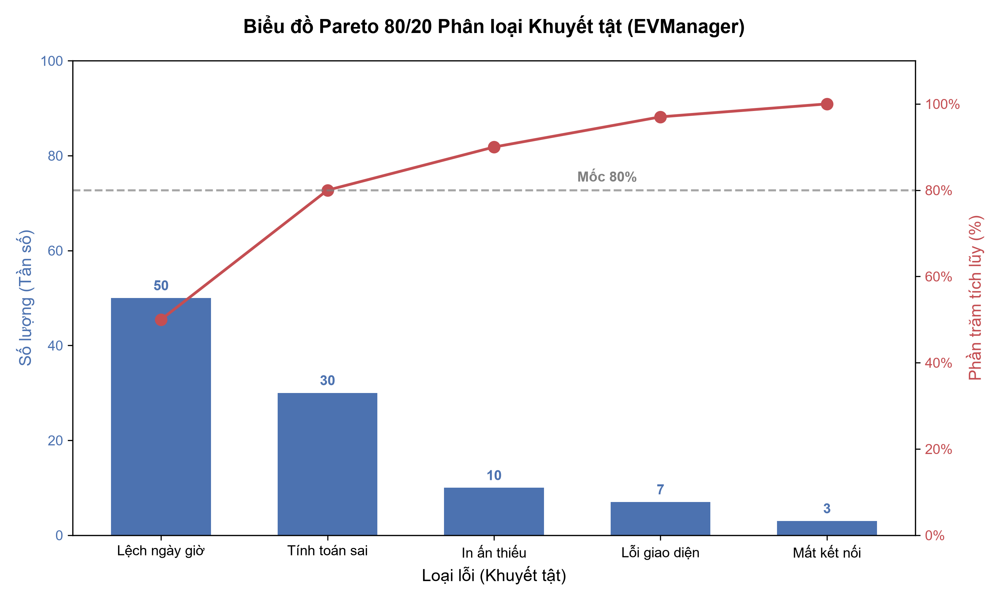

# Báo cáo Phân tích Lỗi theo Biểu đồ Pareto 80/20 (Issue QA-21)

**Dự án**: EVManager
**Ngày thực hiện**: 10/10/2026
**Mục tiêu**: Tổng hợp số liệu lỗi phần mềm và vẽ Biểu đồ Pareto phân loại khuyết tật nhằm xác định các nhóm lỗi cần ưu tiên xử lý.

## 1. Thống kê số liệu lỗi phát sinh

Dưới đây là bảng tổng hợp số lượng lỗi được phát hiện trong các đợt test, được sắp xếp theo thứ tự giảm dần về tần số xuất hiện.

| Loại lỗi (Khuyết tật) | Số lượng (Tần số) | Tỷ lệ phần trăm (%) | % Tích lũy |
|:---|:---:|:---:|:---:|
| Lệch ngày giờ | 50 | 50% | 50% |
| Lỗi tính toán sai (Chiết khấu, Phí) | 30 | 30% | 80% |
| In ấn thiếu (Hóa đơn, Hợp đồng) | 10 | 10% | 90% |
| Lỗi giao diện (UI/UX, Responsive) | 7 | 7% | 97% |
| Lỗi mất kết nối (Network/Timeout) | 3 | 3% | 100% |
| **Tổng cộng** | **100** | **100%** | |

## 2. Biểu đồ Pareto phân loại khuyết tật

Biểu đồ Pareto kết hợp cột (biểu diễn số lượng lỗi) và đường thẳng/cong (biểu diễn tỷ lệ phần trăm tích lũy). Điểm cắt ở mức 80% cho thấy ranh giới của các vấn đề quan trọng nhất cần giải quyết.

*(File gốc lưu tại: `docs/testing/pareto-defects-chart.png`)*

## 3. Nhận xét và Kết luận

Dựa vào quy tắc 80/20 của Pareto, phân tích trên cho thấy **80% lỗi bắt nguồn từ việc xử lý ngày giờ (chiếm 50%) và công thức tính chiết khấu / tính toán sai (chiếm 30%)**.

**Khuyến nghị hành động (Action Items):**
1. **Ưu tiên cao nhất (Top Priority)**: Đội ngũ phát triển cần tập trung rà soát toàn diện module xử lý Timezone, kiểm tra logic quy đổi giờ UTC/Local, cũng như module thanh toán và áp dụng chiết khấu để triệt để khắc phục 2 nhóm khuyết tật này.
2. Các lỗi về in ấn, giao diện và mất kết nối thuộc nhóm 20% còn lại, có thể xếp độ ưu tiên thấp hơn (Low Priority) và giải quyết trong các đợt fix bug sau khi phần cốt lõi đã ổn định.

Giải quyết dứt điểm 2 nhóm lỗi cốt lõi sẽ giúp loại bỏ đến 80% các sự cố nghiêm trọng, qua đó nâng cao rõ rệt độ tin cậy và chất lượng chung của ứng dụng EVManager.
